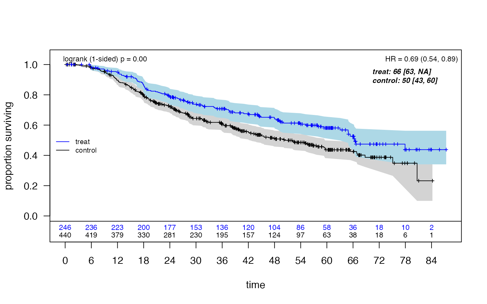
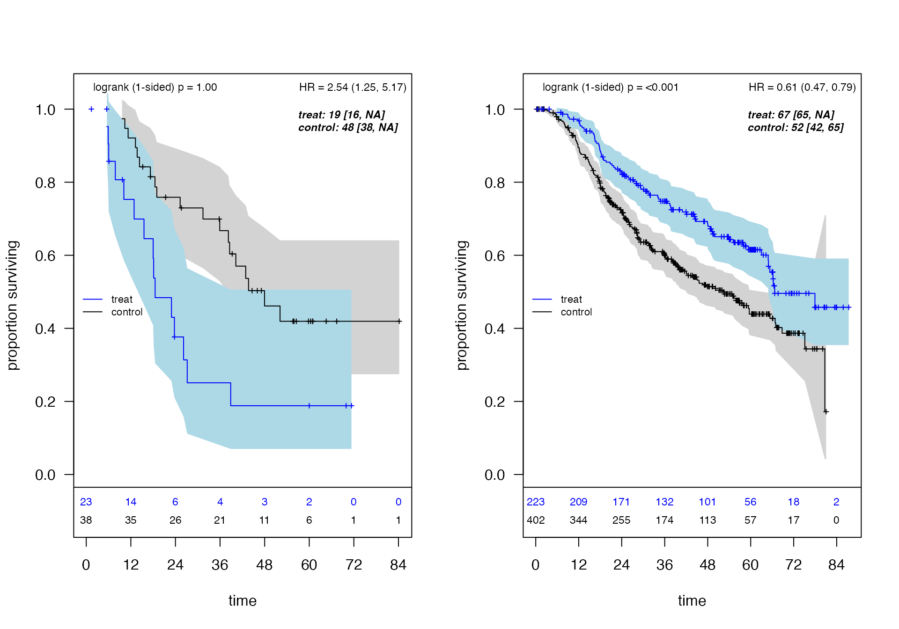
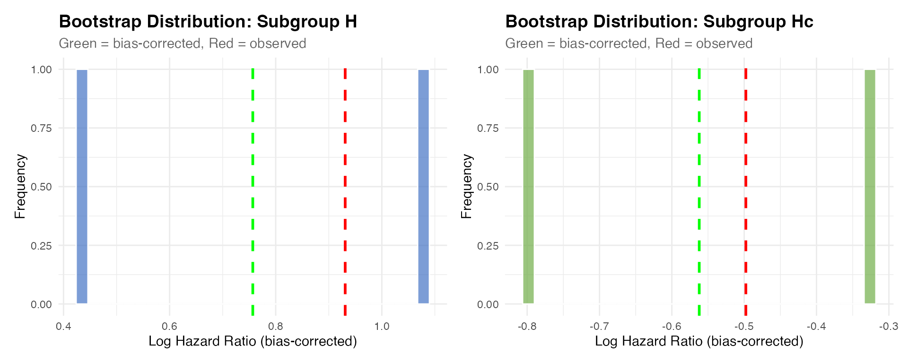
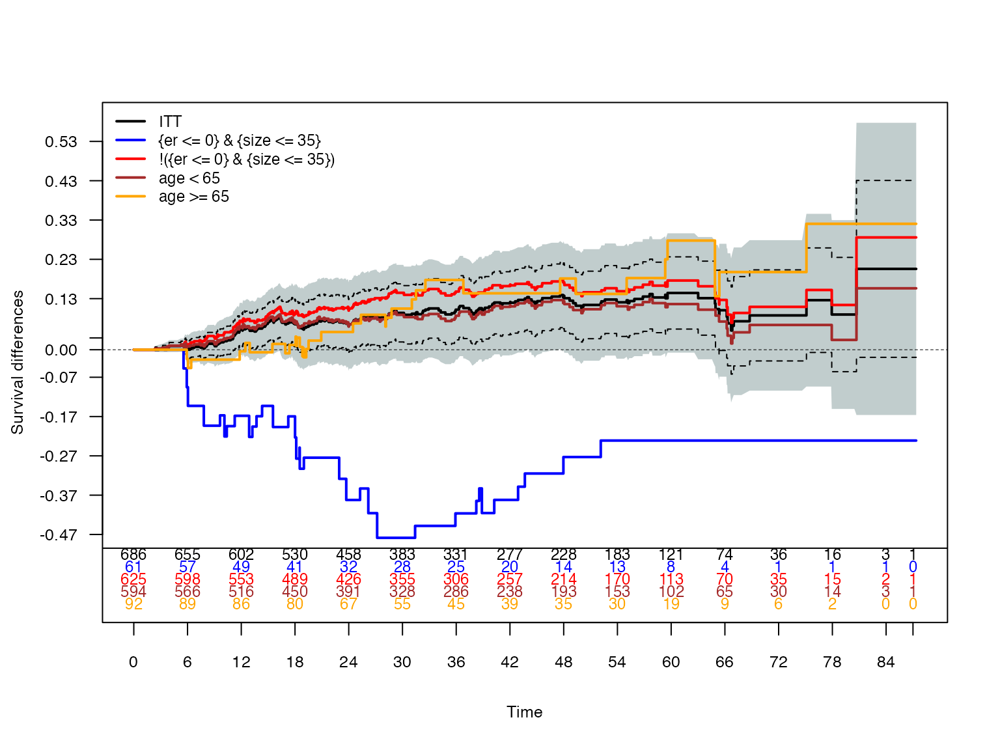

# Exploratory Subgroup Identification with ForestSearch

## Introduction

This vignette demonstrates the **ForestSearch** methodology for
exploratory subgroup identification in survival analysis, as described
in León et al. (2024) *Statistics in Medicine*.

### Motivation

In clinical trials, particularly oncology, subgroup analyses are
essential for:

- Evaluating treatment effect consistency across patient populations
- Identifying subgroups where treatment may be detrimental (harm)
- Characterizing subgroups with enhanced benefit
- Informing regulatory decisions and clinical practice

While prespecified subgroups provide stronger evidence, important
subgroups based on patient characteristics may not be anticipated.
ForestSearch provides a principled approach to **exploratory** subgroup
identification with proper statistical inference.

### Methodology Overview

ForestSearch identifies subgroups through:

1.  **Candidate factor selection**: Using LASSO and/or Generalized
    Random Forests (GRF)
2.  **Exhaustive subgroup search**: Evaluating all combinations up to
    `maxk` factors
3.  **Consistency-based selection**: Applying splitting consistency
    criteria
4.  **Bootstrap bias correction**: Adjusting for selection-induced
    optimism
5.  **Cross-validation**: Assessing algorithm stability

The key innovation is the **splitting consistency criterion**: a
subgroup is considered “consistent with harm” if, when randomly split
50/50 many times, both halves consistently show hazard ratios ≥ 1.0 (for
example if 1.0 represents a meaningful “harm threshold”).

## Setup

### Load Required Packages

``` r
library(forestsearch)
library(survival)
library(data.table)
library(ggplot2)
library(gt)
library(grf)
library(policytree)
library(doFuture)

# Optional packages for enhanced output
library(patchwork)
library(weightedsurv)

# Set ggplot theme
theme_set(theme_minimal(base_size = 12))
```

## Data: German Breast Cancer Study Group Trial

### Study Background

The GBSG trial evaluated hormonal treatment (tamoxifen) versus
chemotherapy in node-positive breast cancer patients. Key
characteristics:

- **Sample size**: N = 686
- **Outcome**: Recurrence-free survival time
- **Censoring rate**: ~56%
- **Treatment**: Hormonal therapy (tamoxifen) vs. chemotherapy

### Data Preparation

``` r
# Load GBSG data (included in forestsearch package)
df.analysis <- gbsg

# Prepare analysis variables
df.analysis <- within(df.analysis, {
  id <- seq_len(nrow(df.analysis))
  time_months <- rfstime / 30.4375
  grade3 <- ifelse(grade == "3", 1, 0)
  treat <- hormon
})

# Define variable roles
confounders.name <- c("age", "meno", "size", "grade3", "nodes", "pgr", "er")
outcome.name <- "time_months"
event.name <- "status"
id.name <- "id"
treat.name <- "hormon"

# Display data structure
cat("Sample size:", nrow(df.analysis), "\n")
```

    ## Sample size: 686

``` r
cat("Events:", sum(df.analysis[[event.name]]), 
    sprintf("(%.1f%%)\n", 100 * mean(df.analysis[[event.name]])))
```

    ## Events: 299 (43.6%)

``` r
cat("Baseline factors:", paste(confounders.name, collapse = ", "), "\n")
```

    ## Baseline factors: age, meno, size, grade3, nodes, pgr, er

### Baseline Characteristics

``` r
create_summary_table(
  data = df.analysis,
  treat_var = treat.name,
  table_title = "GBSG Baseline Characteristics by Treatment Arm",
  vars_continuous = c("age", "nodes", "size", "er", "pgr"),
  vars_categorical = c("grade", "meno"),
  font_size = 12
)
```

| GBSG Baseline Characteristics by Treatment Arm |  |  |  |  |  |
|----|----|----|----|----|----|
| Characteristic |  | Control (n=440) | Treatment (n=246) | P-value¹ | SMD² |
| age | Mean (SD) | 51.1 (10.0) | 56.6 (9.4) | \<0.001 | 0.57 |
| nodes | Mean (SD) | 4.9 (5.6) | 5.1 (5.3) | 0.665 | 0.03 |
| size | Mean (SD) | 29.6 (14.4) | 28.8 (14.1) | 0.470 | 0.06 |
| er | Mean (SD) | 79.7 (124.2) | 125.8 (191.1) | \<0.001 | 0.30 |
| pgr | Mean (SD) | 102.0 (170.0) | 124.3 (249.7) | 0.213 | 0.11 |
| grade |  |  |  | 0.273 | 0.06 |
|  | 1 | 48 (10.9%) | 33 (13.4%) |  |  |
|  | 2 | 281 (63.9%) | 163 (66.3%) |  |  |
|  | 3 | 111 (25.2%) | 50 (20.3%) |  |  |
| meno |  |  |  | \<0.001 | 0.27 |
|  | 0 | 231 (52.5%) | 59 (24.0%) |  |  |
|  | 1 | 209 (47.5%) | 187 (76.0%) |  |  |
| ¹ P-values: t-test for continuous, chi-square/Fisher's exact for categorical/binary variables |  |  |  |  |  |
| ² SMD = Standardized mean difference (Cohen's d for continuous, Cramer's V for categorical) |  |  |  |  |  |

### Kaplan-Meier Analysis (ITT Population)

``` r
# Prepare counting process data for KM plot
dfcount <- df_counting(
  df = df.analysis,
  by.risk = 6,
  tte.name = outcome.name,
  event.name = event.name,
  treat.name = treat.name
)

# Plot with confidence intervals and log-rank test
plot_weighted_km(
  dfcount,
  conf.int = TRUE,
  show.logrank = TRUE,
  ymax = 1.05,
  xmed.fraction = 0.775,
  ymed.offset = 0.125
)
```



The ITT Cox hazard ratio estimate is approximately 0.69 (95% CI: 0.54,
0.89), suggesting an overall benefit for hormonal therapy.

## Preliminary Analysis: Generalized Random Forests

Before running ForestSearch, we can use GRF to explore potential
treatment effect heterogeneity and identify candidate factors.

``` r
t0 <- proc.time()

grf_est <- grf.subg.harm.survival(
  data = df.analysis,
  confounders.name = confounders.name,
  outcome.name = outcome.name,
  event.name = event.name,
  id.name = id.name,
  treat.name = treat.name,
  maxdepth = 2,
  n.min = 60,
  dmin.grf = 12,
  frac.tau = 0.6,
  details = TRUE,
  return_selected_cuts_only = FALSE
)
```

    ## tau, maxdepth = 46.75811 2 
    ##    leaf.node control.mean control.size control.se depth
    ## 1          2         6.49        82.00       3.34     1
    ## 2          3        -4.10       604.00       1.06     1
    ## 11         4        -7.90       112.00       2.81     2
    ## 21         5         3.86       177.00       1.87     2
    ## 4          7        -5.89       356.00       1.33     2
    ## 
    ## Selected subgroup:
    ##   leaf.node control.mean control.size control.se depth
    ## 1         2         6.49        82.00       3.34     1
    ## 
    ## GRF subgroup found
    ## Terminating node at max.diff (sg.harm.id):
    ## [1] "er <= 0"
    ## 
    ## All splits (from all trees):
    ## [1] "er <= 0"   "age <= 50" "age <= 43"

``` r
timings$grf <- (proc.time() - t0)["elapsed"]
```

``` r
# Display policy trees
# leaf1 = recommend control, leaf2 = recommend treatment
par(mfrow = c(1, 2))
plot(grf_est$tree1, leaf.labels = c("Control", "Treat"), main = "Depth 1")
```

``` r
plot(grf_est$tree2, leaf.labels = c("Control", "Treat"), main = "Depth 2")
```

``` r
par(mfrow = c(1, 1))
```

GRF identifies estrogen receptor status (ER) as a key factor, with ER ≤
0 suggesting potential harm from hormonal therapy.

## ForestSearch Analysis

### Parallel Processing Configuration

ForestSearch supports parallel processing for computationally intensive
operations (bootstrap, cross-validation).

``` r
# Detect available cores (limited to 2 cores for CRAN checks)
n_cores <- 2
n_cores_total <- parallel::detectCores()
cat("Using", n_cores, "of", n_cores_total, "total cores for parallel processing")
```

    ## Using 2 of 14 total cores for parallel processing

### Running ForestSearch

ForestSearch performs an exhaustive search over candidate subgroup
combinations with up to `maxk` factors. Key parameters:

| Parameter                | Value | Description                             |
|--------------------------|-------|-----------------------------------------|
| `hr.threshold`           | 1.25  | Minimum HR for consistency evaluation   |
| `hr.consistency`         | 1.0   | Minimum consistency rate for candidates |
| `pconsistency.threshold` | 0.90  | Required consistency for selection      |
| `maxk`                   | 2     | Maximum factors in subgroup definition  |
| `n.min`                  | 60    | Minimum subgroup sample size            |
| `d0.min`, `d1.min`       | 12    | Minimum events per treatment arm        |

``` r
t0 <- proc.time()

fs <- forestsearch(
  df.analysis,
  confounders.name = confounders.name,
  outcome.name = outcome.name,
  treat.name = treat.name,
  event.name = event.name,
  id.name = id.name,
  # Threshold parameters (per León et al. 2024)
  hr.threshold = 1.25,
  hr.consistency = 1.0,
  pconsistency.threshold = 0.80,
  stop_threshold = 0.80,
  # Search configuration
  sg_focus = "hr",
  max_subgroups_search = 3,
  use_twostage = TRUE,
  # Factor selection
  use_grf = TRUE, 
  return_selected_cuts_only = TRUE,
  use_lasso = TRUE,
  cut_type = "default",
  # Subgroup constraints
  maxk = 2,
  n.min = 60,
  d0.min = 12,
  d1.min = 12,
  # Consistency evaluation
  fs.splits = 100,
  # Parallel processing
  parallel_args = list(
    plan = "multisession",
    workers = n_cores,
    show_message = TRUE
  ),
  # Output options
  showten_subgroups = TRUE,
  details = TRUE,
  plot.sg = TRUE
)
```

    ## 
    ## === Two-Stage Consistency Evaluation Enabled ===
    ## Stage 1 screening splits: 30 
    ## Maximum total splits: 100 
    ## Batch size: 20 
    ## ================================================
    ## 
    ## GRF stage for cut selection with dmin, tau = 12 0.6 
    ##   return_selected_cuts_only = TRUE: using cuts from selected tree only
    ## tau, maxdepth = 46.75811 2 
    ##    leaf.node control.mean control.size control.se depth
    ## 1          2         6.49        82.00       3.34     1
    ## 2          3        -4.10       604.00       1.06     1
    ## 11         4        -7.90       112.00       2.81     2
    ## 21         5         3.86       177.00       1.87     2
    ## 4          7        -5.89       356.00       1.33     2
    ## 
    ## Selected subgroup:
    ##   leaf.node control.mean control.size control.se depth
    ## 1         2         6.49        82.00       3.34     1
    ## 
    ## GRF subgroup found
    ## Terminating node at max.diff (sg.harm.id):
    ## [1] "er <= 0"
    ## 
    ## Cuts from selected tree (depth = 1 ):
    ## [1] "er <= 0"
    ## GRF cuts identified: 1 
    ##   Cuts: er <= 0 
    ##   Selected tree depth: 1 
    ## # of continuous/categorical characteristics 5 2 
    ## Continuous characteristics: age size nodes pgr er 
    ## Categorical characteristics: meno grade3 
    ## ## Prior to lasso: age size nodes pgr er 
    ## #### Lasso selection results 
    ## 7 x 1 sparse Matrix of class "dgCMatrix"
    ##                  s0
    ## age     .          
    ## meno    .          
    ## size    0.005433435
    ## grade3  0.178139021
    ## nodes   0.049670523
    ## pgr    -0.001812895
    ## er      .          
    ## Cox-LASSO selected: size grade3 nodes pgr 
    ## Cox-LASSO not selected: age meno er 
    ## ### End Lasso selection 
    ## ## After lasso: size nodes pgr 
    ## Default cuts included from Lasso: size <= mean(size) size <= median(size) size <= qlow(size) size <= qhigh(size) nodes <= mean(nodes) nodes <= median(nodes) nodes <= qlow(nodes) nodes <= qhigh(nodes) pgr <= mean(pgr) pgr <= median(pgr) pgr <= qlow(pgr) pgr <= qhigh(pgr) 
    ## Categorical after Lasso: grade3 
    ## Factors per GRF: er <= 0 
    ## Initial GRF cuts included er <= 0 
    ## Factors included per GRF (not in lasso) er <= 0 
    ## 
    ## ===== CONSOLIDATED CUT EVALUATION (IMPROVED) =====
    ## Evaluating 14 cut expressions once and caching...
    ## Cut evaluation summary:
    ##   Total cuts:  14 
    ##   Valid cuts:  14 
    ##   Errors:  0 
    ## ✓ All 14 factors validated as 0/1
    ## ===== END CONSOLIDATED CUT EVALUATION =====
    ## 
    ## # of candidate subgroup factors= 14 
    ##  [1] "er <= 0"      "size <= 29.3" "size <= 25"   "size <= 20"   "size <= 35"  
    ##  [6] "nodes <= 5"   "nodes <= 3"   "nodes <= 1"   "nodes <= 7"   "pgr <= 110"  
    ## [11] "pgr <= 32.5"  "pgr <= 7"     "pgr <= 131.8" "grade3"      
    ## Number of possible configurations (<= maxk): maxk = 2 , # combinations = 406 
    ## Events criteria: control >= 12 , treatment >= 12 
    ## Sample size criteria: n >= 60 
    ## Subgroup search completed in 0.01 minutes
    ## 
    ## --- Filtering Summary ---
    ##   Combinations evaluated: 406 
    ##   Passed variance check: 374 
    ##   Passed prevalence (>= 0.025 ): 374 
    ##   Passed redundancy check: 354 
    ##   Passed event counts (d0>= 12 , d1>= 12 ): 250 
    ##   Passed sample size (n>= 60 ): 247 
    ##   Cox model fit successfully: 247 
    ##   Passed HR threshold (>= 1.25 ): 7 
    ## -------------------------
    ## 
    ## Found 7 subgroup candidate(s)
    ## # of candidate subgroups (meeting all criteria) = 7 
    ## Random seed set to: 8316951 
    ## Two-stage parameters:
    ##   n.splits.screen: 30 
    ##   screen.threshold: 0.617 
    ##   batch.size: 20 
    ##   conf.level: 0.95 
    ## # of unique initial candidates: 7 
    ## # Restricting to top stop_Kgroups = 3 
    ## # of candidates to evaluate: 3 
    ## # Early stop threshold: 0.8 
    ## 
    ## ================================================================================ 
    ## TOP 3 CANDIDATE SUBGROUPS FOR CONSISTENCY EVALUATION
    ## Sorted by: hr 
    ## ================================================================================ 
    ## 
    ## Rank   HR        N       Events  K    Subgroup Definition
    ## -------------------------------------------------------------------------------- 
    ## 1      2.537     61      34      2    {er <= 0} & {size <= 35}
    ## 2      2.222     75      41      2    {er <= 0} & {pgr <= 32.5}
    ## 3      2.054     61      35      2    {er <= 0} & !{size <= 20}
    ## --------------------------------------------------------------------------------

    ## Parallel config: workers = 2 , batch_size = 1 
    ## Batch 1 / 3 : candidates 1 - 1 
    ## 
    ## ==================================================
    ## EARLY STOP TRIGGERED (batch 1 )
    ##   Candidate: 1 of 3 
    ##   Pcons: 0.97 >= 0.8 
    ## ==================================================
    ## 
    ## Evaluated 1 of 3 candidates (early stop) 
    ## 1 subgroups passed consistency threshold



    ## *** Subgroup found: {er <= 0} {size <= 35} 
    ## % consistency criteria met= 0.97 
    ## SG focus = hr 
    ## Seconds and minutes forestsearch overall = 2.002 0.0334 
    ## Consistency algorithm used: twostage

``` r
plan("sequential")
timings$forestsearch <- (proc.time() - t0)["elapsed"]

cat("\nForestSearch completed in", 
    round(timings$forestsearch, 1), "seconds\n")
```

    ## 
    ## ForestSearch completed in 2 seconds

### ForestSearch Results

#### Identified Subgroups

``` r
# Generate results tables
res_tabs <- sg_tables(fs, ndecimals = 3, which_df = "est")

# Display top subgroups meeting criteria
res_tabs$sg10_out
```

| **Identified Subgroups** |  |  |  |  |  |  |
|----|----|----|----|----|----|----|
| Two-factor subgroups (maxk=2) |  |  |  |  |  |  |
| Factor 1 | Factor 2 | N | Events | E₁ | HR | P_(cons) |
| {er \<= 0} | {size \<= 35} | 61 | 34 | 15 | 2.537 | 0.970 |
| **Search Configuration:** Single-factor candidates (L) = 28; Maximum combinations evaluated = 406; Search depth (maxk) = 2 |  |  |  |  |  |  |
| **Search Results:** Candidate subgroups found = 7; Maximum HR estimate = 2.54 |  |  |  |  |  |  |
| **Note:** E₁ = events in treatment arm; P_(cons) = consistency proportion |  |  |  |  |  |  |

#### Treatment Effect Estimates

``` r
# ITT and subgroup estimates
res_tabs$tab_estimates
```

| **Treatment Effect Estimates** |  |  |  |  |  |  |  |
|----|----|----|----|----|----|----|----|
| Training data estimates |  |  |  |  |  |  |  |
| Subgroup | n | n1 | events | m1 | m0 | RMST | HR (95% CI) |
| ITT | 686 (100.0%) | 246 (35.9%) | 299 (43.6%) | 66.3 | 50.2 | 7.8 | 0.69 (0.54, 0.89) |
| Questionable¹ | 61 (8.9%) | 23 (37.7%) | 34 (55.7%) | 18.5 | 48 | -19 | 2.54 (1.25, 5.17) |
| Recommend | 625 (91.1%) | 223 (35.7%) | 265 (42.4%) | 66.7 | 52.2 | 9.6 | 0.61 (0.47, 0.79) |
| ¹ **Identified subgroup** : {er \<= 0} & {size \<= 35} |  |  |  |  |  |  |  |

#### Identified Subgroup Definition

``` r
cat("Identified subgroup (H):", paste(fs$sg.harm, collapse = " & "), "\n")
```

    ## Identified subgroup (H): {er <= 0} & {size <= 35}

``` r
cat("Subgroup size:", sum(fs$df.est$treat.recommend == 0), 
    sprintf("(%.1f%% of ITT)\n", 
            100 * mean(fs$df.est$treat.recommend == 0)))
```

    ## Subgroup size: 61 (8.9% of ITT)

ForestSearch identifies **Estrogen ≤ 0** (ER-negative) as the subgroup
with potential harm. This is biologically plausible: tamoxifen is a
selective estrogen receptor modulator with limited efficacy in
ER-negative tumors.

## Bootstrap Bias Correction

### Rationale

Cox model estimates from identified subgroups are **upwardly biased**
due to the selection process (subgroups are selected *because* they show
extreme effects). Bootstrap bias correction addresses this by:

1.  Resampling with replacement
2.  Re-running the entire ForestSearch algorithm
3.  Computing bias terms from bootstrap vs. observed estimates
4.  Applying infinitesimal jackknife variance estimation

### Running Bootstrap Analysis

``` r
# Number of bootstrap iterations
# Use 500-2000 for production; reduced here for vignette
NB <- 2

t0 <- proc.time()

fs_bc <- forestsearch_bootstrap_dofuture(
  fs.est = fs,
  nb_boots = NB,
  show_three = FALSE,
  details = FALSE,
  parallel_args = list(
    plan = "multisession",
    workers = n_cores,
    show_message = TRUE
  )
)

plan("sequential")
timings$bootstrap <- (proc.time() - t0)["elapsed"]

cat("\nBootstrap completed in", 
    round(timings$bootstrap / 60, 1), "minutes\n")
```

    ## 
    ## Bootstrap completed in 0.1 minutes

### Bootstrap Summary and Diagnostics

``` r
# Comprehensive summary with diagnostics
summaries <- summarize_bootstrap_results(
  sgharm = fs$sg.harm,
  boot_results = fs_bc,
  create_plots = TRUE,
  est.scale = "hr"
)
```

    ## 
    ## ===============================================================
    ##            BOOTSTRAP ANALYSIS SUMMARY                          
    ## ===============================================================
    ## 
    ## IDENTIFIED SUBGROUP:
    ## -------------------------------------------------------------
    ##   H: {er <= 0} & {size <= 35}
    ## 
    ## BOOTSTRAP SUCCESS METRICS:
    ## -------------------------------------------------------------
    ##   Total iterations:              2
    ##   Successful subgroup ID:        2 (100.0%)
    ##   Failed to find subgroup:       0 (0.0%)
    ## 
    ## TIMING ANALYSIS:
    ## -------------------------------------------------------------
    ## Overall:
    ##   Total bootstrap time:          0.04 minutes (0.00 hours)
    ##   Average per iteration:         0.02 min (1.2 sec)
    ##   Projected for 1000 boots:      19.29 min (0.32 hrs)

``` r
# Display bias-corrected estimates table
summaries$table
```

[TABLE]

### Kaplan-Meier by Identified Subgroups

``` r
 km_result <- plot_sg_weighted_km(
   fs.est = fs,
   outcome.name = "time_months",
   event.name = "status",
   treat.name = "hormon",
   show.logrank = FALSE,
   conf.int = TRUE,
   by.risk = 12,
   show.cox = FALSE, show.cox.bc = TRUE,
   fs_bc = fs_bc,
   hr_bc_position = "topright"
 )
```


Kaplan-Meier survival curves by identified subgroup

**Note:** Identified subgroup: {er \<= 0} & {size \<= 35}. HR(bc) =
bootstrap bias-corrected hazard ratio. Medians \[95% CI\] for arms are
un-adjusted.

#### Event Count Summary

Low event counts can lead to unstable HR estimates. This summary helps
identify potential issues:

``` r
# note that default required minimum events is 12 for subgroup candidate
# Here we evaluate frequency of subgroup candidates in bootstrap samples less than 15
event_summary <- summarize_bootstrap_events(fs_bc, threshold = 15)
```

    ## 
    ## === Bootstrap Event Count Summary ===
    ## Total bootstrap iterations: 2
    ## Event threshold: <15 events
    ## 
    ## ORIGINAL Subgroup H on BOOTSTRAP samples:
    ##   Control arm <15 events: 0 (0.0%)
    ##   Treatment arm <15 events: 0 (0.0%)
    ##   Either arm <15 events: 0 (0.0%)
    ## 
    ## ORIGINAL Subgroup Hc on BOOTSTRAP samples:
    ##   Control arm <15 events: 0 (0.0%)
    ##   Treatment arm <15 events: 0 (0.0%)
    ##   Either arm <15 events: 0 (0.0%)
    ## 
    ## NEW Subgroups found: 2 (100.0%)
    ## 
    ## NEW Subgroup H* on ORIGINAL data:
    ##   Control arm <15 events: 1 (50.0% of successful)
    ##   Treatment arm <15 events: 1 (50.0% of successful)
    ##   Either arm <15 events: 1 (50.0% of successful)
    ## 
    ## NEW Subgroup Hc* on ORIGINAL data:
    ##   Control arm <15 events: 0 (0.0% of successful)
    ##   Treatment arm <15 events: 0 (0.0% of successful)
    ##   Either arm <15 events: 0 (0.0% of successful)

#### Bootstrap Diagnostics

``` r
# Quality metrics
summaries$diagnostics_table_gt
```

| **Bootstrap Diagnostics Summary**  |                   |            |
|------------------------------------|-------------------|------------|
| Analysis of 2 bootstrap iterations |                   |            |
| Category                           | Metric            | Value      |
| Success Rate                       | Total iterations  | 2          |
|                                    | Successful        | 2 (100.0%) |
|                                    | Failed            | 0 (0.0%)   |
|                                    | Success rating    | Excellent  |
| Subgroup H (Questionable)          | Observed HR       | 2.537      |
|                                    | Bias-corrected HR | 2.131      |
|                                    | Bootstrap CV (%)  | 60.2%      |
|                                    | N estimates       | 2          |
| Subgroup Hc (Recommend)            | Observed HR       | 0.608      |
|                                    | Bias-corrected HR | 0.570      |
|                                    | Bootstrap CV (%)  | 59.4%      |
|                                    | N estimates       | 2          |

#### Subgroup Agreement

How consistently does bootstrap identify the same subgroup?

``` r
# Agreement with original analysis
if (!is.null(summaries$subgroup_summary$original_agreement)) {
  summaries$subgroup_summary$original_agreement
}
```

    ##                             Metric                    Value
    ##                             <char>                   <char>
    ## 1:      Total bootstrap iterations                        2
    ## 2:           Successful iterations                        2
    ## 3: Failed iterations (no subgroup)                        0
    ## 4:                                                         
    ## 5:    Original subgroup definition {er <= 0} & {size <= 35}
    ## 6:       Exact match with original                 0 (0.0%)
    ## 7:         Different from original               2 (100.0%)
    ## 8:   Partial match (shared factor)                 0 (0.0%)

``` r
# Factor presence across bootstrap iterations
if (!is.null(summaries$subgroup_summary$factor_presence)) {
  summaries$subgroup_summary$factor_presence
}
```

    ##   Rank Factor Count Percent
    ## 1    1    age     1      50
    ## 2    2 grade3     1      50
    ## 3    3    pgr     1      50
    ## 4    4   size     1      50

#### Bootstrap Distributions

``` r
if (!is.null(summaries$plots)) {
  summaries$plots$H_distribution + summaries$plots$Hc_distribution
}
```



## Cross-Validation

Cross-validation assesses the **stability** of the ForestSearch
algorithm. Two approaches are available:

### K-Fold Cross-Validation

``` r
# 10-fold CV with multiple iterations
# Use Ksims >= 50 for production
Ksims <- 1

t0 <- proc.time()

fs_kfold <- forestsearch_tenfold(
  fs.est = fs,
  sims = Ksims,
  Kfolds = 2,
  details = FALSE,
  parallel_args = list(
    plan = "multisession",
    workers = n_cores,
    show_message = FALSE
  )
)

plan("sequential")
timings$kfold <- (proc.time() - t0)["elapsed"]
metrics_tables <- cv_metrics_tables(fs_kfold)
metrics_tables
```

| **Cross-Validation Metrics** |  |  |
|----|----|----|
| Subgroup: Identified Subgroup |  |  |
| Metric | Description | Value (%) |
| Agreement |  |  |
| Sensitivity (H) | Agreement rate for subgroup H | 11.5 |
| Sensitivity (Hc) | Agreement rate for complement Hc | 89.8 |
| PPV (H) | Positive predictive value for H | 9.9 |
| PPV (Hc) | Positive predictive value for Hc | 91.2 |
| Subgroup Finding |  |  |
| Any Found | Any subgroup identified | 50.0 |
| Exact Match | Exact match on all factors | 0.0 |
| At Least 1 | At least one factor matches | 50.0 |
| Cov1 Any | First covariate found (any cut) | 0.0 |
| Cov2 Any | Second covariate found (any cut) | 50.0 |
| Cov1 & Cov2 | Both covariates found | 0.0 |
| Cov1 Exact | First covariate exact match | 0.0 |
| Cov2 Exact | Second covariate exact match | 50.0 |
| Based on 1 simulation(s) with 2-fold CV. Values are proportions shown as percentages. |  |  |

### Out-of-Bag (N-Fold) Cross-Validation

N-fold CV (leave-one-out):

``` r
t0 <- proc.time()

fs_OOB <- forestsearch_Kfold(
  fs.est = fs,
  details = FALSE,
  Kfolds = round(nrow(df.analysis)/100,0),  # N-fold = leave-one-out
  parallel_args = list(
    plan = "multisession",
    workers = n_cores,
    show_message = TRUE
  )
)

plan("sequential")
timings$oob <- (proc.time() - t0)["elapsed"]

# Summarize OOB results
cv_out <- forestsearch_KfoldOut(
  res = fs_OOB,
  details = FALSE,
  outall = TRUE
)

tables <- cv_summary_tables(cv_out)

tables$combined_table

tables$metrics_table
```

## Results Visualization

### Forest Plot

The forest plot summarizes treatment effects across the ITT population,
reference subgroups, and identified subgroups with cross-validation
metrics.

``` r
# Define reference subgroups for comparison
subgroups <- list(
  age_gt65 = list(
    subset_expr = "age > 65",
    name = "Age > 65",
    type = "reference"
  ),
  age_le65 = list(
    subset_expr = "age <= 65",
    name = "Age ≤ 65",
    type = "reference"
  ),
  pgr_positive = list(
    subset_expr = "pgr > 0",
    name = "PgR > 0",
    type = "reference"
  ),
  pgr_negative = list(
    subset_expr = "pgr <= 0",
    name = "PgR ≤ 0",
    type = "reference"
  )
)


my_theme <- create_forest_theme(base_size = 24, 
footnote_fontsize = 17, cv_fontsize = 22)


# Create forest plot
# Include fs_kfold and fs_OOB if available for CV metrics
result <- plot_subgroup_results_forestplot(
  fs_results = list(
    fs.est = fs,
    fs_bc = fs_bc,
    fs_OOB = NULL,
    fs_kfold = fs_kfold
  ),
  df_analysis = df.analysis,
  subgroup_list = subgroups,
  outcome.name = outcome.name,
  event.name = event.name,
  treat.name = treat.name,
  E.name = "Hormonal",
  C.name = "Chemo",
  ci_column_spaces = 25,
  xlog = TRUE,
  theme = my_theme
)


# Option 2: Custom sizing
render_forestplot(result)   
```


Subgroup forest plot including identified subgroups

#### KM Difference plots: ITT and subgroups

The solid black line denotes the ITT Kaplan-Meier treatment difference
estimates along with 95%95% CIs (the grey shaded region). K-M
differences corresponding to subgroups are displayed.

``` r
# Add additional subgroups along with ITT and identified subgroups
ref_sgs <- list(
age_young = list(subset_expr = "age < 65", color = "brown"),
age_old = list(subset_expr = "age >= 65", color = "orange")
)

plot_km_band_forestsearch(
 df = df.analysis,
   fs.est = fs,
 ref_subgroups = ref_sgs,
 outcome.name = outcome.name,
   event.name = event.name,
   treat.name = treat.name,
 draws_band = 20
)
```



``` r
# # Example with more subgroups
# ref_sgs <- list(
# pgr_positive = list(subset_expr = "pgr > 0", color ="green"),
# pgr_negative = list(subset_expr = "pgr <= 0", color = "purple"),
# age_young = list(subset_expr = "age < 65", color = "brown"),
# age_old = list(subset_expr = "age >= 65", color = "orange")
# )
```

## Summary and Interpretation

### Key Findings

``` r
# Extract key results
cat("=" %>% rep(60) %>% paste(collapse = ""), "\n")
```

    ## ============================================================

``` r
cat("FORESTSEARCH ANALYSIS SUMMARY\n")
```

    ## FORESTSEARCH ANALYSIS SUMMARY

``` r
cat("=" %>% rep(60) %>% paste(collapse = ""), "\n\n")
```

    ## ============================================================

``` r
cat("Dataset: GBSG (N =", nrow(df.analysis), ")\n")
```

    ## Dataset: GBSG (N = 686 )

``` r
cat("Outcome: Recurrence-free survival\n\n")
```

    ## Outcome: Recurrence-free survival

``` r
cat("ITT Analysis:\n")
```

    ## ITT Analysis:

``` r
cat("  HR (95% CI): 0.69 (0.54, 0.89)\n\n")
```

    ##   HR (95% CI): 0.69 (0.54, 0.89)

``` r
cat("Identified Subgroup (H):\n")
```

    ## Identified Subgroup (H):

``` r
cat("  Definition:", paste(fs$sg.harm, collapse = " & "), "\n")
```

    ##   Definition: {er <= 0} & {size <= 35}

``` r
cat("  Size:", sum(fs$df.est$treat.recommend == 0), 
    sprintf("(%.1f%%)\n", 100 * mean(fs$df.est$treat.recommend == 0)))
```

    ##   Size: 61 (8.9%)

``` r
cat("  Unadjusted HR:", sprintf("%.2f", exp(fs$grp.consistency$out_sg$result$hr[1])), "\n")
```

    ##   Unadjusted HR: 12.64

``` r
cat("\nComplement Subgroup (Hc):\n")
```

    ## 
    ## Complement Subgroup (Hc):

``` r
cat("  Size:", sum(fs$df.est$treat.recommend == 1),
    sprintf("(%.1f%%)\n", 100 * mean(fs$df.est$treat.recommend == 1)))
```

    ##   Size: 625 (91.1%)

### Clinical Interpretation

The ForestSearch analysis identifies **estrogen receptor-negative (ER ≤
0)** patients as a subgroup with potential lack of benefit from hormonal
therapy.

**Biological plausibility**: Tamoxifen is a selective estrogen receptor
modulator. Its efficacy depends on ER expression. The finding that
ER-negative patients may not benefit is consistent with:

- Mechanistic understanding of tamoxifen action
- Meta-analyses showing no tamoxifen benefit in ER-negative breast
  cancer
- Clinical guidelines recommending tamoxifen primarily for ER-positive
  tumors

**Caveats**:

1.  This is an **exploratory** analysis requiring independent validation
2.  The bias-corrected estimates have wider confidence intervals
3.  Cross-validation metrics should be evaluated for algorithm stability

### Computational Timing

| Computational Timing |            |            |
|----------------------|------------|------------|
| Component            | Time (sec) | Time (min) |
| GRF                  | 0.1        | 0.0        |
| ForestSearch         | 2.0        | 0.0        |
| Bootstrap            | 3.2        | 0.1        |
| Total                | 10.1       | 0.2        |

[ Code](#collapse-timingsummary)

``` r
timings$total <- (proc.time() - t_vignette_start)["elapsed"]

timing_df <- data.frame(
  Analysis = c("GRF", "ForestSearch", "Bootstrap", "Total"),
  Seconds = c(
    timings$grf,
    timings$forestsearch,
    timings$bootstrap,
    timings$total
  )
)
timing_df$Minutes <- timing_df$Seconds / 60

gt(timing_df) |>
  tab_header(title = "Computational Timing") |>
  fmt_number(columns = c(Seconds, Minutes), decimals = 1) |>
  cols_label(
    Analysis = "Component",
    Seconds = "Time (sec)",
    Minutes = "Time (min)"
  )
```

## References

León LF, Jemielita T, Guo Z, Marceau West R, Anderson KM (2024).
“Exploratory subgroup identification in the heterogeneous Cox model: A
relatively simple procedure.” *Statistics in Medicine*. DOI:
10.1002/sim.10163

## Session Information

``` r
sessionInfo()
```

    ## R version 4.5.1 (2025-06-13)
    ## Platform: aarch64-apple-darwin20
    ## Running under: macOS Tahoe 26.3
    ## 
    ## Matrix products: default
    ## BLAS:   /Library/Frameworks/R.framework/Versions/4.5-arm64/Resources/lib/libRblas.0.dylib 
    ## LAPACK: /Library/Frameworks/R.framework/Versions/4.5-arm64/Resources/lib/libRlapack.dylib;  LAPACK version 3.12.1
    ## 
    ## locale:
    ## [1] en_US.UTF-8/en_US.UTF-8/en_US.UTF-8/C/en_US.UTF-8/en_US.UTF-8
    ## 
    ## time zone: America/Los_Angeles
    ## tzcode source: internal
    ## 
    ## attached base packages:
    ## [1] stats     graphics  grDevices utils     datasets  methods   base     
    ## 
    ## other attached packages:
    ##  [1] weightedsurv_0.1.0  patchwork_1.3.2     doFuture_1.2.0     
    ##  [4] future_1.69.0       foreach_1.5.2       policytree_1.2.3   
    ##  [7] grf_2.5.0           gt_1.3.0            ggplot2_4.0.2      
    ## [10] data.table_1.18.2.1 survival_3.8-6      forestsearch_0.1.0 
    ## 
    ## loaded via a namespace (and not attached):
    ##  [1] gtable_0.3.6         shape_1.4.6.1        xfun_0.56           
    ##  [4] bslib_0.10.0         htmlwidgets_1.6.4    visNetwork_2.1.4    
    ##  [7] lattice_0.22-9       vctrs_0.7.1          tools_4.5.1         
    ## [10] generics_0.1.4       parallel_4.5.1       tibble_3.3.1        
    ## [13] pkgconfig_2.0.3      Matrix_1.7-4         forestploter_1.1.3  
    ## [16] RColorBrewer_1.1-3   S7_0.2.1             desc_1.4.3          
    ## [19] lifecycle_1.0.5      compiler_4.5.1       farver_2.1.2        
    ## [22] stringr_1.6.0        textshaping_1.0.4    codetools_0.2-20    
    ## [25] litedown_0.9         htmltools_0.5.9      sass_0.4.10         
    ## [28] yaml_2.3.12          glmnet_4.1-10        pillar_1.11.1       
    ## [31] pkgdown_2.2.0        jquerylib_0.1.4      cachem_1.1.0        
    ## [34] iterators_1.0.14     parallelly_1.46.1    commonmark_2.0.0    
    ## [37] tidyselect_1.2.1     digest_0.6.39        stringi_1.8.7       
    ## [40] dplyr_1.2.0          listenv_0.10.0       labeling_0.4.3      
    ## [43] splines_4.5.1        fastmap_1.2.0        grid_4.5.1          
    ## [46] cli_3.6.5            magrittr_2.0.4       DiagrammeR_1.0.11   
    ## [49] randomForest_4.7-1.2 future.apply_1.20.1  withr_3.0.2         
    ## [52] scales_1.4.0         rmarkdown_2.30       globals_0.19.0      
    ## [55] otel_0.2.0           gridExtra_2.3        progressr_0.18.0    
    ## [58] ragg_1.5.0           evaluate_1.0.5       knitr_1.51          
    ## [61] markdown_2.0         rlang_1.1.7          Rcpp_1.1.1          
    ## [64] glue_1.8.0           xml2_1.5.2           rstudioapi_0.18.0   
    ## [67] jsonlite_2.0.0       R6_2.6.1             systemfonts_1.3.1   
    ## [70] fs_1.6.6
