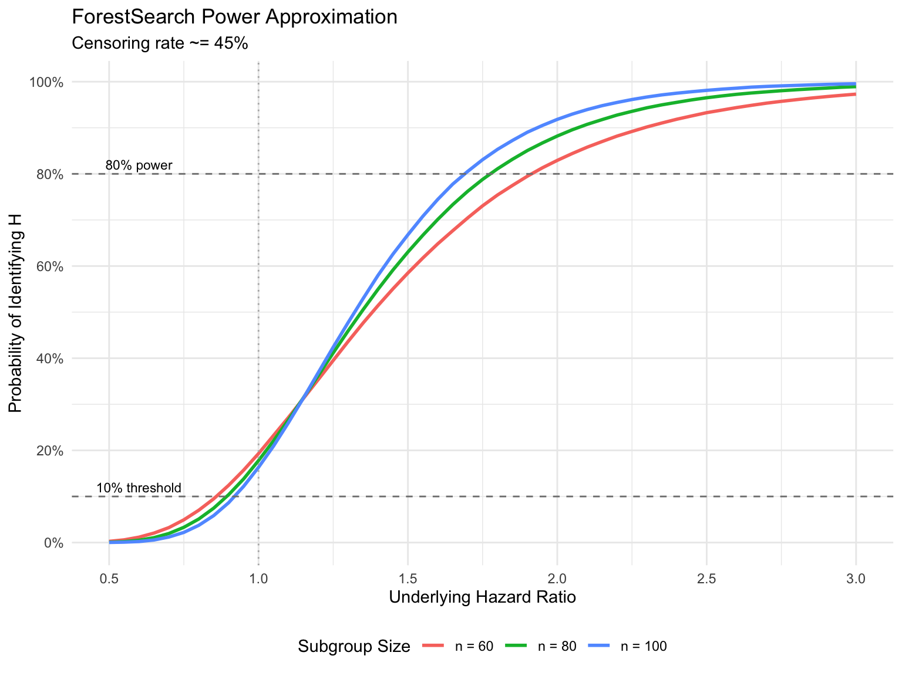

# Methodology

## 1 Introduction

ForestSearch is a procedure for identifying subgroups with large
treatment effects in clinical trials with survival endpoints, with
particular focus on subgroups where treatment may be potentially
detrimental. The approach is relatively simple and flexible, screening
all possible subgroups based on hazard ratio thresholds indicative of
harm with assessment according to the standard Cox model. By reversing
the role of treatment, one can also seek to identify subgroups with
substantial benefit.

This vignette provides a detailed summary of the methodology as
described in Leon et al. (2024), *“Exploratory subgroup identification
in the heterogeneous Cox model: A relatively simple procedure”*,
published in *Statistics in Medicine*. Source code and replication
materials are available at <https://github.com/larry-leon/forestSearch>.

### 1.1 Motivation

In oncology trials, subgroup analyses via forest plots are standard
presentations in regulatory reviews and clinical publications. The goal
is typically to evaluate the consistency of treatment effects across
pre-specified subgroups relative to the intention-to-treat (ITT)
population. The European Medicines Agency guideline on subgroups further
describes scenarios where there is interest “to identify post-hoc a
subgroup where efficacy and risk-benefit is convincing” or “in
identifying a subgroup, where a relevant treatment effect and compelling
evidence of a favorable risk-benefit profile can be assessed.”

However, there may be important subgroups based on patient
characteristics that are not anticipated or well understood.
ForestSearch addresses this need for exploratory subgroup identification
with the following goals:

- **Identify** an underlying subgroup $`H`$ consisting of subjects who
  derive the least benefit (or potential harm) from treatment
- **Estimate** treatment effects within identified subgroups with
  appropriate bias correction
- **Validate** findings through cross-validation to assess stability

### 1.2 Key Features

1.  **Split-sample consistency evaluation** to identify subgroups
    “maximally consistent with harm”
2.  **Bootstrap bias correction** using infinitesimal jackknife variance
    estimation
3.  **Variable selection** via LASSO and/or Generalized Random Forests
    (GRF)
4.  **Cross-validation** for assessing algorithmic stability
5.  **Reversibility**: by switching the treatment indicator, the same
    framework can identify subgroups with substantial *benefit*

## 2 Statistical Framework

### 2.1 The Cox Model Setting

Consider the two-sample random censorship model with $`N`$ observations
from a randomized clinical trial. Let $`T`$ denote the survival time,
$`C`$ the censoring time, $`V`$ the treatment assignment, and
$`\boldsymbol{Z} = (Z_1, Z_2, \ldots, Z_p)`$ a $`p`$-dimensional
collection of baseline covariates. We observe the possibly censored
survival time $`Y = \min(T, C)`$ with $`\Delta = I(T \le C)`$ the event
indicator. The observations $`(V_i, \boldsymbol{Z}_i, Y_i, \Delta_i)`$
for $`i = 1, \ldots, N`$ are assumed to be iid replicates.

ForestSearch is based on the standard Cox model fitted within candidate
subgroups:

``` math

\lambda(t; V) = \lambda_0(t) \exp(\beta V),
 \qquad(1)
```

where $`\lambda_0(t)`$ is the baseline hazard and $`\beta`$ is the
log-hazard ratio for treatment. This is the standard model used in
oncology forest plot summaries—adjusted for treatment only.

### 2.2 Type-1 Error Framework

Heterogeneous treatment effects are assumed to be induced by the
existence of a detrimental subgroup $`H`$ with true marginal hazard
ratio $`\theta^{\dagger}(H) > 1`$, where the size of $`H`$ is at least
60 subjects with an underlying expected event count $`d`$. Two type-1
error scenarios for false subgroup identification are defined:

1.  **Scenario (i):** A subgroup $`H`$ is identified where in truth
    $`\theta^{\dagger}(H) \le 1`$ (non-detrimental), even though
    heterogeneous effects may exist via a mixture of true $`H`$ and
    $`H^c`$.
2.  **Scenario (ii):** The treatment effect is uniformly beneficial,
    $`\theta^{\dagger}(\text{ITT}) < 1`$, so no detrimental subgroup
    effects exist.

### 2.3 Marginal vs. Controlled Direct Effects

An important distinction in Forest Search is between marginal hazard
ratios $`\theta^{\dagger}(\cdot)`$ and controlled direct effects (CDEs)
$`\theta^{\ddagger}(\cdot)`$. For a data-generating model with hazard
function:

``` math

\lambda_v(t; \boldsymbol{z}) = \lambda_0(t) \exp(\gamma_0 v +
\gamma_1 v z_1 z_3 + \boldsymbol{\gamma}_2' \boldsymbol{z}_2),
 \qquad(2)
```

the CDEs are $`\theta^{\ddagger}(H) = \exp(\gamma_0 + \gamma_1)`$ and
$`\theta^{\ddagger}(H^c) = \exp(\gamma_0)`$. As Aalen et al. (2015)
describe, marginal effects for $`H`$ and $`H^c`$ can differ
substantially from the CDEs. Forest Search targets marginal hazard
ratios via the unadjusted Cox model, which is the standard approach in
oncology forest plots.

## 3 The ForestSearch Algorithm

The ForestSearch algorithm proceeds through four main steps:

### 3.1 Step 1: Construct Candidate Factors

For candidate baseline factors $`X_k`$, $`k = 1, \ldots, K`$, construct
dummy indicators for each unique factor level.

Let $`l_k`$ denote the unique number of values with
$`L = \sum_{k=1}^{K} l_k`$ the number of possible single-factor
subgroups.

**Example:** If $`X_1`$ denotes age cut at 50 years and $`X_2`$ denotes
gender, then $`L = 4`$:

- age $`\le`$ 50
- age $`>`$ 50
- gender = male
- gender = female

Let $`J_1, \ldots, J_L`$ denote the resulting subgroup indicators. For
example, for age cut at 50 years:

- $`J_1 = I(\text{age} \leq 50)`$ indicates membership in the “50 and
  younger” subgroup
- $`J_2 = I(\text{age} > 50)`$ indicates membership in the “older than
  50” subgroup

Each $`J_1, \ldots, J_L`$ and non-null combinations between them (e.g.,
“males 50 and younger”) represents a potential subgroup.

For continuous covariates, binary splits are generated via:

- **LASSO** (Cox regularization via `glmnet`): selects prognostic
  factors
- **GRF** (causal survival forests): selects candidate factors and
  splits based on RMST heterogeneity
- **Quartile cuts**: splitting at the mean, median, $`q_1`$, and $`q_3`$

Any combination of the above can be used. Two standard configurations
are:

- $`FS_l`$: LASSO only for candidate selection
- $`FS_{lg}`$: LASSO + GRF for candidate selection

### 3.2 Step 2: Enumerate Candidate Subgroups

There are $`2^L - 1`$ all-possible subgroup combinations. We restrict to
those based on **at most two factors**. The total number of possible
two-factor combinations is:

``` math

\binom{L}{2} + L = \frac{L(L-1)}{2} + L
```

As a minimal sample size criterion, we further restrict to candidate
subgroup combinations with:

- Minimum size of 60 subjects
- Minimum of 10 events in each treatment arm

Let $`\{G_s, s = 1, \ldots, S\}`$ denote the collection of subgroups
meeting the sample size criteria where $`S \leq L(L-1)/2 + L`$.

### 3.3 Step 3: Screening and Consistency Evaluation

#### 3.3.1 3a. Hazard Ratio Screening

For subgroup $`G_s`$ (of size $`\ge`$ 60 and at least 20 events),
estimate the Cox model log-hazard ratio $`\hat{\beta}_s`$, and consider
the subgroup as a candidate if:

``` math

\hat{\beta}_s \geq \log(1.25).
```

This corresponds to a hazard ratio threshold of 1.25, indicating
potential harm.

#### 3.3.2 3b. Split-Sample Consistency

To judge the “consistency with harm”:

1.  Randomly split the $`G_s`$ subgroup 50/50
2.  Estimate the log-hazard ratio in each of these 2 random splits
3.  Consider this subgroup to be “consistent with harm” if, for each
    random split, **both** splits have estimated log-hazard ratios
    $`\ge \log(1.0) = 0`$

That is, $`\min(\hat{\beta}_s^1, \hat{\beta}_s^2) \geq \log(1.0)`$ for
log-hazard ratio estimate pairs $`\{\hat{\beta}_s^1, \hat{\beta}_s^2\}`$
corresponding to each random split.

#### 3.3.3 3c. Consistency Rate Estimation

Repeat many times (e.g., $`R = 400`$) to estimate the consistency rate.
Let $`\{\hat{\beta}_s^{1r}, \hat{\beta}_s^{2r}\}`$ denote pairs for the
$`r`$th random split for $`r = 1, \ldots, R`$. The consistency rate is:

``` math

\hat{p}_{\text{consistency}} = \frac{1}{R} \sum_{r=1}^{R}
I\!\left(\min(\hat{\beta}_s^{1r}, \hat{\beta}_s^{2r}) \geq 0\right).
 \qquad(3)
```

### 3.4 Step 4: Subgroup Selection

For subgroups with consistency rates at least 90%, choose the subgroup
with the highest consistency rate as the estimated $`H`$, denoted
$`\widehat{H}`$ (“maximally consistent”).

If no subgroup achieves consistency $`\ge`$ 90%, then consider $`H`$ as
null ($`\widehat{H} = \emptyset`$).

For the complementary group, $`H^c`$ is estimated as the complement of
$`\widehat{H}`$, denoted $`\widehat{H}^c`$. If $`\widehat{H}`$ is null,
then $`\widehat{H}^c`$ is the ITT population.

### 3.5 Selection Criteria Variants

Step 4 can be modified in several ways:

| `sg_focus` | Description |
|----|----|
| `"hr"` | Maximize consistency rate (default) |
| `"maxSG"` | Select largest subgroup among those with consistency $`\ge`$ threshold |
| `"minSG"` | Select smallest subgroup among those with consistency $`\ge`$ threshold |
| `"hrMaxSG"` | Among consistent candidates, select largest with best HR |
| `"hrMinSG"` | Among consistent candidates, select smallest with best HR |

Table 1: ForestSearch subgroup selection criteria.

Additional constraints can include median survival thresholds for the
experimental arm, control arm, or both.

ForestSearch Algorithm Overview

## 4 Asymptotic Considerations

### 4.1 Power Approximation

We can approximate the probability of identifying subgroup $`H`$ via
numerical integration. Let
$`W_1, W_2 \stackrel{iid}{\sim} N(\beta, 8/d)`$ where
$`\beta = \log(\theta^{\dagger}(H))`$ and $`d`$ is the expected number
of events in the subgroup.

The screening criterion $`\hat{\beta}_s \ge \log(1.25)`$ is equivalent
(approximately) to:

``` math

\hat{\beta}_s^1 + \hat{\beta}_s^2 \ge 2\log(1.25),
 \qquad(4)
```

since $`\hat{\beta}_s \approx (\hat{\beta}_s^1 + \hat{\beta}_s^2)/2`$ by
construction of the random splitting.

For a subgroup $`H`$ with underlying log-hazard ratio $`\beta`$, we can
approximate the probability of identifying $`H`$ via:
$`P(\text{identify } H) \approx`$

``` math

\int \int I(w_1 + w_2 \geq 2\log(1.25)) \cdot I(w_1 \geq 0) \cdot
I(w_2 \geq 0) \cdot \varphi(w_1; \beta, 8/d) \cdot
\varphi(w_2; \beta, 8/d) \, dw_1 \, dw_2,
 \qquad(5)
```

where $`\{W_1, W_2\} \sim N(\beta, 8/d)`$ independently, and
$`\varphi(\cdot; \beta, 8/d)`$ denotes the normal density with mean
$`\beta`$ and variance $`8/d`$.

The following is based on Monte Carlo simulations. The package also
contains a numerical integration implementation that is illustrated in
the simulation vignette materials.

Code

``` r
# Power approximation function
approx_power <- function(hr, n_subgroup, cens_rate = 0.45) {
  beta <- log(hr)
  d <- (1 - cens_rate) * n_subgroup
  var_split <- 8 / d

  # Numerical integration
  integrate_2d <- function(beta, var) {
    # Use Monte Carlo integration
    set.seed(123)
    n_sim <- 100000
    w1 <- rnorm(n_sim, mean = beta, sd = sqrt(var))
    w2 <- rnorm(n_sim, mean = beta, sd = sqrt(var))

    mean((w1 + w2 >= 2 * log(1.25)) & (w1 >= 0) & (w2 >= 0))
  }

  integrate_2d(beta, var_split)
}

# Calculate power curves
hr_seq <- seq(0.5, 3.0, by = 0.05)
n_values <- c(60, 80, 100)

power_data <- expand.grid(hr = hr_seq, n = n_values)
power_data$power <- mapply(approx_power, power_data$hr, power_data$n)
power_data$n <- factor(power_data$n, labels = paste("n =", n_values))

library(ggplot2)
ggplot(power_data, aes(x = hr, y = power, color = n)) +
  geom_line(linewidth = 1) +
  geom_hline(yintercept = 0.10, linetype = "dashed", color = "gray50") +
  geom_hline(yintercept = 0.80, linetype = "dashed", color = "gray50") +
  geom_vline(xintercept = 1.0, linetype = "dotted", color = "gray70") +
  scale_x_continuous(breaks = seq(0.5, 3.0, by = 0.5)) +
  scale_y_continuous(breaks = seq(0, 1, by = 0.2), labels = scales::percent) +
  labs(
    x = "Underlying Hazard Ratio",
    y = "Probability of Identifying H",
    color = "Subgroup Size",
    title = "ForestSearch Power Approximation",
    subtitle = "Censoring rate ~= 45%"
  ) +
  theme_minimal() +
  theme(legend.position = "bottom") +
  annotate("text", x = 0.6, y = 0.12, label = "10% threshold", size = 3) +
  annotate("text", x = 0.6, y = 0.82, label = "80% power", size = 3)
```



Approximate probability of finding H via ForestSearch

### 4.2 Threshold Selection Rationale

The choice of the 1.25 and 1.0 thresholds was based on the desire to
control the rate for finding a subgroup $`H`$ to be approximately 10%
when the underlying hazard ratio for $`H`$ is below 1.0.

If the underlying treatment effect is uniform and beneficial, then for a
random subgroup $`H`$, Cox model estimates will randomly fluctuate
around the ITT effect. Because ForestSearch seeks subgroups with
evidence for harm (via the screening and consistency thresholds), the
chance of forming subgroups under the null with an estimated benefit
randomly in favor of control is less likely the stronger the (uniform)
ITT treatment effect.

**Example:** For
$`\theta^{\dagger}(H) \equiv \theta^{\dagger}(\text{ITT}) = 0.75`$, the
approximation yields:

| Subgroup size | Type-1 error ($`\theta^{\dagger}(H) = 0.75`$) | $`\approx`$ 80% power at |
|:--:|:--:|:--:|
| $`n = 60`$ | 4.9% | HR $`\approx`$ 1.94 |
| $`n = 80`$ | 3.3% | HR $`\approx`$ 1.81 |
| $`n = 100`$ | 2.2% | HR $`\approx`$ 1.73 |

Table 2: Type-1 error and approximate 80% power thresholds.

## 5 Bootstrap Bias Correction

### 5.1 Sources of Bias

By the nature of the ForestSearch procedure, we expect unadjusted Cox
model estimates based on $`\widehat{H}`$ to be **upwardly biased** due
to the hazard ratio thresholds (since by construction, point estimates
are $`\ge 1.25`$ for $`\widehat{H}`$).

However, the bias can also be pressured in the opposite direction
depending on:

- The proportion of $`H^c`$ subjects incorrectly included in
  $`\widehat{H}`$
- The value of $`\theta^{\dagger}(H)`$ relative to
  $`\theta^{\dagger}(H^c)`$ (e.g., a mixture of
  $`\theta^{\dagger}(H) = 2.0`$ vs. $`\theta^{\dagger}(H^c) = 0.65`$)

### 5.2 Bias-Corrected Estimator

For bias correction, we proceed on the Cox regression coefficient scale,
denoted $`\hat{\beta}(\widehat{H})`$, and then exponentiate to obtain
point estimates and confidence intervals for hazard ratios
$`\hat{\theta}(\widehat{H}) := \exp(\hat{\beta}(\widehat{H}))`$.

Our bias-corrected estimator takes into account **two sources of bias**
involving the discrepancies between the bootstrapped and observed data
Cox estimators. The approach is along the lines of Harrell et
al. (1996), but additionally incorporates the bias term
$`\hat{\beta}_b^*(\widehat{H}) - \hat{\beta}(\widehat{H})`$.

#### 5.2.1 Notation

For the observed data with estimated subgroup $`\widehat{H}`$:

- $`\hat{\beta}(\widehat{H})`$: Estimated Cox model regression parameter

For bootstrap samples $`b = 1, \ldots, B`$ with estimated subgroup
$`\widehat{H}^*_b`$:

- $`\hat{\beta}^*_b(\widehat{H}^*_b)`$: Cox model parameter for
  bootstrap sample based on bootstrap-estimated subgroup
- $`\hat{\beta}(\widehat{H}^*_b)`$: Cox model parameter for observed
  data based on bootstrap-estimated subgroup
- $`\hat{\beta}^*_b(\widehat{H})`$: Cox model parameter for bootstrap
  sample based on observed subgroup

#### 5.2.2 Bias Terms

Define the bias terms:

``` math

\eta^*_b(\widehat{H}^*_b) = \hat{\beta}^*_b(\widehat{H}^*_b) -
\hat{\beta}(\widehat{H}^*_b)
```

``` math

\eta^*_b(\widehat{H}) = \hat{\beta}^*_b(\widehat{H}) -
\hat{\beta}(\widehat{H})
```

#### 5.2.3 Bias-Corrected Estimators

The bias-corrected estimators are defined as:

``` math

\hat{\beta}^*(\widehat{H}) = \hat{\beta}(\widehat{H}) -
\frac{1}{B}\sum_{b=1}^{B} \left[\eta^*_b(\widehat{H}^*_b) +
\eta^*_b(\widehat{H})\right], \qquad
\hat{\theta}^*(\widehat{H}) =
\exp\!\left(\hat{\beta}^*(\widehat{H})\right)
 \qquad(6)
```

Similarly for the complement:

``` math

\hat{\beta}^*(\widehat{H}^c) = \hat{\beta}(\widehat{H}^c) -
\frac{1}{B}\sum_{b=1}^{B} \left[\eta^*_b(\widehat{H}^{c*}_b) +
\eta^*_b(\widehat{H}^c)\right], \qquad
\hat{\theta}^*(\widehat{H}^c) =
\exp\!\left(\hat{\beta}^*(\widehat{H}^c)\right)
 \qquad(7)
```

The bootstrap resamples are drawn independently with replacement from
the observed data
$`\{O_i := (V_i, \boldsymbol{Z}_i, Y_i, \Delta_i),\; i = 1, \ldots, N\}`$.
The full ForestSearch algorithm (including LASSO and/or GRF candidate
selection) is mimicked in each bootstrap replicate. In general, the
variance induced by the (well-defined) candidate selection algorithm is
incorporated by mimicking the algorithm in the bootstrap process.

### 5.3 Infinitesimal Jackknife Variance Estimation

To estimate the variance, we apply an **infinitesimal jackknife
approximation**, viewing the bias-corrected estimators as “bagged
estimators.”

Let $`O^*_b = \{O^*_{b1}, O^*_{b2}, \ldots, O^*_{bN}\}`$ denote
bootstrap sample $`b`$. Let $`K^*_{bi} = \#\{O^*_{bj} = O_i\}`$ denote
the number of times observation $`O_i`$ is drawn for the $`b`$th
bootstrap sample, and let
$`\bar{K}^*_i = (1/B)\sum_{b=1}^{B} K^*_{bi}`$.

The infinitesimal jackknife variance estimate is:

``` math

\tilde{V} = \sum_{i=1}^{N} \widetilde{\text{cov}}_i^2
```

where:

``` math

\widetilde{\text{cov}}_i = \frac{1}{B} \sum_{b=1}^{B}
(K^*_{bi} - \bar{K}^*_i)
\left[\hat{\beta}(\widehat{H}) - \eta^*_b(\widehat{H}^*_b) -
\eta^*_b(\widehat{H}) - \hat{\beta}^*(\widehat{H})\right]
```

The bias-corrected variance is:

``` math

\hat{V} = \tilde{V} - \frac{N}{B} \tilde{\sigma}^2_B
 \qquad(8)
```

where:

``` math

\tilde{\sigma}^2_B = \frac{1}{B} \sum_{b=1}^{B}
\left[\hat{\beta}(\widehat{H}) - \eta^*_b(\widehat{H}^*_b) -
\eta^*_b(\widehat{H}) - \hat{\beta}^*(\widehat{H})\right]^2
```

Confidence intervals for hazard ratios are based on standard normal
approximations (exponentiated):
$`\exp\!\left(\hat{\beta}^* \pm 1.96\sqrt{\hat{V}}\right)`$.

Bootstrap Bias Correction Workflow

## 6 Cross-Validation

Cross-validation is used for evaluating the quality and stability of the
selection algorithm. Two forms are implemented.

### 6.1 N-Fold (Leave-One-Out) Cross-Validation

For N-fold CV, we exclude each subject ($`i = 1, \ldots, N`$) from the
analysis and predict their $`\widehat{H}`$ (or $`\widehat{H}^c`$)
classification based on the remaining $`N-1`$ subjects.

Let $`\hat{\pi}^{-i}(\boldsymbol{Z}_i)`$ denote the $`i`$th subject’s
predicted classification based on the FS procedure without the subject
in the analysis. Similarly, $`\hat{\pi}(\boldsymbol{Z}_i)`$ is the FS
classification based on the full sample analysis. Form:

``` math

\widehat{O}_{CV} = \{\hat{O}_i := (V_i, Y_i, \Delta_i,
\hat{\pi}(\boldsymbol{Z}_i), \hat{\pi}^{-i}(\boldsymbol{Z}_i)),\;
i = 1, \ldots, N\}.
```

Cox model analyses based on $`\hat{\pi}(\cdot)`$ subgroups correspond to
estimates that are unadjusted for the selection algorithm, whereas
$`\hat{\pi}^{-i}(\cdot)`$ represents an out-of-bag (OOB) classification
where each subject is not included in the selection algorithm from which
they are classified.

**Interpretation:**

- Correspondence between $`\hat{\pi}(\cdot)`$ and
  $`\hat{\pi}^{-i}(\cdot)`$ subgroup analysis results may be
  anticipated, especially for large $`N`$
- If $`\hat{\pi}`$ and $`\hat{\pi}^{-i}`$ are identical, there is no
  diagnostic value; in contrast, substantial lack of correspondence may
  suggest underlying instability

### 6.2 K-Fold Cross-Validation

In K-fold CV (e.g., 10-fold):

1.  Randomly partition the data into K folds
2.  For each fold (leaving these subjects out), select $`\widehat{H}`$
    based on the other K-1 folds
3.  Predict the classification for the left-out fold

Since this process depends on the random partition, repeat 50–200 times
and summarize correspondence measures across the partitions.

### 6.3 CV Metrics

The sensitivity and positive predictive value metrics are modified by
replacing $`\widehat{H}`$ with $`\widehat{H}^{-i}`$ and the true $`H`$
with $`\widehat{H}`$:

``` math

\text{sensCV}(\widehat{H}) =
\frac{\#\{i \in \widehat{H}^{-i} \cap \widehat{H}\}}
     {\#\{i \in \widehat{H}\}}, \qquad
\text{ppvCV}(\widehat{H}) =
\frac{\#\{i \in \widehat{H}^{-i} \cap \widehat{H}\}}
     {\#\{i \in \widehat{H}^{-i}\}}.
 \qquad(9)
```

| Metric | Description | Interpretation |
|:---|:---|:---|
| sensCV(Ĥ) | Proportion of full-analysis Ĥ subjects also classified as Ĥ in CV | Higher = more stable Ĥ identification |
| sensCV(Ĥᶜ) | Proportion of full-analysis Ĥᶜ subjects also classified as Ĥᶜ in CV | Higher = more stable Ĥᶜ identification |
| ppvCV(Ĥ) | Proportion of CV Ĥ subjects that match full-analysis Ĥ | Higher = CV predictions align with full analysis |
| ppvCV(Ĥᶜ) | Proportion of CV Ĥᶜ subjects that match full-analysis Ĥᶜ | Higher = CV predictions align with full analysis |
| Exact Match | Proportion of CV folds reproducing exact subgroup definition | Higher = algorithm consistently identifies same subgroup |

Cross-Validation Metrics for ForestSearch

## 7 Simulation Study

### 7.1 Data-Generating Model

The simulation setting is based on the German Breast Cancer Study Group
(GBSG) trial covariate structure. A “super-population” of 5,000 subjects
was constructed by resampling from the observed GBSG data while
retaining covariate structure. Survival outcomes were generated from a
Weibull regression model:

``` math

\log(T) = \mu + \beta_0 V + \beta_1 V Z_1 Z_3 +
\boldsymbol{\beta}_2' \boldsymbol{Z}_2 + \tau \epsilon,
 \qquad(10)
```

where $`\epsilon`$ follows the standard extreme value distribution,
$`\tau`$ is a dispersion parameter,
$`\boldsymbol{Z}_2 = (Z_1, Z_2, Z_3, Z_4, Z_5)`$, and the interaction
$`V Z_1 Z_3`$ defines the true subgroup
$`H = \{Z_1 = 1\} \cap \{Z_3 = 1\}`$. Parameters $`\mu`$,
$`\boldsymbol{\beta}_2`$, and $`\tau`$ were based on Weibull model fits
to the observed GBSG data; $`\beta_0`$ and $`\beta_1`$ were chosen to
generate target marginal hazard ratio effects. A covariate-dependent
censoring distribution was generated analogously with an overall
censoring rate of approximately 46%.

### 7.2 Scenarios

Three models were evaluated across 20,000 simulations:

| Model | Condition |  N  | p_H (%) | θ†(ITT) | θ†(H) | θ†(Hc) |
|:-----:|:---------:|:---:|:-------:|:-------:|:-----:|:------:|
|  M1   |   Null    | 700 |   \-    |  0.70   |  \-   |   \-   |
|  M1   |    Alt    | 700 |   13%   |  0.71   |  2.0  |  0.65  |
|  M2   |   Null    | 500 |   \-    |  0.69   |  \-   |   \-   |
|  M2   |    Alt    | 500 |   20%   |  0.79   |  2.0  |  0.69  |
|  M3   |   Null    | 300 |   \-    |  0.55   |  \-   |   \-   |
|  M3   |    Alt    | 300 |   30%   |  0.74   |  2.0  |  0.56  |

Simulation model specifications.

Each model was evaluated with and without additional random noise
factors ($`N(0,1)`$ variables completely unrelated to the outcome): 3
noise factors for $`M_1`$, and 5 noise factors for $`M_2`$ and $`M_3`$.

### 7.3 Comparator Methods

ForestSearch was compared against:

- **GRF / GRF.60**: Generalized random forests targeting RMST, with
  GRF.60 using a truncated horizon
  $`\tau_{60} = 0.6\min(\tau_0, \tau_1)`$ for stability. Requires
  $`\ge`$ 6-month RMST benefit for control.
- **VT(24) / VT(36)**: Virtual twins targeting survival rate differences
  at 24 or 36 months. Requires $`\delta \ge 0.225`$ in favor of control.

All methods were restricted to subgroups with $`\ge`$ 60 subjects and
maximum tree depth of 2. Classification accuracy is measured by
sensitivity and positive predictive value:

``` math

\text{sens}(\widehat{H}) =
\frac{\#\{i \in \widehat{H} \cap H\}}{\#\{i \in H\}}, \qquad
\text{ppv}(\widehat{H}) =
\frac{\#\{i \in \widehat{H} \cap H\}}{\#\{i \in \widehat{H}\}}.
 \qquad(11)
```

### 7.4 Key Results: Subgroup Identification

| Method | T1E | Power | sens(Ĥ) | T1E | Power | sens(Ĥ) |
|:-------|:---:|:-----:|:-------:|:---:|:-----:|:-------:|
| FS_l   | 2%  |  71%  |   64%   | 3%  |  89%  |   77%   |
| FS_lg  | 11% |  83%  |   74%   | 14% |  96%  |   81%   |
| GRF    | 61% |  94%  |   66%   | 60% |  99%  |   70%   |
| GRF.60 | 27% |  71%  |   52%   | 32% |  86%  |   58%   |
| VT(24) | 4%  |  44%  |   37%   | 4%  |  56%  |   44%   |
| VT(36) | 6%  |  42%  |   34%   | 6%  |  53%  |   40%   |

Subgroup identification results with noise factors. T1E = type-1 error
(any(H) under null); Power = any(H) under alternative; sens(H-hat) =
sensitivity for H classification under alternative.

**Summary of identification results:**

- $`FS_l`$ maintained type-1 error $`\le 3\%`$ across all scenarios,
  including with noise factors, and was the most stable approach
- $`FS_{lg}`$ had slightly elevated type-1 error (up to 14% with noise,
  inherited from GRF) but achieved the highest classification accuracy
  among approaches with well-controlled type-1 error
- GRF had substantially inflated type-1 error (up to 61% with noise)
  under $`M_1`$ and $`M_2`$; intuitively, with the addition of noise
  factors there was more opportunity to randomly form erroneous splits
- Under $`M_3`$ (strongest ITT effect,
  $`\theta^{\dagger}(\text{ITT}) = 0.55`$), all approaches had
  better-controlled type-1 error since the chance of forming subgroups
  with estimates in favor of control is less likely with a more
  pronounced ITT treatment effect
- The power approximation from [Equation 5](#eq-power) was reasonably
  accurate across all models

### 7.5 Key Results: Estimation Properties

Estimation properties for $`FS_{lg}`$ with $`B = 300`$ bootstrap
replicates (based on 1,000 simulations per model with noise factors):

| Estimator              | Rel. bias (marginal) | Rel. bias (CDE) | Oracle coverage |
|:-----------------------|:--------------------:|:---------------:|:---------------:|
| θ̂(Ĥ) observed          |      9% to 24%       |    9% to 14%    |     \>= 98%     |
| θ̂\*(Ĥ) bias-corrected  |    -10% to -2.4%     | -11.6% to -6.3% |     \>= 95%     |
| θ̂(Ĥᶜ) observed         |     0.5% to 5.1%     |  -9.7% to 2.8%  |     \>= 99%     |
| θ̂\*(Ĥᶜ) bias-corrected |    2.3% to 10.9%     |  -4.8% to 4.6%  |    \>= 100%     |

Estimation properties for FS_lg across models M1-M3. Relative bias
ranges shown across the three models. Oracle coverage = CI coverage for
the oracle (true subgroup) estimate.

The bias-corrected estimators tend to be **conservative**:
underestimating both $`\theta^{\dagger}(H)`$ and
$`\theta^{\ddagger}(\widehat{H})`$ (“conservative for harm”) while
overestimating both $`\theta^{\dagger}(H^c)`$ and
$`\theta^{\ddagger}(\widehat{H}^c)`$ (“conservative for benefit”).
Coverage rates for $`\hat{\theta}^*(\widehat{H}^c)`$ were $`\ge 93\%`$
for each target, and the oracle coverage rates for both estimators were
$`\ge 95\%`$.

## 8 Applications

### 8.1 GBSG Breast Cancer Trial

The German Breast Cancer Study Group trial ($`N = 686`$) compared
tamoxifen (hormonal therapy) to chemotherapy for tumor recurrence. The
observed censoring rate was approximately 56%, and the Cox ITT hazard
ratio estimate was 0.69 (95% CI: 0.54, 0.89). Seven baseline prognostic
factors were available.

**ForestSearch results:** Using the selection criterion for the
*largest* subgroup with consistency $`\ge`$ 90%, with LASSO followed by
quartile cuts on continuous factors, and GRF ($`GRF_{60}`$) for
additional candidate selection:

- $`\widehat{H}`$ = Estrogen = 0 (consistency rate 95.1%)
- $`\hat{\theta}^*(\widehat{H}) = 1.58`$ (0.86, 2.9) — 82 subjects (12%)
- $`\hat{\theta}^*(\widehat{H}^c) = 0.64`$ (0.44, 0.93) — 604 subjects
  (88%)

The bias-corrected estimate for $`H^c`$ suggests a slightly stronger
benefit (0.64 vs 0.69 for ITT) that is statistically significant.

**Cross-validation:** N-fold CV showed perfect stability (all 686
training sets reproduced Estrogen = 0). Across 200 random 10-fold CV
analyses, the median number of folds identifying a subgroup was 9/10,
with $`\text{sensCV}(\widehat{H}) = 73\%`$ and
$`\text{ppvCV}(\widehat{H}) = 83\%`$.

**Biological plausibility:** Tamoxifen is a selective estrogen receptor
(ER) modulator with limited efficacy in ER-negative tumors. A
patient-level meta-analysis by the Early Breast Cancer Trialists’
Collaborative Group found for ER-negative (ER = 0) subjects, the
event-rate ratio was 1.11 (SE = 0.13); whereas for ER-positive
($`\ge 10\%`$) subjects it was 0.62 (SE = 0.03).

### 8.2 ACTG-175 HIV Trial

The ACTG-175 study ($`N = 1{,}083`$) compared zidovudine + didanosine
(experimental) to didanosine monotherapy (control). The survival outcome
was the first occurrence of CD4 decline $`\ge`$ 50, AIDS progression, or
death. The Cox ITT hazard ratio estimate was 0.84 (0.65, 1.09), with 15
baseline covariates available.

**Goal:** Identify a subgroup with *substantial benefit* by reversing
treatment roles (screening threshold $`\log(1/0.6)`$, consistency
threshold $`\log(1/0.8)`$), selecting the largest subgroup with
consistency $`\ge`$ 90%.

**ForestSearch results:**

- $`\widehat{Q}`$ = Preanti $`\le`$ 744.5 and Age $`>`$ 34 (consistency
  92.8%)
- $`\hat{\theta}^*(\widehat{Q}) = 0.59`$ (0.37, 0.94) — 382 subjects
  (35%)
- $`\hat{\theta}^*(\widehat{Q}^c) = 0.95`$ (0.65, 1.41) — 701 subjects
  (65%)

The bias-corrected estimate suggests a relatively strong benefit (0.59
vs 0.84 for ITT) that is statistically significant.

**Cross-validation:** N-fold CV reproduced the full analysis subgroup
definition in all but 7 of 1,083 training sets. The N-fold predicted Cox
estimate was 0.59 (0.37, 0.94), identical to the bootstrap
bias-corrected estimate. Across 200 random 10-fold analyses, median 9/10
folds identified a subgroup with
$`\text{sensCV}(\widehat{Q}) \approx 69\%`$.

**Biological plausibility:** The finding aligns with the HIV Trialists’
Collaborative Group meta-analysis reporting greater treatment effects
among participants with no previous antiretroviral therapy or higher
baseline CD4 counts. Of the $`\widehat{Q}`$ subgroup, 46.9% were
antiretroviral treatment naive.

## 9 Variable Selection Methods

### 9.1 LASSO

LASSO (Least Absolute Shrinkage and Selection Operator) is used for Cox
model covariate (prognostic) selection via `glmnet`. In simulations,
LASSO helps mitigate false discovery when analyses include baseline
factors that are completely random noise.

``` r
# LASSO is enabled by default
result <- forestsearch(
  df.analysis = data,
  use_lasso = TRUE,
  use_grf = FALSE,
  ...
)
```

### 9.2 Generalized Random Forests (GRF)

GRF targets RMST (Restricted Mean Survival Time) via causal survival
forests and can be used as a complementary variable selection method. In
ForestSearch, GRF is used for identifying candidate factors (binary
splits) rather than as the primary identification procedure.

``` r
# Enable both LASSO and GRF
result <- forestsearch(
  df.analysis = data,
  use_lasso = TRUE,
  use_grf = TRUE,
  ...
)
```

### 9.3 Recommendations

| Scenario | Recommendation |
|----|----|
| Standard analysis | `use_lasso = TRUE, use_grf = FALSE` |
| Exploratory with many candidates | `use_lasso = TRUE, use_grf = TRUE` |
| When noise factors may be present | Always include LASSO |
| Large datasets with complex interactions | Consider GRF for variable importance |

Table 3: Variable selection recommendations.

In the ACTG-175 analysis, when 20 random noise factors were artificially
added without LASSO, ForestSearch identified a nonsensical subgroup
based on a noise factor. In contrast, when LASSO was included, the same
subgroup and essentially the same bootstrap bias-corrected estimates
were obtained.

## 10 Practical Considerations

### 10.1 Sample Size Requirements

- **Minimum subgroup size:** 60 subjects (default `n.min = 60`)
- **Minimum events:** 10–12 per treatment arm (default `d0.min = 12`,
  `d1.min = 12`)
- **Recommended trial size:** $`N \ge 300`$ for Phase 2; $`N \ge 500`$
  for Phase 3

### 10.2 Computational Considerations

The computational time depends on the number of candidate factors
($`K`$), the number of subgroup combinations meeting size criteria
($`S`$), the number of consistency splits (`fs.splits`, default
400–1000), the number of bootstrap iterations ($`B`$, typically
300–2000), and the number of CV repetitions.

**Typical timing** (Apple M1, 20 cores):

| Component                 | Time                      |
|---------------------------|---------------------------|
| FS analysis               | $`\sim`$ 0.05–0.2 minutes |
| 2000 bootstraps           | $`\sim`$ 29–30 minutes    |
| N-fold CV                 | $`\sim`$ 4–22 minutes     |
| 200 $`\times`$ 10-fold CV | $`\sim`$ 59–105 minutes   |

Table 4: Computational timing for ForestSearch. Parallel computing is
implemented via the `doFuture` package.

### 10.3 Interpretation Guidelines

1.  **Bias-corrected estimates** should be reported alongside unadjusted
    estimates
2.  **Cross-validation metrics** provide diagnostic value for stability
3.  **Biological plausibility** should be evaluated using external
    knowledge (e.g., patient-level meta-analyses of randomized trials)
4.  **Results are exploratory** and should inform future trial design
    rather than definitive conclusions
5.  **Conservative estimation**: the bias-corrected estimators tend to
    underestimate harm and overestimate benefit, which is a favorable
    property for exploratory subgroup analyses
6.  **Caution against extrapolation**: findings should not be
    extrapolated to comparisons of regimens other than the control
    regimens studied

## 11 References

Athey, Susan, Julie Tibshirani, and Stefan Wager. 2019. “Generalized
Random Forests.” *The Annals of Statistics* 47 (2): 1148–78.

## 12 Session Information

Code

``` r
sessionInfo()
```

    R version 4.5.1 (2025-06-13)
    Platform: aarch64-apple-darwin20
    Running under: macOS Tahoe 26.2

    Matrix products: default
    BLAS:   /Library/Frameworks/R.framework/Versions/4.5-arm64/Resources/lib/libRblas.0.dylib
    LAPACK: /Library/Frameworks/R.framework/Versions/4.5-arm64/Resources/lib/libRlapack.dylib;  LAPACK version 3.12.1

    locale:
    [1] en_US.UTF-8/en_US.UTF-8/en_US.UTF-8/C/en_US.UTF-8/en_US.UTF-8

    time zone: America/Los_Angeles
    tzcode source: internal

    attached base packages:
    [1] stats     graphics  grDevices utils     datasets  methods   base

    other attached packages:
    [1] ggplot2_4.0.2     DiagrammeR_1.0.11

    loaded via a namespace (and not attached):
     [1] vctrs_0.7.1        cli_3.6.5          knitr_1.51         rlang_1.1.7
     [5] xfun_0.56          otel_0.2.0         generics_0.1.4     S7_0.2.1
     [9] jsonlite_2.0.0     glue_1.8.0         htmltools_0.5.9    scales_1.4.0
    [13] rmarkdown_2.30     grid_4.5.1         tibble_3.3.1       evaluate_1.0.5
    [17] visNetwork_2.1.4   fastmap_1.2.0      yaml_2.3.12        lifecycle_1.0.5
    [21] compiler_4.5.1     dplyr_1.2.0        RColorBrewer_1.1-3 pkgconfig_2.0.3
    [25] htmlwidgets_1.6.4  rstudioapi_0.18.0  farver_2.1.2       digest_0.6.39
    [29] R6_2.6.1           tidyselect_1.2.1   pillar_1.11.1      magrittr_2.0.4
    [33] withr_3.0.2        tools_4.5.1        gtable_0.3.6      
