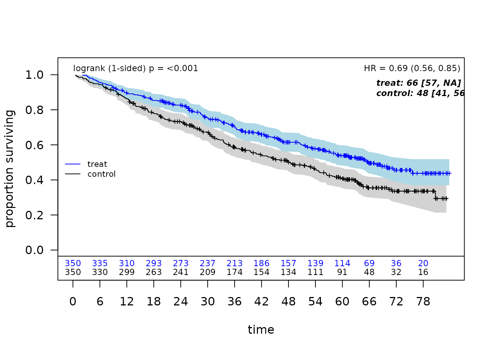
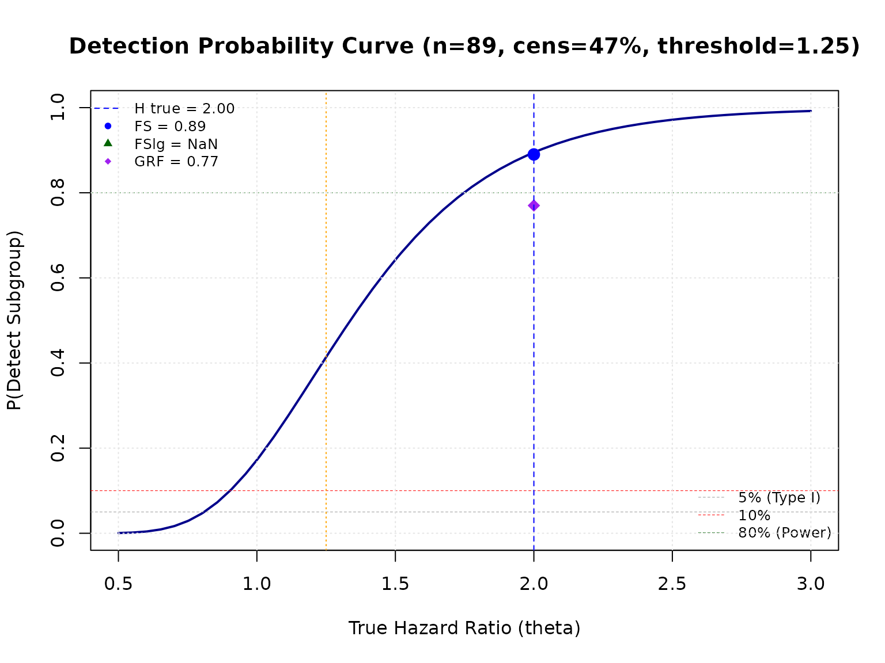

# Simulation Studies for Evaluating ForestSearch Performance

## Introduction

This vignette demonstrates how to conduct simulation studies to evaluate
the performance of forestsearch for identifying subgroups with
differential treatment effects.

We describe a simulation framework with a detailed example that
reproduces (essentially) simulation results presented in Leon et
al. (2024).

The simulation framework allows you to:

- Generate synthetic clinical trial data with known treatment effect
  heterogeneity
- Evaluate subgroup identification rates (power)
- Assess classification accuracy (sens, spec, PPV, NPV)
- Compare different analysis methods (ForestSearch, GRF)
- Estimate Type I error under null hypothesis
- Track and summarize computational timings across simulations

1.  **Create DGM**: Define a data generating mechanism with specified
    treatment effects
2.  **Simulate Trials**: Generate multiple simulated datasets
3.  **Running simulated trials**: drawing 44 under null (uniform
    benefit) and 44 under alternative (HTEs)
4.  **Run Analyses**: Apply ForestSearch (and optionally GRF) to each
    dataset
5.  **Summarize Results**: Aggregate operating characteristics across
    simulations

The simulation framework is based on the
[`generate_aft_dgm_flex()`](https://larry-leon.github.io/forestsearch/reference/generate_aft_dgm_flex.md)
methodology:

| Feature                           | Description                              |
|-----------------------------------|------------------------------------------|
| **Individual Potential Outcomes** | `theta_0`, `theta_1`, `loghr_po` columns |
| **Average Hazard Ratios (AHR)**   | Alternative to Cox-based HR estimation   |
| **Stacked PO for Cox HR**         | Same epsilon for causal inference        |
| **`use_twostage` Parameter**      | Faster exploratory analysis option       |
| **Backward Compatible**           | Works with old and new DGM formats       |

## Setup

``` r
# Core packages
library(forestsearch)
library(weightedsurv)

library(data.table)
library(survival)
library(ggplot2)
library(gt)

# Parallel processing
library(foreach)
library(doFuture)
library(future)

library(katex)
```

### Simulation Workflow Overview

This section outlines the end-to-end workflow for evaluating
ForestSearch performance via simulation. Each step is described below
the workflow diagram, with cross-references to the corresponding
vignette sections.

Four-stage simulation workflow for evaluating subgroup identification
performance.

#### Step 1: Create a Data Generating Mechanism (DGM)

The DGM defines the ground truth for the simulation. Building on the
GBSG breast cancer dataset as a covariate template,
[`setup_gbsg_dgm()`](https://larry-leon.github.io/forestsearch/reference/setup_gbsg_dgm.md)
fits an Accelerated Failure Time (AFT) model with Weibull baseline
hazard and generates a super-population of potential outcomes.

Key decisions at this stage:

- **Hypothesis**: `model = "alt"` introduces treatment effect
  heterogeneity (harm subgroup H vs. benefit complement H^(c));
  `model = "null"` imposes a uniform treatment effect so that no true
  subgroup exists (for type-I error evaluation).
- **Effect size**: The `k_inter` parameter scales the
  treatment-by-covariate interaction. Rather than setting it manually,
  use
  [`calibrate_k_inter()`](https://larry-leon.github.io/forestsearch/reference/calibrate_k_inter.md)
  to find the value that achieves a target HR in the harm subgroup,
  calibrated either to the Cox HR (`use_ahr = FALSE`) or to the average
  hazard ratio (`use_ahr = TRUE`).
- **Subgroup definition**: By default, H = {low estrogen receptor AND
  premenopausal} (z1 = 1 & z3 = 1), covering roughly 13% of the
  super-population.
- **Censoring**: Weibull or uniform censoring, optionally adjusted via
  `cens_adjust` to control the overall event rate.

The resulting DGM object stores the super-population, true hazard ratios
(both Cox-based and AHR), individual-level potential outcomes
(`loghr_po`), and all model parameters needed for downstream simulation.

#### Step 2: Simulate Clinical Trials

[`simulate_from_dgm()`](https://larry-leon.github.io/forestsearch/reference/simulate_from_dgm.md)
draws random samples from the super-population to create synthetic trial
datasets. Each simulated trial:

- Samples *n* patients (e.g., 700) with 1:1 randomisation.
- Generates survival times from the AFT model using the DGM parameters.
- Applies censoring (Weibull or uniform, with optional `cens_adjust`
  adjustment) and administrative censoring at `analysis_time`.
- Carries forward the true subgroup indicator `flag_harm` and individual
  `loghr_po` for evaluation.

Because ForestSearch uses random-split consistency evaluation, each
simulated trial is an independent replicate of the full analysis
pipeline.

#### Step 3: Run Analyses on Each Trial

[`run_simulation_analysis()`](https://larry-leon.github.io/forestsearch/reference/run_simulation_analysis.md)
wraps the ForestSearch algorithm (and optionally GRF) and returns a
one-row-per-method summary for each replicate. A typical call enables
one or more methods:

| Method          | Flag                            | Description                                 |
|-----------------|---------------------------------|---------------------------------------------|
| FS (LASSO only) | `run_fs = TRUE`                 | ForestSearch with LASSO-selected candidates |
| FSlg            | `run_fs = TRUE, use_grf = TRUE` | LASSO + GRF candidates combined             |
| GRF             | `run_grf = TRUE`                | Standalone GRF subgroup search              |

For each method the function records whether a subgroup was identified
(`any.H`), its composition (`sens`, `spec`, `ppv`, `npv`), hazard ratio
estimates (`hr.H.hat`, `hr.Hc.hat`), AHR estimates (`ahr.H.hat`,
`ahr.Hc.hat`), subgroup size, and timing.

The simulation loop is parallelised via `foreach` / `doFuture` (see
[Setting Up Parallel Processing](#setup-parallel)):

``` r
results_alt <- foreach(
  sim = 1:n_sims,
  .combine = rbind,
  .options.future = list(packages = c("forestsearch", "survival", "data.table"),
                         seed = TRUE)
) %dofuture% {
  run_simulation_analysis(sim_id = sim, dgm = dgm_calibrated, ...)
}
```

#### Step 4: Summarise Operating Characteristics

Three complementary summary functions distil the raw simulation output
into interpretable results:

[`format_oc_results()`](https://larry-leon.github.io/forestsearch/reference/format_oc_results.md)
produces a gt table of operating characteristics (detection rate,
sensitivity, specificity, PPV, NPV, and mean HR estimates) across all
analysis methods, with selectable metric groups (`"detection"`,
`"classification"`, `"hr_estimates"`, `"ahr_estimates"`,
`"subgroup_size"`, or `"all"`).

[`build_estimation_table()`](https://larry-leon.github.io/forestsearch/reference/build_estimation_table.md)
focuses on estimation bias: for each estimator (naive Cox HR,
bias-corrected HR, AHR) in both H and H^(c), it reports the mean, SD,
range, and relative bias versus the DGM truth. When CDE values are
available, dual bias columns (b‡ vs CDE, b† vs marginal HR) are shown,
matching the notation of Table 5 in Leon et al. (2024).

[`build_classification_table()`](https://larry-leon.github.io/forestsearch/reference/build_classification_table.md)
assembles detection and classification rates across multiple DGM
scenarios (e.g., null and alternative) in a single table, facilitating
comparison with the published benchmarks in Leon et al. (2024).

Additionally,
[`interpret_estimation_table()`](https://larry-leon.github.io/forestsearch/reference/interpret_estimation_table.md)
generates a templated narrative paragraph that auto-populates with the
numerical results, suitable for direct inclusion in reports via
`results = "asis"`.

#### Putting It Together

The sections that follow implement each step in detail. A compact
version of the full workflow (excluding diagnostics) is:

``` r
# Step 1: Create and calibrate DGM
k_inter <- calibrate_k_inter(target_hr_harm = 2.0, use_ahr = FALSE)
dgm     <- setup_gbsg_dgm(model = "alt", k_inter = k_inter)

# Step 2 + 3: Simulate and analyse in parallel
results <- foreach(sim = 1:500, .combine = rbind) %dofuture% {
  run_simulation_analysis(sim_id = sim, dgm = dgm, n_sample = 700,
                          run_fs = TRUE, run_grf = TRUE, fs_params = fs_params)
}

# Step 4: Summarise
format_oc_results(results, metrics = "all")
build_estimation_table(results, dgm, analysis_method = "FS")
interpret_estimation_table(results, dgm, scenario = "alt")
```

### Initializing the Timing Framework

A structured timing framework tracks computational cost at each stage of
the simulation study. We initialize a named list that accumulates
elapsed times for DGM creation, calibration, validation, simulation
loops under H1 and H0, summarization, and table formatting.

``` r
# ── Master timing list ──────────────────────────────────────────────────────
# Each entry stores elapsed wall-clock seconds for one stage.
# Entries are added cumulatively as we proceed through the vignette.
timings <- list()

t_vignette_start <- proc.time()
```

## Creating a Data Generating Mechanism

The simulation framework uses the German Breast Cancer Study Group
(GBSG) dataset as a template for realistic covariate distributions and
censoring patterns.

### Understanding the DGM

The
[`setup_gbsg_dgm()`](https://larry-leon.github.io/forestsearch/reference/setup_gbsg_dgm.md)
function creates a data generating mechanism (DGM) based on an
Accelerated Failure Time (AFT) model with Weibull distribution. Key
features:

- **Covariates**: Age, estrogen receptor, menopausal status,
  progesterone receptor, nodes
- **Treatment effect heterogeneity**: Specified via interaction terms
- **Subgroup definition**: H = {low estrogen receptor AND premenopausal}
- **Censoring**: Weibull or uniform censoring model

#### New Output Structure (Aligned with generate_aft_dgm_flex)

The DGM now includes:

    dgm$hazard_ratios <- list(
      overall          = hr_causal,      # Cox-based overall HR
      AHR              = AHR,            # Average HR from loghr_po

      AHR_harm         = AHR_H_true,     # AHR in harm subgroup
      AHR_no_harm      = AHR_Hc_true,    # AHR in complement
      harm_subgroup    = hr_H_true,      # Cox-based HR in H
      no_harm_subgroup = hr_Hc_true,     # Cox-based HR in Hc

      # Controlled Direct Effects (CDE) — see treatment_effect_definitions vignette

      CDE              = CDE_overall,    # Overall CDE
      CDE_harm         = CDE_H,         # CDE in harm subgroup   (theta-ddagger(H))
      CDE_no_harm      = CDE_Hc         # CDE in complement      (theta-ddagger(Hc))
    )

The CDE is the ratio of average hazard contributions on the natural
scale: CDE(S) = mean(exp(theta_1_i)) / mean(exp(theta_0_i)), and differs
from the AHR = exp(mean(loghr_po)) due to Jensen’s inequality. In the
paper’s notation, the CDE corresponds to θ‡ (theta-double-dagger), while
the marginal (causal) HR corresponds to θ† (theta-dagger). These two
targets define the dual bias columns in Table 5 of Leon et al. (2024).

The super-population data (`dgm$df_super_rand`) now contains:

| Column     | Description                                            |
|------------|--------------------------------------------------------|
| `theta_0`  | Log-hazard contribution under control                  |
| `theta_1`  | Log-hazard contribution under treatment                |
| `loghr_po` | Individual causal log hazard ratio (theta_1 - theta_0) |

### What `setup_gbsg_dgm()` does

[`setup_gbsg_dgm()`](https://larry-leon.github.io/forestsearch/reference/setup_gbsg_dgm.md)
is a **GBSG-specific convenience wrapper**. It encodes the particular
data preparation choices made in León et al. (2024) — the subgroup
definition (ER ≤ q25, premenopausal), the binary discretisation of
continuous covariates, the Weibull outcome and censoring models — so
that a calibrated DGM for the GBSG simulation setting can be created
with a single call:

``` r
# One-line creation of the León et al. (2024) simulation DGM
dgm <- setup_gbsg_dgm(
  model   = "alt",    # "alt" (heterogeneous effects) or "null"
  k_inter = 2.5,      # treatment × subgroup interaction strength
  k_treat = 1.0,      # overall treatment effect modifier
  seed    = 8316951
)
```

The returned object has class `c("aft_dgm_flex", "gbsg_dgm")` and is
fully compatible with
[`simulate_from_dgm()`](https://larry-leon.github.io/forestsearch/reference/simulate_from_dgm.md)
and
[`run_simulation_analysis()`](https://larry-leon.github.io/forestsearch/reference/run_simulation_analysis.md).

------------------------------------------------------------------------

### Replicating `setup_gbsg_dgm()` with `generate_aft_dgm_flex()`

[`generate_aft_dgm_flex()`](https://larry-leon.github.io/forestsearch/reference/generate_aft_dgm_flex.md)
is the general DGM builder. It requires the analyst to supply the
dataset and make every modelling choice explicitly. The GBSG DGM in
[`setup_gbsg_dgm()`](https://larry-leon.github.io/forestsearch/reference/setup_gbsg_dgm.md)
is equivalent to the following call — it simply automates this
preparation:

``` r
library(forestsearch)
library(survival)   # for survival::gbsg

# ── Step 1: Prepare the GBSG dataset ──────────────────────────────────────

dfa <- survival::gbsg

# Convert time to months (matching León et al.)
dfa$y     <- dfa$rfstime / 30.4375
dfa$treat <- dfa$hormon

# Subgroup-defining binary variables
# H = {ER ≤ 25th percentile} ∩ {premenopausal}
er_cut <- quantile(dfa$er, probs = 0.25)
dfa$z1 <- as.factor(ifelse(dfa$er  <= er_cut, 1L, 0L))  # ER low
dfa$z2 <- as.factor(ifelse(dfa$age <= median(dfa$age), 1L, 0L))
dfa$z3 <- as.factor(ifelse(dfa$meno == 0, 1L, 0L))       # premenopausal
dfa$z4 <- as.factor(ifelse(dfa$pgr  <= median(dfa$pgr), 1L, 0L))
dfa$z5 <- as.factor(ifelse(dfa$nodes <= median(dfa$nodes), 1L, 0L))
dfa$v6 <- as.factor(ifelse(dfa$size  <= median(dfa$size), 1L, 0L))
dfa$v7 <- as.factor(ifelse(dfa$grade == 3, 1L, 0L))

# ── Step 2: Call generate_aft_dgm_flex() ──────────────────────────────────

dgm_flex <- generate_aft_dgm_flex(
  data            = dfa,
  outcome_var     = "y",
  event_var       = "status",
  treatment_var   = "treat",
  # Analyst-visible covariates (what FS will search over)
  continuous_vars = character(0),    # all pre-discretised
  factor_vars     = c("z1", "z2", "z3", "z4", "z5", "v6", "v7"),
  # Subgroup definition: H = {z1 = 1} ∩ {z3 = 1}
  subgroup_vars   = c("z1", "z3"),
  subgroup_cuts   = list(z1 = 1, z3 = 1),   # both must equal 1
  # Treatment effect structure
  model   = "alt",
  k_inter = 2.5,
  k_treat = 1.0,
  n_super = 5000,
  seed    = 8316951
)
```

[`setup_gbsg_dgm()`](https://larry-leon.github.io/forestsearch/reference/setup_gbsg_dgm.md)
is preferred for the GBSG simulation setting because it guarantees exact
replication of the León et al. (2024) covariate construction and
subgroup definition without requiring the analyst to reproduce all
preparation steps by hand.

------------------------------------------------------------------------

### When to use each function

| Scenario                                          | Recommended function                                                                                                                                                                                                |
|---------------------------------------------------|---------------------------------------------------------------------------------------------------------------------------------------------------------------------------------------------------------------------|
| Replicating León et al. (2024) simulations        | [`setup_gbsg_dgm()`](https://larry-leon.github.io/forestsearch/reference/setup_gbsg_dgm.md)                                                                                                                         |
| GBSG-based simulation with custom parameters      | [`setup_gbsg_dgm()`](https://larry-leon.github.io/forestsearch/reference/setup_gbsg_dgm.md)                                                                                                                         |
| DGM based on a different dataset                  | [`generate_aft_dgm_flex()`](https://larry-leon.github.io/forestsearch/reference/generate_aft_dgm_flex.md)                                                                                                           |
| Custom subgroup definition or covariate structure | [`generate_aft_dgm_flex()`](https://larry-leon.github.io/forestsearch/reference/generate_aft_dgm_flex.md)                                                                                                           |
| Multi-regional or MRCT simulation                 | [`generate_aft_dgm_flex()`](https://larry-leon.github.io/forestsearch/reference/generate_aft_dgm_flex.md) via [`create_dgm_for_mrct()`](https://larry-leon.github.io/forestsearch/reference/create_dgm_for_mrct.md) |

[`setup_gbsg_dgm()`](https://larry-leon.github.io/forestsearch/reference/setup_gbsg_dgm.md)
is not deprecated in the sense of being removed or discouraged for GBSG
work — it remains the correct entry point for the simulation studies in
this package. The general function
[`generate_aft_dgm_flex()`](https://larry-leon.github.io/forestsearch/reference/generate_aft_dgm_flex.md)
is the right choice when the simulation is based on a **different
dataset or subgroup structure**.

------------------------------------------------------------------------

### Simulating from either DGM

Both
[`setup_gbsg_dgm()`](https://larry-leon.github.io/forestsearch/reference/setup_gbsg_dgm.md)
and
[`generate_aft_dgm_flex()`](https://larry-leon.github.io/forestsearch/reference/generate_aft_dgm_flex.md)
return an object of class `"aft_dgm_flex"`, so
[`simulate_from_dgm()`](https://larry-leon.github.io/forestsearch/reference/simulate_from_dgm.md)
works identically with either:

``` r
# Works for dgm from setup_gbsg_dgm() or generate_aft_dgm_flex()
sim_data <- simulate_from_dgm(
  dgm           = dgm,
  n             = 700,
  analysis_time = Inf,   # no administrative censoring
  cens_adjust   = 0,
  seed          = 1
)

# sim_data columns (underscore notation):
#   y_sim       — observed time
#   event_sim   — event indicator
#   treat_sim   — treatment assignment
#   flag_harm   — true subgroup membership (H = 1, Hc = 0)
#   loghr_po    — individual log-HR (for AHR calculation)
```

### Alternative Hypothesis (Heterogeneous Treatment Effect)

Under the alternative hypothesis, we create a DGM where the treatment
effect varies across patient subgroups:

``` r
t0 <- proc.time()[3]

# Create DGM with heterogeneous treatment effect
# HR in harm subgroup (H) will be > 1 (treatment harmful)
# HR in complement (H^c) will be < 1 (treatment beneficial)

dgm_alt <- setup_gbsg_dgm(
  model = "alt",
  k_treat = 1.0,
  k_inter = 2.0,      # Interaction effect multiplier
  k_z3 = 1.0,
  z1_quantile = 0.25, # ER threshold at 25th percentile
  n_super = 5000,
  cens_type = "weibull",
  seed = 8316951,
  verbose = TRUE
)

# Enrich DGM with CDE values (computed from super-population theta_0/theta_1)
dgm_alt <- compute_dgm_cde(dgm_alt)

# Examine the DGM (print method now shows both HR and AHR metrics)
print(dgm_alt)
```

    ## GBSG-Based AFT Data Generating Mechanism (Aligned)
    ## ===================================================
    ## 
    ## Model type: alt 
    ## Super-population size: 5000 
    ## 
    ## Effect Modifiers:
    ##   k_treat: 1 
    ##   k_inter: 2 
    ##   k_z3: 1 
    ## 
    ## Hazard Ratios (Cox-based, stacked PO):
    ##   Overall (causal): 0.7331 
    ##   Harm subgroup (H): 2.9651 
    ##   Complement (Hc): 0.6612 
    ##   Ratio HR(H)/HR(Hc): 4.4846 
    ## 
    ## Average Hazard Ratios (from loghr_po):
    ##   AHR (overall): 0.7431 
    ##   AHR_harm (H): 3.8687 
    ##   AHR_no_harm (Hc): 0.5848 
    ##   Ratio AHR(H)/AHR(Hc): 6.6157 
    ## 
    ## Subgroup definition: z1 == 1 & z3 == 1 (low ER & premenopausal) 
    ## ER threshold: 8 (quantile = 0.25)
    ## Subgroup size: 634 (12.7%)
    ## Analysis variables: v1, v2, v3, v4, v5, v6, v7

``` r
timings$dgm_creation <- proc.time()[3] - t0
```

#### Accessing Hazard Ratios (New Aligned Format)

``` r
# Traditional access (backward compatible)
cat("Cox-based HRs:\n")
```

    ## Cox-based HRs:

``` r
cat("  HR(H):", round(dgm_alt$hr_H_true, 4), "\n")
```

    ##   HR(H): 2.9651

``` r
cat("  HR(Hc):", round(dgm_alt$hr_Hc_true, 4), "\n")
```

    ##   HR(Hc): 0.6612

``` r
cat("  HR(overall):", round(dgm_alt$hr_causal, 4), "\n")
```

    ##   HR(overall): 0.7331

``` r
# New AHR metrics (aligned with generate_aft_dgm_flex)
cat("\nAverage Hazard Ratios (from loghr_po):\n")
```

    ## 
    ## Average Hazard Ratios (from loghr_po):

``` r
cat("  AHR(H):", round(dgm_alt$AHR_H_true, 4), "\n")
```

    ##   AHR(H): 3.8687

``` r
cat("  AHR(Hc):", round(dgm_alt$AHR_Hc_true, 4), "\n")
```

    ##   AHR(Hc): 0.5848

``` r
cat("  AHR(overall):", round(dgm_alt$AHR, 4), "\n")
```

    ##   AHR(overall): 0.7431

``` r
# Controlled Direct Effects (CDE) — theta-ddagger in paper notation
# Populated by compute_dgm_cde() above
cat("\nControlled Direct Effects:\n")
```

    ## 
    ## Controlled Direct Effects:

``` r
cat("  CDE(H):", round(dgm_alt$hazard_ratios$CDE_harm, 4), "\n")
```

    ##   CDE(H): 3.8687

``` r
cat("  CDE(Hc):", round(dgm_alt$hazard_ratios$CDE_no_harm, 4), "\n")
```

    ##   CDE(Hc): 0.5848

``` r
cat("  CDE(overall):", round(dgm_alt$hazard_ratios$CDE, 4), "\n")
```

    ##   CDE(overall): 1.098

``` r
# Using hazard_ratios list (unified access)
cat("\nVia hazard_ratios list:\n")
```

    ## 
    ## Via hazard_ratios list:

``` r
cat("  harm_subgroup:", round(dgm_alt$hazard_ratios$harm_subgroup, 4), "\n")
```

    ##   harm_subgroup: 2.9651

``` r
cat("  AHR_harm:", round(dgm_alt$hazard_ratios$AHR_harm, 4), "\n")
```

    ##   AHR_harm: 3.8687

``` r
cat("  CDE_harm:", round(dgm_alt$hazard_ratios$CDE_harm, 4), "\n")
```

    ##   CDE_harm: 3.8687

#### Examining Individual-Level Treatment Effects

``` r
# The super-population now includes individual log hazard ratios
df_super <- dgm_alt$df_super_rand

cat("Individual-level potential outcomes:\n")
```

    ## Individual-level potential outcomes:

``` r
cat("  theta_0 (control log-hazard) range:", 
    round(range(df_super$theta_0), 3), "\n")
```

    ##   theta_0 (control log-hazard) range: -0.891 1.76

``` r
cat("  theta_1 (treatment log-hazard) range:", 
    round(range(df_super$theta_1), 3), "\n")
```

    ##   theta_1 (treatment log-hazard) range: -1.427 2.909

``` r
cat("  loghr_po (individual log-HR) range:", 
    round(range(df_super$loghr_po), 3), "\n")
```

    ##   loghr_po (individual log-HR) range: -0.537 1.353

``` r
# Verify AHR calculation
ahr_manual <- exp(mean(df_super$loghr_po))
cat("\nAHR verification:\n")
```

    ## 
    ## AHR verification:

``` r
cat("  exp(mean(loghr_po)) =", round(ahr_manual, 4), "\n")
```

    ##   exp(mean(loghr_po)) = 0.7431

``` r
cat("  dgm$AHR =", round(dgm_alt$AHR, 4), "\n")
```

    ##   dgm$AHR = 0.7431

``` r
# Verify CDE calculation
# CDE(S) = mean(exp(theta_1)) / mean(exp(theta_0))  [ratio on natural scale]
cde_manual <- mean(exp(df_super$theta_1)) / mean(exp(df_super$theta_0))
cat("\nCDE verification (overall):\n")
```

    ## 
    ## CDE verification (overall):

``` r
cat("  mean(exp(theta_1)) / mean(exp(theta_0)) =", round(cde_manual, 4), "\n")
```

    ##   mean(exp(theta_1)) / mean(exp(theta_0)) = 1.098

``` r
cat("  AHR = exp(mean(loghr_po)) =", round(ahr_manual, 4), "\n")
```

    ##   AHR = exp(mean(loghr_po)) = 0.7431

``` r
cat("  Note: CDE != AHR due to Jensen's inequality\n")
```

    ##   Note: CDE != AHR due to Jensen's inequality

``` r
# Distribution of individual treatment effects
cat("\nIndividual HR distribution:\n")
```

    ## 
    ## Individual HR distribution:

``` r
individual_hr <- exp(df_super$loghr_po)
cat("  Mean:", round(mean(individual_hr), 4), "\n")
```

    ##   Mean: 1.0012

``` r
cat("  Median:", round(median(individual_hr), 4), "\n")
```

    ##   Median: 0.5848

``` r
cat("  SD:", round(sd(individual_hr), 4), "\n")
```

    ##   SD: 1.0928

### Calibrating for a Target Hazard Ratio

Often, you want to specify the exact hazard ratio in the harm subgroup.
Use
[`calibrate_k_inter()`](https://larry-leon.github.io/forestsearch/reference/calibrate_k_inter.md)
to find the interaction parameter that achieves this.

#### Calibrate to Cox-based HR (Default)

``` r
t0 <- proc.time()[3]

# Find k_inter for Cox-based HR = 2.0 in harm subgroup
k_inter_cox <- calibrate_k_inter(
  target_hr_harm = 2.0,
  model = "alt",
  k_treat = 1.0,
  cens_type = "weibull",
  use_ahr = FALSE,  # Default: calibrate to Cox-based HR
  verbose = TRUE
)

# Create DGM with calibrated k_inter
dgm_calibrated_cox <- setup_gbsg_dgm(
  model = "alt",
  k_treat = 1.0,
  k_inter = k_inter_cox,
  verbose = TRUE
)

cat("\nVerification (Cox-based):\n")
```

    ## 
    ## Verification (Cox-based):

``` r
cat("Achieved HR(H):", round(dgm_calibrated_cox$hr_H_true, 3), "\n")
```

    ## Achieved HR(H): 2

``` r
cat("HR(H^c):", round(dgm_calibrated_cox$hr_Hc_true, 3), "\n")
```

    ## HR(H^c): 0.661

``` r
cat("Overall HR:", round(dgm_calibrated_cox$hr_causal, 3), "\n")
```

    ## Overall HR: 0.722

``` r
timings$calibrate_cox <- proc.time()[3] - t0
```

#### Calibrate to AHR (New Option)

``` r
t0 <- proc.time()[3]

# Alternatively, calibrate to Average Hazard Ratio
k_inter_ahr <- calibrate_k_inter(
  target_hr_harm = 2.0,
  model = "alt",
  k_treat = 1.0,
  cens_type = "weibull",
  use_ahr = TRUE,  # NEW: calibrate to AHR instead
  verbose = TRUE
)

# Create DGM with AHR-calibrated k_inter
dgm_calibrated_ahr <- setup_gbsg_dgm(
  model = "alt",
  k_treat = 1.0,
  k_inter = k_inter_ahr,
  verbose = TRUE
)

cat("\nVerification (AHR-based):\n")
```

    ## 
    ## Verification (AHR-based):

``` r
cat("Achieved AHR(H):", round(dgm_calibrated_ahr$AHR_H_true, 3), "\n")
```

    ## Achieved AHR(H): 2

``` r
cat("AHR(H^c):", round(dgm_calibrated_ahr$AHR_Hc_true, 3), "\n")
```

    ## AHR(H^c): 0.585

``` r
cat("Overall AHR:", round(dgm_calibrated_ahr$AHR, 3), "\n")
```

    ## Overall AHR: 0.683

``` r
timings$calibrate_ahr <- proc.time()[3] - t0
```

#### Compare Cox HR vs AHR Calibration

``` r
# Compare the two calibration approaches
cat("Comparison of calibration methods:\n")
```

    ## Comparison of calibration methods:

``` r
cat(sprintf("%-20s %-12s %-12s\n", "Metric", "Cox-calib", "AHR-calib"))
```

    ## Metric               Cox-calib    AHR-calib

``` r
cat(sprintf("%-20s %-12.4f %-12.4f\n", "k_inter", k_inter_cox, k_inter_ahr))
```

    ## k_inter              1.4947       1.3016

``` r
cat(sprintf("%-20s %-12.4f %-12.4f\n", "HR(H)", 
            dgm_calibrated_cox$hr_H_true, dgm_calibrated_ahr$hr_H_true))
```

    ## HR(H)                2.0000       1.7233

``` r
cat(sprintf("%-20s %-12.4f %-12.4f\n", "AHR(H)", 
            dgm_calibrated_cox$AHR_H_true, dgm_calibrated_ahr$AHR_H_true))
```

    ## AHR(H)               2.4001       2.0000

### Validating k_inter Effect on Heterogeneity

Use
[`validate_k_inter_effect()`](https://larry-leon.github.io/forestsearch/reference/validate_k_inter_effect.md)
to verify the interaction parameter properly modulates treatment effect
heterogeneity:

``` r
t0 <- proc.time()[3]

# Test k_inter effect on HR heterogeneity
# k_inter = 0 should give ratio ~ 1 (no heterogeneity)
validation_results <- validate_k_inter_effect(
  k_inter_values = c(-2, -1, 0, 1, 2, 3),
  verbose = TRUE
)
```

    ## Testing k_inter effect on HR heterogeneity...
    ## 
    ## k_inter  HR(H)    HR(Hc)   AHR(H)   AHR(Hc)  Ratio(Cox) Ratio(AHR)
    ## ---------------------------------------------------------------------- 
    ## -2.0     0.1336   0.6612   0.0884   0.5848   0.2021     0.1512    
    ## -1.0     0.3033   0.6612   0.2274   0.5848   0.4587     0.3888    
    ## 0.0      0.6552   0.6612   0.5848   0.5848   0.9909     1.0000    
    ## 1.0      1.3873   0.6612   1.5041   0.5848   2.0982     2.5721    
    ## 2.0      2.9651   0.6612   3.8687   0.5848   4.4846     6.6157    
    ## 3.0      6.6375   0.6612   9.9507   0.5848   10.0387    17.0162   
    ## 
    ## PASS: k_inter = 0 gives Cox ratio ~= 1 (no heterogeneity)
    ## PASS: k_inter = 0 gives AHR ratio ~= 1 (no heterogeneity)
    ## 
    ## AHR vs Cox HR alignment:
    ##   k_inter = -2.0: HR(H) vs AHR(H) diff = 0.0452
    ##   k_inter = -1.0: HR(H) vs AHR(H) diff = 0.0759
    ##   k_inter = 0.0: HR(H) vs AHR(H) diff = 0.0704
    ##   k_inter = 1.0: HR(H) vs AHR(H) diff = 0.1168
    ##   k_inter = 2.0: HR(H) vs AHR(H) diff = 0.9036
    ##   k_inter = 3.0: HR(H) vs AHR(H) diff = 3.3132

``` r
timings$validation <- proc.time()[3] - t0
```

### Null Hypothesis (Uniform Treatment Effect)

For Type I error evaluation, create a DGM with uniform treatment effect:

``` r
t0 <- proc.time()[3]

# Create null DGM (no treatment effect heterogeneity)
dgm_null <- setup_gbsg_dgm(
  model = "null",
  k_treat = 1.0,
  verbose = TRUE
)

cat("\nNull hypothesis HRs:\n")
```

    ## 
    ## Null hypothesis HRs:

``` r
cat("Overall HR:", round(dgm_null$hr_causal, 3), "\n")
```

    ## Overall HR: 0.722

``` r
cat("HR(H^c):", round(dgm_null$hr_Hc_true, 3), "\n")
```

    ## HR(H^c): 0.722

``` r
cat("AHR(H^c):", round(dgm_null$AHR_Hc_true, 3), "\n")
```

    ## AHR(H^c): 0.654

``` r
cat("AHR:", round(dgm_null$AHR, 3), "\n")
```

    ## AHR: 0.654

``` r
timings$dgm_null <- proc.time()[3] - t0
```

## Simulating Trial Data

### Single Trial Simulation

Use
[`simulate_from_dgm()`](https://larry-leon.github.io/forestsearch/reference/simulate_from_dgm.md)
to generate a single simulated trial:

``` r
# Use the Cox-calibrated DGM for simulations
dgm_calibrated <- dgm_calibrated_cox

# Simulate a single trial
sim_data <- simulate_from_dgm(
  dgm = dgm_calibrated,
  n = 700,
  rand_ratio = 1,        # 1:1 randomization
  seed = 1,
  analysis_time = 84,       # 84 months administrative censoring
  cens_adjust = log(1.5)     # Censoring adjustment
)

# Examine the data
cat("Simulated trial:\n")
```

    ## Simulated trial:

``` r
cat("  N =", nrow(sim_data), "\n")
```

    ##   N = 700

``` r
cat("  Events =", sum(sim_data$event_sim), 
    "(", round(100 * mean(sim_data$event_sim), 1), "%)\n")
```

    ##   Events = 351 ( 50.1 %)

``` r
cat("  Harm subgroup size =", sum(sim_data$flag_harm),
    "(", round(100 * mean(sim_data$flag_harm), 1), "%)\n")
```

    ##   Harm subgroup size = 90 ( 12.9 %)

``` r
# Quick survival analysis
fit_itt <- coxph(Surv(y_sim, event_sim) ~ treat_sim, data = sim_data)
cat("  Estimated ITT HR =", round(exp(coef(fit_itt)), 3), "\n")
```

    ##   Estimated ITT HR = 0.69

#### Examining Individual-Level Effects in Simulated Data

``` r
# The simulated data now includes loghr_po
if ("loghr_po" %in% names(sim_data)) {
  cat("\nIndividual treatment effects in simulated trial:\n")
  
  # Compute AHR in simulated data by subgroup
  ahr_H_sim <- exp(mean(sim_data$loghr_po[sim_data$flag_harm == 1]))
  ahr_Hc_sim <- exp(mean(sim_data$loghr_po[sim_data$flag_harm == 0]))
  ahr_overall_sim <- exp(mean(sim_data$loghr_po))
  
  cat("  AHR(H) in sim:", round(ahr_H_sim, 3), "\n")
  cat("  AHR(Hc) in sim:", round(ahr_Hc_sim, 3), "\n")
  cat("  AHR(overall) in sim:", round(ahr_overall_sim, 3), "\n")
} else {
  cat("\nNote: loghr_po not available in simulated data\n")
}
```

    ## 
    ## Individual treatment effects in simulated trial:
    ##   AHR(H) in sim: 2.4 
    ##   AHR(Hc) in sim: 0.585 
    ##   AHR(overall) in sim: 0.701

### Examining Covariate Structure

``` r
dfcount <- df_counting(
  df = sim_data,
  by.risk = 6,
  tte.name = "y_sim", 
  event.name = "event_sim", 
  treat.name = "treat_sim"
)
plot_weighted_km(dfcount, conf.int = TRUE, show.logrank = TRUE, 
                 ymax = 1.05, xmed.fraction = 0.775, ymed.offset = 0.125)
```



``` r
create_summary_table(
  data = sim_data, 
  treat_var = "treat_sim", 
  table_title = "Characteristics by Treatment Arm",
  vars_continuous = c("z1", "z2", "size", "z3", "z4", "z5"),
  vars_categorical = c("flag_harm", "grade3"),
  font_size = 14
)
```

| Characteristics by Treatment Arm                                                              |           |                 |                   |          |      |
|-----------------------------------------------------------------------------------------------|-----------|-----------------|-------------------|----------|------|
| Characteristic                                                                                |           | Control (n=350) | Treatment (n=350) | P-value¹ | SMD² |
| z1                                                                                            | Mean (SD) | 0.3 (0.5)       | 0.2 (0.4)         | 0.030    | 0.16 |
| z2                                                                                            | Mean (SD) | 2.5 (1.1)       | 2.4 (1.2)         | 0.710    | 0.03 |
| size                                                                                          | Mean (SD) | 29.6 (15.7)     | 29.2 (14.9)       | 0.722    | 0.03 |
| z3                                                                                            | Mean (SD) | 0.4 (0.5)       | 0.4 (0.5)         | 0.879    | 0.01 |
| z4                                                                                            | Mean (SD) | 2.4 (1.1)       | 2.5 (1.1)         | 0.176    | 0.10 |
| z5                                                                                            | Mean (SD) | 2.4 (1.0)       | 2.4 (1.1)         | 0.916    | 0.01 |
| flag_harm                                                                                     |           | 52 (14.9%)      | 38 (10.9%)        | 0.142    | 0.12 |
| grade3                                                                                        |           | 101 (28.9%)     | 84 (24.0%)        | 0.170    | 0.11 |
| ¹ P-values: t-test for continuous, chi-square/Fisher's exact for categorical/binary variables |           |                 |                   |          |      |
| ² SMD = Standardized mean difference (Cohen's d for continuous, Cramer's V for categorical)   |           |                 |                   |          |      |

## Running Simulation Studies

### Setting Up Parallel Processing

For efficient simulation studies, use parallel processing:

``` r
# Configure parallel backend
n_workers <- min(parallel::detectCores() - 1, 120)

plan(multisession, workers = n_workers)

cat("Using", n_workers, "parallel workers\n")
```

    ## Using 3 parallel workers

### Define Simulation Parameters

``` r
# Simulation settings
sim_config_alt <- list(
  n_sims = nsims_alt,          # Number of simulations (use 500-1000 for final)
  n_sample = 700,         # Sample size per trial
  analysis_time = 84,        # Maximum follow-up (months)
  seed_base = 8316951,
  cens_adjust = log(1.5)
)

sim_config_null <- list(
  n_sims = nsims_null,          # More simulations for Type I error estimation
  n_sample = 700,         # Sample size per trial
  analysis_time = 84,        # Maximum follow-up (months)
  seed_base = 8316951,
  cens_adjust = log(1.5)
)

# ForestSearch parameters (now includes use_twostage)
fs_params <- list(
  outcome.name = "y_sim",
  event.name = "event_sim",
  treat.name = "treat_sim",
  id.name = "id",
  use_lasso = TRUE,
  use_grf = TRUE,
  hr.threshold = 1.25,
  hr.consistency = 1.0,
  pconsistency.threshold = 0.90,
  fs.splits = 400,
  n.min = 60,
  d0.min = 12,
  d1.min = 12,
  maxk = 2,
  by.risk = 12,
  vi.grf.min = -0.2,
  # NEW: Two-stage algorithm option
  use_twostage = TRUE,      # Set TRUE for faster exploratory analysis
  twostage_args = list()     # Optional tuning parameters
)


# Confounders for analysis
confounders_base <- c("z1", "z2", "z3", "z4", "z5", "size", "grade3")
```

#### Two-Stage Algorithm Option

The `use_twostage` parameter enables a faster two-stage search
algorithm:

``` r
# Fast configuration with two-stage algorithm
fs_params_fast <- modifyList(fs_params, list(
  use_twostage = TRUE,
  twostage_args = list(
    n.splits.screen = 30,    # Stage 1 screening splits
    batch.size = 20,         # Stage 2 batch size
    conf.level = 0.95        # Early stopping confidence
  )
))

cat("Standard search: use_twostage =", fs_params$use_twostage, "\n")
```

    ## Standard search: use_twostage = TRUE

``` r
cat("Fast search: use_twostage =", fs_params_fast$use_twostage, "\n")
```

    ## Fast search: use_twostage = TRUE

### Running Alternative Hypothesis Simulations

``` r
cat("Running", sim_config_alt$n_sims, "simulations under H1...\n")
```

    ## Running 44 simulations under H1...

``` r
start_time <- Sys.time()
t0 <- proc.time()[3]

results_alt <- foreach(
  sim = 1:sim_config_alt$n_sims,
  .combine = rbind,
  .errorhandling = "remove",
  .options.future = list(
    packages = c("forestsearch", "survival", "data.table"),
    seed = TRUE
  )
) %dofuture% {
  run_simulation_analysis(
    sim_id = sim,
    dgm = dgm_calibrated,
    n_sample = sim_config_alt$n_sample,
    analysis_time = sim_config_alt$analysis_time,
    cens_adjust = sim_config_alt$cens_adjust,
    confounders_base = confounders_base,
    cox_formula_adj = survival::Surv(y_sim, event_sim) ~ treat_sim + z1 + z2 + z3,
    n_add_noise = 0L,
    run_fs = TRUE,
    run_fs_grf = FALSE,
    run_grf = TRUE,
    fs_params = fs_params,
    verbose = TRUE,
    debug = FALSE,
    verbose_n = 1  # Only print first 1 simulations
  )
}
```

    ## GRF: no subgroup identified
    ## GRF cuts identified: 0 
    ## Cox-LASSO selected: 6 of 7 candidate factors
    ##   Omitted: z2 
    ## Candidate factors: 14 
    ##  [1] "z4 <= 2.5"    "z4 <= 3"      "z4 <= 2"      "z5 <= 2.4"    "z5 <= 2"     
    ##  [6] "z5 <= 1"      "z5 <= 3"      "size <= 29.1" "size <= 25"   "size <= 20"  
    ## [11] "size <= 35"   "z1"           "z3"           "grade3"      
    ## Number of possible configurations (<= maxk): maxk = 2 , # combinations = 406 
    ## Events criteria: control >= 12 , treatment >= 12 
    ## Sample size criteria: n >= 60 
    ## Subgroup search completed in 0.07 minutes
    ## 
    ## --- Filtering Summary ---
    ##   Combinations evaluated: 406 
    ##   Passed variance check: 375 
    ##   Passed prevalence (>= 0.025 ): 375 
    ##   Passed redundancy check: 358 
    ##   Passed event counts (d0>= 12 , d1>= 12 ): 329 
    ##   Passed sample size (n>= 60 ): 320 
    ##   Cox model fit successfully: 320 
    ##   Passed HR threshold (>= 1.25 ): 4 
    ## -------------------------
    ## 
    ## Found 4 subgroup candidate(s)
    ## # of candidate subgroups (meeting all criteria) = 4 
    ## Removed 1 near-duplicate subgroups
    ## # of unique initial candidates: 3 
    ## # Restricting to top stop_Kgroups = 10 
    ## # of candidates to evaluate: 3 
    ## # Early stop threshold: 0.95 
    ## Parallel config: workers = 6 , batch_size = 1 
    ## Batch 1 / 3 : candidates 1 - 1 
    ## Batch 2 / 3 : candidates 2 - 2 
    ## Batch 3 / 3 : candidates 3 - 3 
    ## Evaluated 3 of 3 candidates (complete) 
    ## No subgroups found meeting consistency threshold
    ## Seconds and minutes forestsearch overall = 20.487 0.3415 
    ## Consistency algorithm used: twostage 
    ## tau, maxdepth = 47.90727 2 
    ##    leaf.node control.mean control.size control.se depth
    ## 1          2        -2.43       556.00       1.10     1
    ## 2          3         1.78       144.00       2.55     1
    ## 11         4        -3.77       383.00       1.36     2
    ## 3          6        -1.28       205.00       1.68     2
    ## 4          7         4.22        94.00       3.27     2
    ## GRF subgroup NOT found

``` r
timings$sims_alt_elapsed <- proc.time()[3] - t0
runtime_alt <- difftime(Sys.time(), start_time, units = "mins")
timings$sims_alt_wall <- as.numeric(runtime_alt) * 60  # store in seconds
cat("Completed in", round(runtime_alt, 1), "minutes\n")
```

    ## Completed in 3.5 minutes

``` r
cat("Results:", nrow(results_alt), "rows\n")
```

    ## Results: 88 rows

### Running Null Hypothesis Simulations

``` r
cat("Running", sim_config_null$n_sims, "simulations under H0...\n")
```

    ## Running 44 simulations under H0...

``` r
start_time <- Sys.time()
t0 <- proc.time()[3]

results_null <- foreach(
  sim = 1:sim_config_null$n_sims,
  .combine = rbind,
  .errorhandling = "remove",
  .options.future = list(
    packages = c("forestsearch", "survival", "data.table"),
    seed = TRUE
  )
) %dofuture% {
  
  run_simulation_analysis(
    sim_id = sim,
    dgm = dgm_null,
    n_sample = sim_config_null$n_sample,
    analysis_time = sim_config_null$analysis_time,
    cens_adjust = sim_config_null$cens_adjust,
    confounders_base = confounders_base,
    cox_formula_adj = survival::Surv(y_sim, event_sim) ~ treat_sim + z1 + z2 + z3,
    n_add_noise = 0L,
    run_fs = TRUE,
    run_fs_grf = FALSE,
    run_grf = TRUE,
    fs_params = fs_params,
    verbose = TRUE,
    verbose_n = 1  # Only print first 1 simulations

  )
}
```

    ## GRF: no subgroup identified
    ## GRF cuts identified: 0 
    ## Cox-LASSO selected: 5 of 7 candidate factors
    ##   Omitted: z1, z2 
    ## Candidate factors: 13 
    ##  [1] "z4 <= 2.5"    "z4 <= 3"      "z4 <= 2"      "z5 <= 2.4"    "z5 <= 2"     
    ##  [6] "z5 <= 1"      "z5 <= 3"      "size <= 29.1" "size <= 25"   "size <= 20"  
    ## [11] "size <= 35"   "z3"           "grade3"      
    ## Number of possible configurations (<= maxk): maxk = 2 , # combinations = 351 
    ## Events criteria: control >= 12 , treatment >= 12 
    ## Sample size criteria: n >= 60 
    ## Subgroup search completed in 0.06 minutes
    ## 
    ## --- Filtering Summary ---
    ##   Combinations evaluated: 351 
    ##   Passed variance check: 321 
    ##   Passed prevalence (>= 0.025 ): 321 
    ##   Passed redundancy check: 304 
    ##   Passed event counts (d0>= 12 , d1>= 12 ): 281 
    ##   Passed sample size (n>= 60 ): 275 
    ##   Cox model fit successfully: 275 
    ##   Passed HR threshold (>= 1.25 ): 2 
    ## -------------------------
    ## 
    ## Found 2 subgroup candidate(s)
    ## # of candidate subgroups (meeting all criteria) = 2 
    ## Removed 1 near-duplicate subgroups
    ## # of unique initial candidates: 1 
    ## # Restricting to top stop_Kgroups = 10 
    ## # of candidates to evaluate: 1 
    ## # Early stop threshold: 0.95 
    ## Parallel config: workers = 6 , batch_size = 1 
    ## Batch 1 / 1 : candidates 1 - 1 
    ## Evaluated 1 of 1 candidates (complete) 
    ## No subgroups found meeting consistency threshold
    ## Seconds and minutes forestsearch overall = 10.038 0.1673 
    ## Consistency algorithm used: twostage 
    ## tau, maxdepth = 43.8823 2 
    ##   leaf.node control.mean control.size control.se depth
    ## 1         2        -2.57       661.00       0.92     1
    ## 2         4        -4.46       255.00       1.36     2
    ## 3         5         4.80        65.00       3.13     2
    ## 4         6        -4.43       206.00       1.75     2
    ## 5         7         0.85       174.00       1.83     2
    ## GRF subgroup NOT found

``` r
timings$sims_null_elapsed <- proc.time()[3] - t0
runtime_null <- difftime(Sys.time(), start_time, units = "mins")
timings$sims_null_wall <- as.numeric(runtime_null) * 60
cat("Completed in", round(runtime_null, 1), "minutes\n")
```

    ## Completed in 3.1 minutes

## Summarizing Results

### Operating Characteristics Summary Under HTEs

``` r
t0 <- proc.time()[3]

format_oc_results(results_alt, metrics = c("detection","classification","cde_estimates"), digits = 2, digits_hr = 2,
                  title = "Identification properties (HTEs)", 
                  subtitle = sprintf("n = %d, %d simulations, HR(overall) = %.2f",
                     sim_config_alt$n_sample,
                     sim_config_alt$n_sims,
                     dgm_calibrated$hr_causal))
```

[TABLE]

``` r
# Check for AHR columns in results
ahr_cols <- grep("ahr", names(results_alt), value = TRUE)
cat("AHR columns in results:", paste(ahr_cols, collapse = ", "), "\n\n")
```

    ## AHR columns in results: ahr.H.true, ahr.Hc.true, ahr.H.hat, ahr.Hc.hat

``` r
if (length(ahr_cols) > 0) {
  # Summarize AHR estimates
  results_found <- results_alt[results_alt$any.H == 1 & results_alt$analysis == "FS", ]
  
  if (nrow(results_found) > 0 && "ahr.H.hat" %in% names(results_found)) {
    cat("AHR estimates (when subgroup found):\n")
    cat("  Mean AHR(H) estimated:", round(mean(results_found$ahr.H.hat, na.rm = TRUE), 3), "\n")
    cat("  Mean AHR(Hc) estimated:", round(mean(results_found$ahr.Hc.hat, na.rm = TRUE), 3), "\n")
    cat("  True AHR(H):", round(dgm_calibrated$AHR_H_true, 3), "\n")
    cat("  True AHR(Hc):", round(dgm_calibrated$AHR_Hc_true, 3), "\n")
  }
}
```

    ## AHR estimates (when subgroup found):
    ##   Mean AHR(H) estimated: 2.216 
    ##   Mean AHR(Hc) estimated: 0.594 
    ##   True AHR(H): 2.4 
    ##   True AHR(Hc): 0.585

``` r
build_estimation_table(
  results = results_alt,
  dgm = dgm_calibrated,
  analysis_method = "FS",
  subtitle = sprintf("n = %d, %d simulations, HR(overall) = %.2f",
  sim_config_alt$n_sample,
  sim_config_alt$n_sims,
  dgm_calibrated$hr_causal),
  font_size = 16
)
```

| Estimation Properties                                                                                                                                                                                                                                                            |      |      |      |      |        |        |
|----------------------------------------------------------------------------------------------------------------------------------------------------------------------------------------------------------------------------------------------------------------------------------|------|------|------|------|--------|--------|
| n = 700, 44 simulations, HR(overall) = 0.72 (FS: 36/44 (82%) estimable)                                                                                                                                                                                                          |      |      |      |      |        |        |
|                                                                                                                                                                                                                                                                                  | Avg  | SD   | Min  | Max  | b‡ (%) | b† (%) |
| Ĥ: 36 estimable, avg \|Ĥ\| = 87, θ†(H) = 2, θ‡(H) = 2.4                                                                                                                                                                                                                          |      |      |      |      |        |        |
| θ̂(Ĥ)                                                                                                                                                                                                                                                                             | 2.30 | 0.53 | 1.53 | 3.60 | -4.23  | 14.93  |
| âhr(Ĥ)                                                                                                                                                                                                                                                                           | 2.22 | 0.37 | 1.15 | 2.40 | NA     | -7.68  |
| θ‡(Ĥ)                                                                                                                                                                                                                                                                            | 2.28 | 0.27 | 1.38 | 2.40 | NA     | -5.08  |
| Ĥᶜ: avg \|Ĥᶜ\| = 613, θ†(Hᶜ) = 0.66, θ‡(Hᶜ) = 0.58                                                                                                                                                                                                                               |      |      |      |      |        |        |
| θ̂(Ĥᶜ)                                                                                                                                                                                                                                                                            | 0.63 | 0.08 | 0.47 | 0.78 | 7.29   | -5.11  |
| âhr(Ĥᶜ)                                                                                                                                                                                                                                                                          | 0.59 | 0.02 | 0.58 | 0.67 | NA     | 1.62   |
| θ‡(Ĥᶜ)                                                                                                                                                                                                                                                                           | 0.61 | 0.06 | 0.58 | 0.85 | NA     | 4.61   |
| θ̂(Ĥ) = plugin Cox HR in identified subgroup; θ̂\*(Ĥ) = bootstrap bias-corrected; âhr(Ĥ) = average hazard ratio in identified subgroup; b† = bias relative to marginal HR θ† (causal truth); θ‡(Ĥ) = controlled direct effect in identified subgroup; b‡ = bias relative to CDE θ‡ |      |      |      |      |        |        |

``` r
timings$summarize_alt <- proc.time()[3] - t0
```

#### Interpretation of estimated treatment effects

``` r
interpret_estimation_table(
  results_alt, dgm_calibrated,
  analysis_method = "FS",
  scenario = "alt"
)
```

Under the alternative hypothesis (true HR(H) = 2, true HR(Hc) = 0.66),
36 of 44 simulations (81.8%) identified a subgroup using FS. The
identified subgroup averaged 87 patients (complement: 613).

The naive Cox HR in the identified subgroup averaged 2.3 (SD = 0.53),
corresponding to 14.9% relative bias versus the true HR(H) = 2. In the
complement, the estimate averaged 0.63 (-5.1% bias vs. true HR(Hc) =
0.66).

Relative to the controlled direct effect (CDE) truth theta-ddagger(H) =
2.4, the naive plugin shows -4.2% relative bias.

The average hazard ratio (AHR) in the identified subgroup averaged 2.22
(-7.7% relative bias vs. true AHR(H) = 2.4); in the complement, 0.59
(1.6% bias vs. true AHR(Hc) = 0.58). The AHR shows attenuated bias
relative to the Cox HR, consistent with AHR being a marginal rather than
conditional estimand.

### Operating Characteristics Under NULL (no HTEs)

``` r
t0 <- proc.time()[3]


format_oc_results(results_null, metrics = c("detection","classification","cde_estimates"), digits = 2, digits_hr = 2,
                  title = "Identification properties (under Null)", 
                  subtitle = sprintf("n = %d, %d simulations, HR(overall) = %.2f",
                   sim_config_null$n_sample,
                   sim_config_null$n_sims,
                   dgm_null$hr_causal))
```

[TABLE]

``` r
# Check for AHR columns in results
ahr_cols <- grep("ahr", names(results_null), value = TRUE)
cat("AHR columns in results:", paste(ahr_cols, collapse = ", "), "\n\n")
```

    ## AHR columns in results: ahr.H.true, ahr.Hc.true, ahr.H.hat, ahr.Hc.hat

``` r
if (length(ahr_cols) > 0) {
  # Summarize AHR estimates
  results_found <- results_null[results_null$any.H == 1 & results_null$analysis == "FS", ]
  
  if (nrow(results_found) > 0 && "ahr.H.hat" %in% names(results_found)) {
    cat("AHR estimates (when subgroup found):\n")
    cat("  Mean AHR(H) estimated:", round(mean(results_found$ahr.H.hat, na.rm = TRUE), 3), "\n")
    cat("  Mean AHR(Hc) estimated:", round(mean(results_found$ahr.Hc.hat, na.rm = TRUE), 3), "\n")
    cat("  True AHR(H):", round(dgm_null$AHR_H_true, 3), "\n")
    cat("  True AHR(Hc):", round(dgm_null$AHR_Hc_true, 3), "\n")
  }
}
```

    ## AHR estimates (when subgroup found):
    ##   Mean AHR(H) estimated: 0.654 
    ##   Mean AHR(Hc) estimated: 0.654 
    ##   True AHR(H): NA 
    ##   True AHR(Hc): 0.654

``` r
build_estimation_table(
  results = results_null,
  dgm = dgm_null,
  analysis_method = "FS",
  subtitle = sprintf("n = %d, %d simulations, HR(overall) = %.2f",
  sim_config_null$n_sample,
  sim_config_null$n_sims,
  dgm_null$hr_causal),
  font_size = 16
)
```

| Estimation Properties                                                                                                                                                                                                                                                            |      |      |      |      |        |        |
|----------------------------------------------------------------------------------------------------------------------------------------------------------------------------------------------------------------------------------------------------------------------------------|------|------|------|------|--------|--------|
| n = 700, 44 simulations, HR(overall) = 0.72 (FS: 2/44 (5%) estimable)                                                                                                                                                                                                            |      |      |      |      |        |        |
|                                                                                                                                                                                                                                                                                  | Avg  | SD   | Min  | Max  | b‡ (%) | b† (%) |
| Ĥ: 2 estimable, avg \|Ĥ\| = 72, θ†(H) = 0.72, θ‡(H) = 0.65                                                                                                                                                                                                                       |      |      |      |      |        |        |
| θ̂(Ĥ)                                                                                                                                                                                                                                                                             | 1.77 | 0.08 | 1.71 | 1.83 | 170.46 | 145.01 |
| âhr(Ĥ)                                                                                                                                                                                                                                                                           | 0.65 | 0.00 | 0.65 | 0.65 | NA     | 0.00   |
| θ‡(Ĥ)                                                                                                                                                                                                                                                                            | 0.65 | 0.00 | 0.65 | 0.65 | NA     | 0.00   |
| Ĥᶜ: avg \|Ĥᶜ\| = 628, θ†(Hᶜ) = 0.72, θ‡(Hᶜ) = 0.65                                                                                                                                                                                                                               |      |      |      |      |        |        |
| θ̂(Ĥᶜ)                                                                                                                                                                                                                                                                            | 0.72 | 0.02 | 0.70 | 0.73 | 9.47   | -0.83  |
| âhr(Ĥᶜ)                                                                                                                                                                                                                                                                          | 0.65 | 0.00 | 0.65 | 0.65 | NA     | 0.00   |
| θ‡(Ĥᶜ)                                                                                                                                                                                                                                                                           | 0.65 | 0.00 | 0.65 | 0.65 | NA     | 0.00   |
| θ̂(Ĥ) = plugin Cox HR in identified subgroup; θ̂\*(Ĥ) = bootstrap bias-corrected; âhr(Ĥ) = average hazard ratio in identified subgroup; b† = bias relative to marginal HR θ† (causal truth); θ‡(Ĥ) = controlled direct effect in identified subgroup; b‡ = bias relative to CDE θ‡ |      |      |      |      |        |        |

``` r
timings$summarize_null <- proc.time()[3] - t0
```

#### Interpretation of estimated treatment effects

``` r
interpret_estimation_table(
  results_null, dgm_null,
  analysis_method = "FS",
  scenario = "null"
)
```

Under the null hypothesis (true HR = 0.72 uniformly), 2 of 44
simulations (4.5%) identified a subgroup using FS. This low detection
rate confirms controlled type-I error. Among those 2 false detections,
the identified subgroup averaged 72 patients.

The naive Cox HR in the identified subgroup averaged 1.77 (SD = 0.08),
representing 145.0% relative bias above the true value of 0.72. This
upward bias reflects selection: the algorithm identified whichever
patients happened to look most like a harm subgroup by chance. In the
complement, the Cox HR averaged 0.72 (-0.8% bias), showing the expected
mirror effect where removing the worst-looking patients makes the
remainder appear modestly better.

Relative to the controlled direct effect (CDE) truth theta-ddagger(H) =
0.65, the naive plugin shows 170.5% relative bias.

The average hazard ratio (AHR) in the identified subgroup averaged 0.65
(0.0% relative bias vs. true AHR(H) = 0.65); in the complement, 0.65
(0.0% bias vs. true AHR(Hc) = 0.65). The AHR shows attenuated bias
relative to the Cox HR, consistent with AHR being a marginal rather than
conditional estimand.

These results underscore that under the null, the few false detections
produce highly biased estimates, reinforcing the need for bootstrap bias
correction for any subgroup identified by a data-driven search.

#### Classification Rate Details

``` r
# ── Assemble scenario list from the current vignette results ─────────────
scenario_list <- list(
  null = list(
    results    = results_null,
    label      = "M",
    n_sample   = sim_config_null$n_sample,
    dgm        = dgm_null,
    hypothesis = "null"
  ),
  alt = list(
    results    = results_alt,
    label      = "M",
    n_sample   = sim_config_alt$n_sample,
    dgm        = dgm_calibrated,
    hypothesis = "alt"
  )
)

# ── Build and display the classification table ───────────────────────────
build_classification_table(
  scenario_results = scenario_list,
  analyses = sort(unique(c(
    unique(results_null$analysis),
    unique(results_alt$analysis)
  ))),
  digits = 2,
  font_size = 16,
  title = "Subgroup Identification and Classification Rates",
  n_sims = sim_config_alt$n_sims
)
```

| Subgroup Identification and Classification Rates                   |       |       |
|--------------------------------------------------------------------|-------|-------|
| Across 44 simulations per scenario                                 |       |       |
|                                                                    | FS    | GRF   |
| M Null: N=700, theta(ITT) = 0.72                                   |       |       |
| any(H)                                                             | 0.05  | 0.02  |
| sens(Hc)                                                           | 0.90  | 0.90  |
| ppv(Hc)                                                            | 1.00  | 1.00  |
| avg\|H\|                                                           | 72.00 | 70.00 |
| M Alt: N=700, p_H=13%, theta(H)=2, theta(Hc)=0.66, theta(ITT)=0.72 |       |       |
| any(H)                                                             | 0.82  | 0.61  |
| sens(H)                                                            | 0.92  | 0.99  |
| sens(Hc)                                                           | 0.99  | 0.99  |
| ppv(H)                                                             | 0.93  | 0.94  |
| ppv(Hc)                                                            | 0.99  | 1.00  |
| avg\|H\|                                                           | 87.00 | 96.00 |

## Theoretical Subgroup Detection Rate Approximation

The function
[`compute_detection_probability()`](https://larry-leon.github.io/forestsearch/reference/compute_detection_probability.md)
provides an analytical approximation based on asymptotic normal theory:

``` r
# =============================================================================
# Theoretical Detection Probability Analysis
# =============================================================================

# Calculate expected subgroup characteristics
n_sg_expected <- sim_config_alt$n_sample * mean(dgm_calibrated$df_super$flag_harm)
prop_cens <- mean(results_alt$p.cens)  # Censoring proportion

cat("=== Subgroup Characteristics ===\n")
```

    ## === Subgroup Characteristics ===

``` r
cat("Expected subgroup size (n_sg):", round(n_sg_expected), "\n")
```

    ## Expected subgroup size (n_sg): 89

``` r
cat("Censoring proportion:", round(prop_cens, 3), "\n")
```

    ## Censoring proportion: 0.483

``` r
cat("True HR in H:", round(dgm_calibrated$hr_H_true, 3), "\n")
```

    ## True HR in H: 2

``` r
cat("HR threshold:", fs_params$hr.threshold, "\n")
```

    ## HR threshold: 1.25

``` r
# -----------------------------------------------------------------------------
# Single-Point Detection Probability
# -----------------------------------------------------------------------------

# True H is dgm_calibrated$hr_H_true
# However we want at plim of observed estimate
#plim_hr_hatH <- c(summary_alt[c("hat(hat[H])"),1])

dgm_calibrated$hr_H_true
```

    ##    treat 
    ## 1.999999

``` r
# Compute detection probability at the true HR
prob_detect <- compute_detection_probability(
 theta = dgm_calibrated$hr_H_true,
  n_sg = round(n_sg_expected),
  prop_cens = prop_cens,
  hr_threshold = fs_params$hr.threshold,
  hr_consistency = fs_params$hr.consistency,
  method = "cubature"
)

# Compare theoretical to empirical (alternative)
cat("\n=== Detection Probability Comparison ===\n")
```

    ## 
    ## === Detection Probability Comparison ===

``` r
cat("Theoretical FS (asymptotic):", round(prob_detect, 3), "\n")
```

    ## Theoretical FS (asymptotic): 0.89

``` r
cat("Empirical FS:", round(mean(results_alt[analysis == "FS"]$any.H), 3), "\n")
```

    ## Empirical FS: 0.818

``` r
cat("Empirical FSlg:", round(mean(results_alt[analysis == "FSlg"]$any.H), 3), "\n")
```

    ## Empirical FSlg: NaN

``` r
if ("GRF" %in% results_alt$analysis) {
  cat("Empirical GRF:", round(mean(results_alt[analysis == "GRF"]$any.H), 3), "\n")
}
```

    ## Empirical GRF: 0.614

``` r
# Null 

#plim_hr_itt <- c(summary_alt[c("hat(ITT)all"),1])

# Calculate at min SG size
# Compute detection probability at the true HR
prob_detect_null <- compute_detection_probability(
 theta = dgm_null$hr_causal,
  n_sg = fs_params$n.min,
  prop_cens = prop_cens,
  hr_threshold = fs_params$hr.threshold,
  hr_consistency = fs_params$hr.consistency,
  method = "cubature"
)


# Compare theoretical to empirical (alternative)
cat("\n=== Detection Probability Comparison ===\n")
```

    ## 
    ## === Detection Probability Comparison ===

``` r
cat("Under the null calculate at min SG size:", fs_params$n.min,"\n")
```

    ## Under the null calculate at min SG size: 60

``` r
cat("Theoretical FS at min(SG) (asymptotic):", round(prob_detect_null, 6), "\n")
```

    ## Theoretical FS at min(SG) (asymptotic): 0.042886

``` r
cat("Empirical FS:", round(mean(results_null[analysis == "FS"]$any.H), 6), "\n")
```

    ## Empirical FS: 0.045455

``` r
cat("Empirical FSlg:", round(mean(results_null[analysis == "FSlg"]$any.H), 6), "\n")
```

    ## Empirical FSlg: NaN

``` r
if ("GRF" %in% results_null$analysis) {
  cat("Empirical GRF:", round(mean(results_null[analysis == "GRF"]$any.H), 6), "\n")
}
```

    ## Empirical GRF: 0.022727

``` r
prop_cens <- mean(results_null$p.cens)  # Censoring proportion
cat("Censoring proportion:", round(prop_cens, 3), "\n")
```

    ## Censoring proportion: 0.496

``` r
# -----------------------------------------------------------------------------
# Generate Full Detection Curve
# -----------------------------------------------------------------------------

# Generate detection probability curve across HR values
detection_curve <- generate_detection_curve(
  theta_range = c(0.5, 3.0),
  n_points = 50,
  n_sg = round(n_sg_expected),
  prop_cens = prop_cens,
  hr_threshold = fs_params$hr.threshold,
  hr_consistency = fs_params$hr.consistency,
  include_reference = TRUE,
  verbose = FALSE
)

# -----------------------------------------------------------------------------
# Visualization
# -----------------------------------------------------------------------------

# Plot detection curve with empirical overlay
plot_detection_curve(
  detection_curve,
  add_reference_lines = TRUE,
  add_threshold_line = TRUE,
  title = sprintf(
    "Detection Probability Curve (n=%d, cens=%.0f%%, threshold=%.2f)",
    round(n_sg_expected), 100 * prop_cens, fs_params$hr.threshold
  )
)

# Add empirical results as points
empirical_rates <- c(
  FS = mean(results_alt[analysis == "FS"]$any.H),
  FSlg = mean(results_alt[analysis == "FSlg"]$any.H)
)
if ("GRF" %in% results_alt$analysis) {
  empirical_rates["GRF"] <- mean(results_alt[analysis == "GRF"]$any.H)
}

# Mark the true HR and empirical detection rates
points(
  x = rep(dgm_calibrated$hr_H_true, length(empirical_rates)),
  y = empirical_rates,
  pch = c(16, 17, 18)[1:length(empirical_rates)],
  col = c("blue", "darkgreen", "purple")[1:length(empirical_rates)],
  cex = 1.5
)

# Add vertical line at true HR
abline(v = dgm_calibrated$hr_H_true, lty = 2, col = "blue", lwd = 1)

# Legend for empirical points
legend(
  "topleft",
  legend = c(
    sprintf("H true = %.2f", dgm_calibrated$hr_H_true),
    paste(names(empirical_rates), "=", round(empirical_rates, 3))
  ),
  pch = c(NA, 16, 17, 18)[1:(length(empirical_rates) + 1)],
  lty = c(2, rep(NA, length(empirical_rates))),
  col = c("blue", "blue", "darkgreen", "purple")[1:(length(empirical_rates) + 1)],
  cex = 0.8,
  bty = "n"
)
```



``` r
# Format operating characteristics for H0
format_oc_results(
  results = results_null,
  title = "Type I Error (Null Hypothesis)",
  subtitle = sprintf("n = %d, %d simulations, HR(overall) = %.2f",
                     sim_config_null$n_sample,
                     sim_config_null$n_sims,
                     dgm_null$hr_causal),
  use_gt = TRUE
)
```

[TABLE]

### Key Metrics

``` r
# Extract key metrics
cat("=== KEY OPERATING CHARACTERISTICS ===\n\n")
```

    ## === KEY OPERATING CHARACTERISTICS ===

``` r
cat("Alternative Hypothesis (H1):\n")
```

    ## Alternative Hypothesis (H1):

``` r
for (analysis in unique(results_alt$analysis)) {
  res <- results_alt[results_alt$analysis == analysis, ]
  cat(sprintf("  %s: Power = %.3f, Sens = %.3f, Spec = %.3f, PPV = %.3f\n",
              analysis,
              mean(res$any.H),
              mean(res$sens, na.rm = TRUE),
              mean(res$spec, na.rm = TRUE),
              mean(res$ppv, na.rm = TRUE)))
}
```

    ##   FS: Power = 0.716, Sens = 0.954, Spec = 0.988, PPV = 0.935
    ##   GRF: Power = 0.716, Sens = 0.954, Spec = 0.988, PPV = 0.935

``` r
cat("\nNull Hypothesis (H0):\n")
```

    ## 
    ## Null Hypothesis (H0):

``` r
for (analysis in unique(results_null$analysis)) {
  res <- results_null[results_null$analysis == analysis, ]
  cat(sprintf("  %s: Type I Error = %.4f\n",
              analysis,
              mean(res$any.H)))
}
```

    ##   FS: Type I Error = 0.0341
    ##   GRF: Type I Error = 0.0341

## Using `format_oc_results()`

The
[`format_oc_results()`](https://larry-leon.github.io/forestsearch/reference/format_oc_results.md)
function is a flexible tool for creating publication-quality tables from
simulation results. It accepts the raw `data.table` produced by
[`run_simulation_analysis()`](https://larry-leon.github.io/forestsearch/reference/run_simulation_analysis.md)
(or combined via `rbind` / `rbindlist` across simulations) and returns
either a `gt` table object or a plain `data.frame`.

### Function Signature

``` r
format_oc_results(
  results,
  analyses = NULL,
  metrics = "all",
  digits = 3,
  digits_hr = 3,
  title = "Operating Characteristics Summary",
  subtitle = NULL,
  use_gt = TRUE
)
```

### Key Parameters

| Parameter   | Default                               | Description                                                                                                                                                                                                                                    |
|-------------|---------------------------------------|------------------------------------------------------------------------------------------------------------------------------------------------------------------------------------------------------------------------------------------------|
| `results`   | (required)                            | A `data.table` or `data.frame` with columns `analysis`, `any.H`, `sens`, `spec`, `ppv`, `npv`, `hr.H.hat`, etc., as produced by [`run_simulation_analysis()`](https://larry-leon.github.io/forestsearch/reference/run_simulation_analysis.md). |
| `analyses`  | `NULL`                                | Character vector of analysis labels to include, e.g., `c("FS", "FSlg", "GRF")`. When `NULL`, all unique values of `results$analysis` are included.                                                                                             |
| `metrics`   | `"all"`                               | Which metric groups to show: `"detection"`, `"classification"`, `"hr_estimates"`, `"subgroup_size"`, or `"all"`.                                                                                                                               |
| `digits`    | `3`                                   | Decimal places for proportions (detection rate, sens, spec, PPV, NPV).                                                                                                                                                                         |
| `digits_hr` | `3`                                   | Decimal places for hazard ratio estimates.                                                                                                                                                                                                     |
| `title`     | `"Operating Characteristics Summary"` | Table title shown in the `gt` header.                                                                                                                                                                                                          |
| `subtitle`  | `NULL`                                | Optional subtitle (e.g., sample size and true HR).                                                                                                                                                                                             |
| `use_gt`    | `TRUE`                                | If `TRUE` and the `gt` package is available, returns a styled `gt` table; otherwise returns a `data.frame`.                                                                                                                                    |

### Output Structure

When `metrics = "all"`, the returned table contains one row per analysis
method with the following columns:

| Column        | Description                                                      |
|---------------|------------------------------------------------------------------|
| `Detection`   | Proportion of simulations that identified any subgroup (`any.H`) |
| `Sen`         | Mean sensitivity across all simulations                          |
| `Spec`        | Mean specificity                                                 |
| `PPV`         | Mean positive predictive value                                   |
| `NPV`         | Mean negative predictive value                                   |
| `HR_H_hat`    | Mean estimated HR in identified subgroup (when found)            |
| `HR_Hc_hat`   | Mean estimated HR in complement (when found)                     |
| `HR_ITT`      | Mean overall (ITT) HR across all simulations                     |
| `Size_H_mean` | Mean size of identified subgroup (when found)                    |

### Usage Patterns

**Pattern 1: Quick summary of a single simulation run**

``` r
# After running simulations
format_oc_results(results_alt, title = "H1 Results")
```

**Pattern 2: Compare specific analysis methods**

``` r
# Compare only FS and GRF
format_oc_results(
  results_alt,
  analyses = c("FS", "GRF"),
  title = "FS vs GRF Comparison"
)
```

**Pattern 3: Focus on classification metrics only**

``` r
format_oc_results(
  results_alt,
  metrics = "classification",
  title = "Classification Performance"
)
```

**Pattern 4: Extract as data.frame for custom processing**

``` r
# Get raw summary data.frame for further manipulation
oc_df <- format_oc_results(results_alt, use_gt = FALSE)

# Use for custom plotting or LaTeX export
```

**Pattern 5: Multiple scenarios side-by-side**

``` r
# Create tables for different sample sizes or HR targets
for (scenario in names(results_list)) {
  cat("\n", scenario, "\n")
  print(format_oc_results(
    results_list[[scenario]],
    title = scenario,
    subtitle = sprintf("n = %d", sample_sizes[[scenario]])
  ))
}
```

**Pattern 6: Combine with
[`summarize_simulation_results()`](https://larry-leon.github.io/forestsearch/reference/summarize_simulation_results.md)
for detailed output**

[`summarize_simulation_results()`](https://larry-leon.github.io/forestsearch/reference/summarize_simulation_results.md)
returns a `data.frame` with row names like `any.H`, `sens`, `spec`, etc.
(from
[`summarize_single_analysis()`](https://larry-leon.github.io/forestsearch/reference/summarize_single_analysis.md)),
and one column per analysis method. This is useful for programmatic
access to the raw summary statistics, while
[`format_oc_results()`](https://larry-leon.github.io/forestsearch/reference/format_oc_results.md)
is oriented toward presentation-quality tables:

``` r
# Detailed numeric summary (for computation)
summary_df <- summarize_simulation_results(results_alt)

# Presentation table (for reports)
format_oc_results(results_alt, title = "Publication Table")
```

## Advanced Topics

### Comparing Standard vs Two-Stage Algorithm

``` r
# Run simulations with two-stage algorithm for comparison
results_twostage <- foreach(
  sim = 1:100,
  .combine = rbind,
  .options.future = list(
    packages = c("forestsearch", "survival", "data.table"),
    seed = TRUE
  )
) %dofuture% {
  
  run_simulation_analysis(
    sim_id = sim,
    dgm = dgm_calibrated,
    n_sample = sim_config_alt$n_sample,
    confounders_base = confounders_base,
    run_fs = TRUE,
    run_fs_grf = FALSE,
    run_grf = FALSE,
    fs_params = fs_params_fast,  # use_twostage = TRUE
    verbose = FALSE
  )
}

# Compare detection rates
cat("Standard algorithm power:", round(mean(results_alt$any.H[results_alt$analysis == "FS"]), 3), "\n")
cat("Two-stage algorithm power:", round(mean(results_twostage$any.H), 3), "\n")
```

### Adding Noise Variables

Test ForestSearch robustness by including irrelevant noise variables:

``` r
# Run simulations with noise variables
results_noise <- foreach(
  sim = 1:sim_config_alt$n_sims,
  .combine = rbind,
  .errorhandling = "remove",
  .options.future = list(
    packages = c("forestsearch", "survival", "data.table"),
    seed = TRUE
  )
) %dofuture% {
  
  run_simulation_analysis(
    sim_id = sim,
    dgm = dgm_calibrated,
    n_sample = sim_config_alt$n_sample,
    confounders_base = confounders_base,
    n_add_noise = 10,  # Add 10 noise variables
    run_fs = TRUE,
    fs_params = fs_params,
    verbose = FALSE
  )
}

# Compare detection rates
cat("Without noise:", round(mean(results_alt$any.H), 3), "\n")
cat("With 10 noise vars:", round(mean(results_noise$any.H), 3), "\n")
```

### Sensitivity Analysis: Varying Parameters

``` r
# Test different HR thresholds
thresholds <- c(1.10, 1.25, 1.50)
results_by_thresh <- list()

for (thresh in thresholds) {
  results_by_thresh[[as.character(thresh)]] <- foreach(
    sim = 1:100,
    .combine = rbind,
    .options.future = list(
      packages = c("forestsearch", "survival", "data.table"),
      seed = TRUE
    )
  ) %dofuture% {
    
    run_simulation_analysis(
      sim_id = sim,
      dgm = dgm_calibrated,
      n_sample = sim_config_alt$n_sample,
      confounders_base = confounders_base,
      run_fs = TRUE,
      fs_params = modifyList(fs_params, list(hr.threshold = thresh)),
      verbose = FALSE
    )
  }
  results_by_thresh[[as.character(thresh)]]$threshold <- thresh
}

# Combine and summarize
combined <- rbindlist(results_by_thresh)
combined[, .(power = mean(any.H), ppv = mean(ppv, na.rm = TRUE)), 
         by = .(threshold, analysis)]
```

## Saving Results

``` r
# Save simulation results for later use
save_simulation_results(
  results = results_alt,
  dgm = dgm_calibrated,
  summary_table = summary_alt,
  runtime_hours = as.numeric(runtime_alt) / 60,
  output_file = "forestsearch_simulation_alt.Rdata",
  # Include AHR metrics in saved output
  ahr_metrics = list(
    AHR_H_true = dgm_calibrated$AHR_H_true,
    AHR_Hc_true = dgm_calibrated$AHR_Hc_true,
    AHR = dgm_calibrated$AHR
  )
)

save_simulation_results(
  results = results_null,
  dgm = dgm_null,
  summary_table = summary_null,
  runtime_hours = as.numeric(runtime_null) / 60,
  output_file = "forestsearch_simulation_null.Rdata"
)
```

## Computational Timing Summary

Tracking wall-clock time for every stage of a simulation study is
essential for planning larger experiments and for reporting
reproducibility information.

| Computational Timing Summary                            |             |            |            |
|---------------------------------------------------------|-------------|------------|------------|
| 44 H1 + 44 H0 simulations, 3 workers                    |             |            |            |
| Stage                                                   | Time (sec)¹ | Time (min) | % of Total |
| DGM creation (H1)                                       | 0.2         | 0.00       | 0.0        |
| Calibrate k_inter (Cox)                                 | 7.5         | 0.12       | 1.7        |
| Calibrate k_inter (AHR)                                 | 3.7         | 0.06       | 0.8        |
| Validate k_inter                                        | 0.7         | 0.01       | 0.2        |
| DGM creation (H0)                                       | 0.1         | 0.00       | 0.0        |
| Simulations H1                                          | 208.3       | 3.47       | 46.9       |
| Simulations H0                                          | 185.9       | 3.10       | 41.9       |
| Summarize H1                                            | 0.2         | 0.00       | 0.0        |
| Summarize H0                                            | 0.2         | 0.00       | 0.0        |
| Total vignette                                          | 443.6       | 7.39       | 100.0      |
| ¹ Parallel backend: 3 workers via future::multisession. |             |            |            |

[ Code](#collapse-timingsummary)

``` r
# Finalize total vignette time
timings$total <- (proc.time() - t_vignette_start)["elapsed"]

# ── Build timing data.frame ─────────────────────────────────────────────────
timing_df <- data.frame(
  Stage = c(
    "DGM creation (H1)",
    "Calibrate k_inter (Cox)",
    "Calibrate k_inter (AHR)",
    "Validate k_inter",
    "DGM creation (H0)",
    "Simulations H1",
    "Simulations H0",
    "Summarize H1",
    "Summarize H0",
    "Total vignette"
  ),
  Seconds = c(
    timings$dgm_creation,
    timings$calibrate_cox,
    timings$calibrate_ahr,
    timings$validation,
    timings$dgm_null,
    timings$sims_alt_elapsed,
    timings$sims_null_elapsed,
    timings$summarize_alt,
    timings$summarize_null,
    timings$total
  ),
  stringsAsFactors = FALSE
)

timing_df$Minutes <- timing_df$Seconds / 60
timing_df$Pct <- 100 * timing_df$Seconds / timings$total

# ── Present as gt table ─────────────────────────────────────────────────────
gt(timing_df) |>
  tab_header(
    title = "Computational Timing Summary",
    subtitle = sprintf(
      "%d H1 + %d H0 simulations, %d workers",
      sim_config_alt$n_sims,
      sim_config_null$n_sims,
      n_workers
    )
  ) |>
  fmt_number(columns = Seconds, decimals = 1) |>
  fmt_number(columns = Minutes, decimals = 2) |>
  fmt_number(columns = Pct, decimals = 1) |>
  cols_label(
    Stage   = "Stage",
    Seconds = "Time (sec)",
    Minutes = "Time (min)",
    Pct     = "% of Total"
  ) |>
  tab_style(
    style = cell_text(weight = "bold"),
    locations = cells_body(rows = Stage == "Total vignette")
  ) |>
  tab_footnote(
    footnote = sprintf("Parallel backend: %d workers via future::multisession.",
                       n_workers),
    locations = cells_column_labels(columns = Seconds)
  )
```

#### Per-Simulation Timing

If per-simulation timing is available in the results (via a
`time_elapsed` column or similar), it can be summarized to characterize
the distribution of runtimes across individual simulations:

``` r
# If run_simulation_analysis() stored per-sim elapsed time:
if ("time_elapsed" %in% names(results_alt)) {
  per_sim_stats <- results_alt[
    , .(
      mean_sec  = mean(time_elapsed, na.rm = TRUE),
      median_sec = median(time_elapsed, na.rm = TRUE),
      sd_sec    = sd(time_elapsed, na.rm = TRUE),
      min_sec   = min(time_elapsed, na.rm = TRUE),
      max_sec   = max(time_elapsed, na.rm = TRUE)
    ),
    by = analysis
  ]
  
  gt(per_sim_stats) |>
    tab_header(title = "Per-Simulation Timing (seconds)") |>
    fmt_number(columns = 2:6, decimals = 1)
}
```

Alternatively, the overall wall-clock time divided by the number of
simulations gives the effective per-simulation cost accounting for
parallel overhead:

``` r
cat("Effective per-simulation cost:\n")
```

    ## Effective per-simulation cost:

``` r
cat(sprintf("  H1: %.1f sec/sim (wall) across %d sims on %d workers\n",
            timings$sims_alt_elapsed / sim_config_alt$n_sims,
            sim_config_alt$n_sims, n_workers))
```

    ##   H1: 4.7 sec/sim (wall) across 44 sims on 3 workers

``` r
cat(sprintf("  H0: %.1f sec/sim (wall) across %d sims on %d workers\n",
            timings$sims_null_elapsed / sim_config_null$n_sims,
            sim_config_null$n_sims, n_workers))
```

    ##   H0: 4.2 sec/sim (wall) across 44 sims on 3 workers

## Complete Example Script

Here’s a minimal self-contained script for running a simulation study:

``` r
# ===========================================================================
# Complete ForestSearch Simulation Study - Minimal Example (Aligned)
# ===========================================================================

library(forestsearch)
library(data.table)
library(survival)
library(foreach)
library(doFuture)

# --- Configuration ---
N_SIMS <- 500
N_SAMPLE <- 500
TARGET_HR_HARM <- 1.5

# --- Setup parallel processing ---
plan(multisession, workers = 4)

# --- Create DGM ---
# Option 1: Calibrate to Cox-based HR
k_inter <- calibrate_k_inter(target_hr_harm = TARGET_HR_HARM, 
                             use_ahr = FALSE, verbose = TRUE)

# Option 2: Calibrate to AHR instead
# k_inter <- calibrate_k_inter(target_hr_harm = TARGET_HR_HARM, 
#                              use_ahr = TRUE, verbose = TRUE)

dgm <- setup_gbsg_dgm(model = "alt", k_inter = k_inter, verbose = TRUE)

# Verify hazard ratios (new aligned output)
cat("\nDGM Summary:\n")
cat("  Cox HR(H):", round(dgm$hr_H_true, 3), "\n")
cat("  AHR(H):", round(dgm$AHR_H_true, 3), "\n")
cat("  Cox HR(Hc):", round(dgm$hr_Hc_true, 3), "\n")
cat("  AHR(Hc):", round(dgm$AHR_Hc_true, 3), "\n")

# --- Run simulations ---
confounders <- c("v1", "v2", "v3", "v4", "v5", "v6", "v7")

results <- foreach(
  sim = 1:N_SIMS, 
  .combine = rbind,
  .options.future = list(
    packages = c("forestsearch", "survival", "data.table"),
    seed = TRUE
  )
) %dofuture% {
  run_simulation_analysis(
    sim_id = sim,
    dgm = dgm,
    n_sample = N_SAMPLE,
    analysis_time = 60,
    confounders_base = confounders,
    run_fs = TRUE,
    run_fs_grf = TRUE,
    run_grf = FALSE,
    fs_params = list(
      hr.threshold = 1.25, 
      fs.splits = 300, 
      maxk = 2,
      use_twostage = FALSE  # Set TRUE for faster analysis
    )
  )
}

# --- Summarize ---
summary_table <- summarize_simulation_results(results)
print(summary_table)

# --- Display formatted table ---
format_oc_results(results = results, title = sprintf("Operating Characteristics (n=%d)", N_SAMPLE))

# --- Report AHR metrics (new) ---
results_found <- results[results$any.H == 1, ]
if (nrow(results_found) > 0 && "ahr.H.hat" %in% names(results_found)) {
  cat("\nAHR Estimates:\n")
  cat("  True AHR(H):", round(dgm$AHR_H_true, 3), "\n")
  cat("  Mean estimated AHR(H):", round(mean(results_found$ahr.H.hat, na.rm = TRUE), 3), "\n")
}
```

## Summary

This vignette demonstrated the complete workflow for evaluating
ForestSearch performance through simulation:

| Step           | Function                                                                                                                | Purpose                                 |
|----------------|-------------------------------------------------------------------------------------------------------------------------|-----------------------------------------|
| 1\. Create DGM | [`setup_gbsg_dgm()`](https://larry-leon.github.io/forestsearch/reference/setup_gbsg_dgm.md)                             | Define data generating mechanism        |
| 2\. Calibrate  | [`calibrate_k_inter()`](https://larry-leon.github.io/forestsearch/reference/calibrate_k_inter.md)                       | Achieve target subgroup HR (Cox or AHR) |
| 3\. Validate   | [`validate_k_inter_effect()`](https://larry-leon.github.io/forestsearch/reference/validate_k_inter_effect.md)           | Verify heterogeneity control            |
| 4\. Simulate   | [`simulate_from_dgm()`](https://larry-leon.github.io/forestsearch/reference/simulate_from_dgm.md)                       | Generate trial data                     |
| 5\. Analyze    | [`run_simulation_analysis()`](https://larry-leon.github.io/forestsearch/reference/run_simulation_analysis.md)           | Run ForestSearch/GRF                    |
| 6\. Summarize  | [`summarize_simulation_results()`](https://larry-leon.github.io/forestsearch/reference/summarize_simulation_results.md) | Aggregate metrics                       |
| 7\. Display    | [`format_oc_results()`](https://larry-leon.github.io/forestsearch/reference/format_oc_results.md)                       | Create gt tables                        |

**Key metrics to report:**

- **Power** (H1) / **Type I Error** (H0): Subgroup detection rate
- **Sensitivity**: P(identified \| true harm subgroup)
- **Specificity**: P(not identified \| true complement)
- **PPV**: P(true harm \| identified)
- **NPV**: P(true complement \| not identified)

**New aligned features:**

- **AHR metrics**: Alternative to Cox-based HR (from `loghr_po`)
- **`use_ahr` calibration**: Calibrate to AHR instead of Cox HR
- **`use_twostage`**: Faster two-stage search algorithm option
- **Individual effects**: Access `theta_0`, `theta_1`, `loghr_po` per
  subject

## Appendix A: Publication-Quality Tables

This appendix demonstrates how to build publication-quality tables from
[`summarize_simulation_results()`](https://larry-leon.github.io/forestsearch/reference/summarize_simulation_results.md)
output that match the structure and content of the tables in Leon et
al. (2024). The two target table formats are:

1.  **Table 1 (Classification)**: Subgroup identification and
    classification rates across multiple data generation scenarios and
    analysis methods (cf. Table 4 of Leon et al.).
2.  **Table 2 (Estimation)**: Estimation properties including bias,
    coverage, and confidence interval metrics for the identified
    subgroup hazard ratios.

### Package Functions for Table Construction

The `forestsearch` package provides three exported functions for
building publication-quality simulation tables. These are defined in
`R/simulation_tables.R` and available after loading the package:

- [`build_classification_table()`](https://larry-leon.github.io/forestsearch/reference/build_classification_table.md):
  Constructs a grouped `gt` table of subgroup identification and
  classification rates across scenarios, matching the layout of Table 4
  in Leon et al. (2024).
- [`build_estimation_table()`](https://larry-leon.github.io/forestsearch/reference/build_estimation_table.md):
  Summarizes estimation properties (Avg, SD, Min, Max, relative bias)
  for HR estimates in identified subgroups, matching Table 5 of Leon et
  al. (2024). When CDE values are available (from the DGM or supplied
  explicitly via `cde_H`/`cde_Hc`), produces dual bias columns: b‡ (vs
  CDE θ‡) and b† (vs marginal HR θ†).
- [`render_reference_table()`](https://larry-leon.github.io/forestsearch/reference/render_reference_table.md):
  Renders a pre-assembled data frame of reference results as a styled
  `gt` table with consistent formatting.

See
[`?build_classification_table`](https://larry-leon.github.io/forestsearch/reference/build_classification_table.md),
[`?build_estimation_table`](https://larry-leon.github.io/forestsearch/reference/build_estimation_table.md),
and
[`?render_reference_table`](https://larry-leon.github.io/forestsearch/reference/render_reference_table.md)
for full documentation.

### Generating Tables from Current Simulation Results

Using the package table functions, we construct tables from the
simulation results obtained in this vignette. These demonstrate the
table format; for a full replication of the Leon et al. (2024) tables,
one would run multiple scenarios (e.g., M1: N=700, M2: N=500, M3: N=300)
with 20,000 simulations each.

#### Table 1: Classification Rates

This is a repeat from above (do not run)

``` r
# ── Assemble scenario list from the current vignette results ─────────────
scenario_list <- list(
  null = list(
    results    = results_null,
    label      = "M",
    n_sample   = sim_config_null$n_sample,
    dgm        = dgm_null,
    hypothesis = "null"
  ),
  alt = list(
    results    = results_alt,
    label      = "M",
    n_sample   = sim_config_alt$n_sample,
    dgm        = dgm_calibrated,
    hypothesis = "alt"
  )
)

# ── Build and display the classification table ───────────────────────────
build_classification_table(
  scenario_results = scenario_list,
  analyses = sort(unique(c(
    unique(results_null$analysis),
    unique(results_alt$analysis)
  ))),
  digits = 2,
  title = "Subgroup Identification and Classification Rates",
  n_sims = sim_config_alt$n_sims
)
```

#### Table 2: Estimation Properties

Not run (duplicate of above).

Detailed calculations follow.

``` r
# ── Build estimation table for the preferred analysis method ──────────────
# Uses the alternative-hypothesis results where subgroups are identified.
# If "FSlg" is not present, fall back to "FS".
# CDE values are auto-extracted from the DGM via get_dgm_hr().
# When CDE is available, dual bias columns b‡ (CDE) and b† (marginal) appear.

est_analysis <- if ("FSlg" %in% unique(results_alt$analysis)) "FSlg" else "FS"

build_estimation_table(
  results = results_alt,
  dgm     = dgm_calibrated,
  analysis_method = est_analysis,
  digits  = 2,
  title   = "Estimation Properties for Identified Subgroup"
)
```

## Detailed Summary: How `build_estimation_table()` Calculates Results

### `R/simulation_tables.R`

------------------------------------------------------------------------

### Purpose

[`build_estimation_table()`](https://larry-leon.github.io/forestsearch/reference/build_estimation_table.md)
produces a gt table summarizing how well ForestSearch (or GRF) estimates
the treatment-effect hazard ratio in the identified subgroup (Ĥ) and its
complement (Ĥᶜ). It reports average estimate, variability, range, and
relative bias versus DGM truth for up to eight estimators across two
row-groups. When CDE (controlled direct effect) values are available,
dual bias columns are shown: b‡ (relative to CDE θ‡) and b† (relative to
marginal HR θ†), aligning with Table 5 of Leon et al. (2024).

------------------------------------------------------------------------

### Input Requirements

| Argument          | Role                                                                                                                                                      |
|-------------------|-----------------------------------------------------------------------------------------------------------------------------------------------------------|
| `results`         | `data.table` from [`run_simulation_analysis()`](https://larry-leon.github.io/forestsearch/reference/run_simulation_analysis.md), one row per sim × method |
| `dgm`             | DGM object carrying true parameter values                                                                                                                 |
| `analysis_method` | Which method to filter on (e.g., `"FS"`, `"FSlg"`, `"GRF"`)                                                                                               |
| `n_boots`         | Optional; if non-NULL, shown in subtitle                                                                                                                  |
| `cde_H`           | Optional CDE for harm subgroup (θ‡(H)); auto-extracted from DGM if NULL                                                                                   |
| `cde_Hc`          | Optional CDE for complement (θ‡(Hᶜ)); auto-extracted from DGM if NULL                                                                                     |
| `digits`          | Rounding precision for all displayed numbers                                                                                                              |
| `font_size`       | Pixel size for gt rendering                                                                                                                               |

------------------------------------------------------------------------

### Step-by-Step Calculation Pipeline

#### 1. Filter to Estimable Realizations

``` r
res <- as.data.table(results)
res <- res[analysis == analysis_method]   # keep only the requested method
res_found <- res[any.H == 1]             # keep only sims that found a subgroup
n_estimable <- nrow(res_found)
```

Only simulations where the algorithm **identified a subgroup**
(`any.H == 1`) contribute to estimation summaries. If
`n_estimable == 0`, the function returns `NULL` with a message.

#### 2. Extract True Values from the DGM

**Alternative hypothesis DGM** (`model = "alt"`):

| True value      | Source                      | Description                            |
|-----------------|-----------------------------|----------------------------------------|
| `theta_H_true`  | `dgm$hr_H_true`             | Cox-based HR in the true harm subgroup |
| `theta_Hc_true` | `dgm$hr_Hc_true`            | Cox-based HR in the true complement    |
| `ahr_H_true`    | `get_dgm_hr(dgm, "ahr_H")`  | AHR in the true harm subgroup          |
| `ahr_Hc_true`   | `get_dgm_hr(dgm, "ahr_Hc")` | AHR in the true complement             |
| `cde_H`         | `get_dgm_hr(dgm, "cde_H")`  | CDE in harm subgroup (θ‡(H))           |
| `cde_Hc`        | `get_dgm_hr(dgm, "cde_Hc")` | CDE in complement (θ‡(Hᶜ))             |

**CDE auto-detection**: When `cde_H` and `cde_Hc` are not supplied by
the caller, the function attempts to extract them from the DGM via
[`get_dgm_hr()`](https://larry-leon.github.io/forestsearch/reference/get_dgm_hr.md).
If that fails but the DGM contains a super-population with `theta_0` and
`theta_1` columns,
[`compute_dgm_cde()`](https://larry-leon.github.io/forestsearch/reference/compute_dgm_cde.md)
is called as a fallback to compute and attach CDE values. Under the null
hypothesis, if only an overall CDE is available
(`get_dgm_hr(dgm, "cde")`), it is used for both subgroups (since the
treatment effect is uniform). When CDE values are present, the table
produces dual bias columns: b‡ (relative to CDE) and b† (relative to
marginal HR), matching Table 5 of Leon et al. (2024).

**Null hypothesis DGM** (`model = "null"`):

Under the null, `hr_H_true` is `NA` because no true subgroup exists. The
function detects this via:

``` r
is_null <- (dgm$model_type == "null") ||
           (is.na(theta_H_true) && !is.na(theta_Hc_true))
```

When `is_null` is `TRUE`, all NA true values are backfilled with the
**overall (causal) HR**, which is the uniform true value for any subset:

``` r
hr_overall  <- get_dgm_hr(dgm, "hr_overall")  # tries hazard_ratios$overall
if (is.na(hr_overall)) hr_overall <- dgm$hr_causal  # fallback to direct field

theta_H_true  <- hr_overall   # e.g., 0.72
theta_Hc_true <- hr_overall   # same value under the null
```

The same logic applies for AHR via `get_dgm_hr(dgm, "ahr")` / `dgm$AHR`.

#### 3. Compute Per-Estimator Summary Statistics

The core computation is handled by the `make_est_row()` helper:

``` r
make_est_row <- function(estimates, true_val, label, cde_val = NA_real_) {
  est <- estimates[!is.na(estimates)]   # drop any NA estimates
  if (length(est) == 0) return(NULL)

  avg_est  <- mean(est)
  sd_est   <- sd(est)
  min_est  <- min(est)
  max_est  <- max(est)

  # b-dagger: bias relative to marginal (causal) truth
  b_dagger <- 100 * (avg_est - true_val) / true_val

  row <- data.frame(
    Estimator    = label,
    Avg          = round(avg_est, digits),
    SD           = round(sd_est, digits),
    Min          = round(min_est, digits),
    Max          = round(max_est, digits)
  )

  if (has_cde && !is.na(cde_val)) {
    # b-ddagger: bias relative to CDE truth
    b_ddagger <- 100 * (avg_est - cde_val) / cde_val
    row[["b-ddagger (%)"]] <- round(b_ddagger, digits)
    row[["b-dagger (%)"]]  <- round(b_dagger, digits)
  } else {
    row[["b-dagger (%)"]]  <- round(b_dagger, digits)
  }
  row
}
```

**Key formulas — Relative Bias**:

    b† (%)  = 100 * (mean(theta-hat) - theta†) / theta†     [marginal truth]
    b‡ (%)  = 100 * (mean(theta-hat) - theta‡) / theta‡     [CDE truth]

The **b†** column always appears; it measures percentage bias versus the
DGM’s marginal/causal HR (θ†). When CDE values are available, a second
column **b‡** is prepended, measuring bias versus the controlled direct
effect (θ‡). This dual-column layout matches the `Bias_dagger` /
`Bias_ddagger` columns in Table 5 of Leon et al. (2024). Positive values
indicate upward bias (common for naive Cox HR in data-driven subgroups
due to selection bias).

#### 4. Assemble Rows by Subgroup

The function builds up to **four rows per subgroup** (H and Hᶜ), each
conditional on the corresponding column existing in `res_found`:

##### Rows for Ĥ (identified harm subgroup)

| Row label           | Source column | True value     | CDE value | When included                                        |
|---------------------|---------------|----------------|-----------|------------------------------------------------------|
| `theta-hat(H-hat)`  | `hr.H.hat`    | `theta_H_true` | `cde_H`   | Always (if column exists)                            |
| `theta-hat*(H-hat)` | `hr.H.bc`     | `theta_H_true` | `cde_H`   | Only if bootstrap bias correction ran                |
| `ahr-hat(H-hat)`    | `ahr.H.hat`   | `ahr_H_true`   | —         | Only if AHR columns exist AND `ahr_H_true` is non-NA |
| `cde-hat(H-hat)`    | `cde.H.hat`   | `cde_H`        | —         | Only if CDE columns exist AND CDE truth available    |

##### Rows for Ĥᶜ (identified complement)

| Row label            | Source column | True value      | CDE value | When included                                         |
|----------------------|---------------|-----------------|-----------|-------------------------------------------------------|
| `theta-hat(Hc-hat)`  | `hr.Hc.hat`   | `theta_Hc_true` | `cde_Hc`  | Always (if column exists)                             |
| `theta-hat*(Hc-hat)` | `hr.Hc.bc`    | `theta_Hc_true` | `cde_Hc`  | Only if bootstrap bias correction ran                 |
| `ahr-hat(Hc-hat)`    | `ahr.Hc.hat`  | `ahr_Hc_true`   | —         | Only if AHR columns exist AND `ahr_Hc_true` is non-NA |
| `cde-hat(Hc-hat)`    | `cde.Hc.hat`  | `cde_Hc`        | —         | Only if CDE columns exist AND CDE truth available     |

**Bias column behavior by row type**:

- **Cox HR rows** (θ̂ and θ̂\*): Both b† (vs marginal HR) and b‡ (vs CDE)
  columns are shown when CDE is available. This allows direct comparison
  of how far the Cox estimate falls from each truth target.

- **AHR rows** (âhr): Only b† is shown (bias vs AHR truth). CDE
  comparison is not meaningful because AHR is a different estimand
  (marginal average on log scale, then exponentiated).

- **CDE rows** (θ‡): Only b† is shown (bias vs CDE truth). The CDE
  estimate in the identified subgroup is compared directly to its own
  truth target.

**What each estimator represents**:

- **θ̂(Ĥ)** = Naive Cox HR fitted in the *identified* (data-driven)
  subgroup. Subject to selection bias because the same data that
  selected Ĥ is used to estimate the HR in Ĥ.

- **θ̂\*(Ĥ)** = Bootstrap bias-corrected Cox HR. Uses infinitesimal
  jackknife / bootstrap resampling to estimate and subtract the
  selection bias, yielding a less optimistic (more accurate) estimate.

- **âhr(Ĥ)** = Average Hazard Ratio computed as `exp(mean(loghr_po))`
  over patients in Ĥ. This is a marginal (population-averaged) estimand
  rather than the conditional Cox HR, so it is less sensitive to
  covariate imbalance within the identified subgroup.

- **θ‡(Ĥ)** = Controlled Direct Effect computed as
  `mean(exp(theta_1)) / mean(exp(theta_0))` over patients in Ĥ. This is
  a ratio of average hazard contributions on the natural scale and
  differs from AHR due to Jensen’s inequality. In the notation of Leon
  et al. (2024), this corresponds to θ‡ (theta-double-dagger).

**What the truth targets represent**:

- **θ†** (theta-dagger) = The marginal/causal Cox HR in the true
  subgroup (from DGM). This is the primary bias target (`b†` column).

- **θ‡** (theta-double-dagger) = The controlled direct effect (CDE) in
  the true subgroup: `CDE(S) = mean(exp(theta_1)) / mean(exp(theta_0))`.
  This is a deterministic super-population quantity. CDE ≠ AHR due to
  Jensen’s inequality. The `b‡` column measures bias relative to this
  target.

#### 5. Attach Row-Group Headers

Each subgroup block gets a descriptive Unicode header that encodes the
ground truth and sample characteristics:

**H header**:
`"Ĥ: 18 estimable, avg |Ĥ| = 90, θ†(H) = 2.0, θ‡(H) = 2.25"`

Built by `build_H_label(n_estimable, avg_size_H, theta_H_true, cde_H)`.

**Hᶜ header**: `"Ĥᶜ: avg |Ĥᶜ| = 610, θ†(Hᶜ) = 0.65, θ‡(Hᶜ) = 0.60"`

Built by `build_Hc_label(avg_size_Hc, theta_Hc_true, cde_Hc)`.

The CDE portion (θ‡) is conditionally appended only when CDE values are
available. The notation uses θ† for marginal/causal HR and θ‡ for CDE,
matching Leon et al. (2024) Table 5 conventions.

#### 6. Apply Unicode Labels

Plain-text estimator keys are replaced with Unicode mathematical
notation *before* creating the gt object, via a `label_map` lookup:

| Plain-text key       | Unicode label | Rendered as |
|----------------------|---------------|-------------|
| `theta-hat(H-hat)`   | `θ̂(Ĥ)`        | θ̂(Ĥ)        |
| `theta-hat*(H-hat)`  | `θ̂*(Ĥ)`       | θ̂\*(Ĥ)      |
| `ahr-hat(H-hat)`     | `âhr(Ĥ)`      | âhr(Ĥ)      |
| `cde-hat(H-hat)`     | `θ‡(Ĥ)`       | θ‡(Ĥ)       |
| `theta-hat(Hc-hat)`  | `θ̂(Ĥᶜ)`       | θ̂(Ĥᶜ)       |
| `theta-hat*(Hc-hat)` | `θ̂*(Ĥᶜ)`      | θ̂\*(Ĥᶜ)     |
| `ahr-hat(Hc-hat)`    | `âhr(Ĥᶜ)`     | âhr(Ĥᶜ)     |
| `cde-hat(Hc-hat)`    | `θ‡(Ĥᶜ)`      | θ‡(Ĥᶜ)      |

This avoids HTML tags (which gt strips) and `fmt_markdown` /
`text_transform` (which can corrupt row-group rendering).

#### 7. Render gt Table

The final gt table uses:

- `groupname_col = "Subgroup"` — creates the two row-group sections
- Conditional subtitle with or without bootstrap count
- Uniform `font_size` across body cells, row-group headers, column
  labels, and table-level font size
- A **notation footnote** explaining the estimators (θ̂(Ĥ), θ̂\*(Ĥ),
  âhr(Ĥ), θ‡(Ĥ)) and bias columns (b†, b‡), automatically including CDE
  definitions when CDE values are present

------------------------------------------------------------------------

### Example Output Structure

For an alternative-hypothesis simulation with 18/20 detections,
bootstrap correction, AHR columns, and CDE values present:

    ┌──────────────────────────────────────────────────────────────────────────────┐
    │ Estimation Properties                                                        │
    │ FS: 18 estimable realizations                                                │
    ├──────────────────────────────────────────────────────────────────────────────┤
    │ Ĥ: 18 estimable, avg |Ĥ| = 90, θ†(H) = 2.0, θ‡(H) = 2.25                 │
    │──────────────────────────────────────────────────────────────────────────────│
    │          │  Avg  │  SD   │  Min  │  Max  │ b‡ (%)  │ b† (%)                 │
    │ θ̂(Ĥ)    │ 2.18  │ 0.53  │ 1.40  │ 6.08  │  -3.1   │  9.2                  │
    │ θ̂*(Ĥ)   │ 1.80  │ 0.48  │ 1.07  │ 4.82  │ -20.0   │ -10.0                 │
    │ âhr(Ĥ)   │ 1.92  │ 0.41  │ 1.25  │ 4.10  │   —     │  3.8                  │
    │ θ‡(Ĥ)    │ 2.30  │ 0.55  │ 1.32  │ 5.90  │   —     │  2.2                  │
    ├──────────────────────────────────────────────────────────────────────────────┤
    │ Ĥᶜ: avg |Ĥᶜ| = 610, θ†(Hᶜ) = 0.65, θ‡(Hᶜ) = 0.60                        │
    │──────────────────────────────────────────────────────────────────────────────│
    │          │  Avg  │  SD   │  Min  │  Max  │ b‡ (%)  │ b† (%)                 │
    │ θ̂(Ĥᶜ)   │ 0.65  │ 0.08  │ 0.44  │ 0.90  │   8.3   │ -0.3                  │
    │ θ̂*(Ĥᶜ)  │ 0.66  │ 0.08  │ 0.45  │ 0.92  │  10.0   │  1.4                  │
    │ âhr(Ĥᶜ)  │ 0.69  │ 0.07  │ 0.50  │ 0.88  │   —     │  1.5                  │
    │ θ‡(Ĥᶜ)   │ 0.61  │ 0.07  │ 0.42  │ 0.85  │   —     │  1.7                  │
    ├──────────────────────────────────────────────────────────────────────────────┤
    │ θ̂(Ĥ) = plugin Cox HR; θ̂*(Ĥ) = bootstrap bias-corrected;                   │
    │ âhr(Ĥ) = average hazard ratio; θ‡(Ĥ) = controlled direct effect;           │
    │ b† = bias vs marginal HR θ†; b‡ = bias vs CDE θ‡                            │
    └──────────────────────────────────────────────────────────────────────────────┘

When **CDE values are not available**, the table falls back to a single
bias column (b†), the CDE rows are omitted, and the row-group headers
omit the θ‡ values. Under the **null hypothesis** the same structure
applies, but:

- True values for both H and Hᶜ are the overall causal HR (e.g., 0.72)
- `n_estimable` is typically small (e.g., 2/20 = 10% false detection
  rate)
- The naive θ̂(Ĥ) shows large positive bias (selection effect)
- The complement θ̂(Ĥᶜ) shows the mirror effect (slightly below truth)
- If an overall CDE exists, it is used uniformly for both subgroups

------------------------------------------------------------------------

### Column-to-Calculation Mapping

| Output column | Calculation                                                      |
|---------------|------------------------------------------------------------------|
| **Avg**       | `mean(estimates)`                                                |
| **SD**        | `sd(estimates)` (empirical, across sims)                         |
| **Min**       | `min(estimates)`                                                 |
| **Max**       | `max(estimates)`                                                 |
| **b‡ (%)**    | `100 * (mean(estimates) - cde_val) / cde_val` (CDE truth)        |
| **b† (%)**    | `100 * (mean(estimates) - true_val) / true_val` (marginal truth) |

The b‡ column only appears when CDE truth values are available. For Cox
HR rows, both b† and b‡ are shown. For AHR rows, only b† is shown (bias
vs AHR truth). For CDE rows, only b† is shown (bias vs CDE truth). All
calculations use only non-NA values from `res_found$<column>`.

------------------------------------------------------------------------

### Source Columns in Simulation Results

These columns are produced by
[`run_simulation_analysis()`](https://larry-leon.github.io/forestsearch/reference/run_simulation_analysis.md)
and
[`extract_fs_estimates()`](https://larry-leon.github.io/forestsearch/reference/extract_fs_estimates.md)
/
[`extract_grf_estimates()`](https://larry-leon.github.io/forestsearch/reference/extract_grf_estimates.md):

| Column        | Description                                             |
|---------------|---------------------------------------------------------|
| `any.H`       | Binary: 1 = subgroup identified, 0 = not                |
| `hr.H.hat`    | Naive Cox HR in the identified subgroup Ĥ               |
| `hr.Hc.hat`   | Naive Cox HR in the complement Ĥᶜ                       |
| `hr.H.bc`     | Bootstrap bias-corrected HR in Ĥ (when bootstraps ran)  |
| `hr.Hc.bc`    | Bootstrap bias-corrected HR in Ĥᶜ (when bootstraps ran) |
| `ahr.H.hat`   | AHR = exp(mean(loghr_po)) in Ĥ                          |
| `ahr.Hc.hat`  | AHR = exp(mean(loghr_po)) in Ĥᶜ                         |
| `cde.H.hat`   | CDE = mean(exp(θ₁))/mean(exp(θ₀)) in Ĥ                  |
| `cde.Hc.hat`  | CDE = mean(exp(θ₁))/mean(exp(θ₀)) in Ĥᶜ                 |
| `cde.H.true`  | CDE in the true harm subgroup H                         |
| `cde.Hc.true` | CDE in the true complement Hᶜ                           |
| `ahr.H.true`  | AHR in the true harm subgroup H                         |
| `ahr.Hc.true` | AHR in the true complement Hᶜ                           |
| `size.H`      | Number of patients in identified subgroup               |
| `size.Hc`     | Number of patients in complement                        |
| `analysis`    | Method label: “FS”, “FSlg”, or “GRF”                    |

------------------------------------------------------------------------

### Notation Alignment with `format_oc_results()`

Both
[`build_estimation_table()`](https://larry-leon.github.io/forestsearch/reference/build_estimation_table.md)
and
[`format_oc_results()`](https://larry-leon.github.io/forestsearch/reference/format_oc_results.md)
follow the same notation conventions from Leon et al. (2024):

| Symbol | Meaning                                        |
|--------|------------------------------------------------|
| H      | True (oracle) subgroup                         |
| Hᶜ     | True complement                                |
| Ĥ      | Identified (data-driven) subgroup              |
| Ĥᶜ     | Identified complement                          |
| \*     | Bootstrap bias-corrected (reserved)            |
| θ†     | Marginal/causal HR truth (theta-dagger)        |
| θ‡     | Controlled direct effect truth (theta-ddagger) |

The asterisk (\*) is reserved exclusively for bootstrap bias-corrected
estimates (θ̂\*).

#### Producing Multi-Scenario Tables (Full Replication)

To produce a table matching Table 4 of Leon et al. (2024) with three
model scenarios (M1, M2, M3), noise / no-noise comparisons, and six
analysis methods, the following pattern extends the above approach:

``` r
# ===========================================================================
# Full replication: M1 (N=700), M2 (N=500), M3 (N=300)
# Each with no-noise and 10-noise variants
# Six analysis methods: FS_l, FS_lg, GRF, GRF_60, VT(24), VT(36)
# ===========================================================================

# Assume results have been run and stored in a named list:
# all_results <- list(
#   "M1_null_nonoise" = list(results = ..., label = "M1", ...),
#   "M1_alt_nonoise"  = list(results = ..., label = "M1", ...),
#   "M1_null_noise"   = list(results = ..., label = "M1", ...),
#   ...
# )

# ── Build two-panel table (no noise | with noise) ──────────────────────
# Panel 1: No additional noise factors
table_nonoise <- build_classification_table(
  scenario_results = all_results[grep("nonoise", names(all_results))],
  analyses = c("FS", "FSlg", "GRF", "GRF60", "VT24", "VT36"),
  title = "Analysis with No Additional Noise Factors",
  n_sims = 20000
)

# Panel 2: With additional noise factors
table_noise <- build_classification_table(
  scenario_results = all_results[grep("noise$", names(all_results))],
  analyses = c("FS", "FSlg", "GRF", "GRF60", "VT24", "VT36"),
  title = "Analysis with Additional Noise Factors",
  n_sims = 20000
)

# Display
table_nonoise
table_noise

# ── For combined LaTeX output ────────────────────────────────────────────
# Use gt::as_latex() or gt::gtsave() to export:
# gt::gtsave(table_nonoise, filename = "table4_nonoise.tex")
# gt::gtsave(table_noise,   filename = "table4_noise.tex")
```

#### Notes on Matching the Leon et al. (2024) Table Format

The LaTeX tables in the reference use specific formatting conventions:

| Feature                        | LaTeX Table             | [`build_classification_table()`](https://larry-leon.github.io/forestsearch/reference/build_classification_table.md) Equivalent                               |
|--------------------------------|-------------------------|--------------------------------------------------------------------------------------------------------------------------------------------------------------|
| Bold for inflated Type I error | `\bf{0.25}`             | Use [`tab_style()`](https://gt.rstudio.com/reference/tab_style.html) with conditional logic on `any(H) > 0.05`                                               |
| Superscript footnote markers   | `$^{a}$`                | Use [`tab_footnote()`](https://gt.rstudio.com/reference/tab_footnote.html) with [`cells_body()`](https://gt.rstudio.com/reference/cells_body.html) locations |
| Multi-column headers           | `\multicolumn{6}{c}{}`  | Use [`tab_spanner()`](https://gt.rstudio.com/reference/tab_spanner.html) in gt                                                                               |
| Model scenario group rows      | `\multicolumn{13}{c}{}` | Use `groupname_col` in gt                                                                                                                                    |
| Horizontal rules               | `\midrule`              | Handled by [`tab_style()`](https://gt.rstudio.com/reference/tab_style.html) borders                                                                          |

For the estimation properties table (Table 5), the three-row structure
per subgroup (oracle estimate, plugin estimate, bias-corrected estimate)
maps directly to the `make_est_row()` helper with different input
columns from the bootstrap results. The dual bias columns align with the
paper’s notation:

| Paper column                    | Package column    | Target                            |
|---------------------------------|-------------------|-----------------------------------|
| $b^{\dagger}$                   | `b† (%)`          | Bias relative to marginal HR (θ†) |
| ${\widehat{b}}^{\ddagger}$      | `b‡ (%)`          | Bias relative to CDE (θ‡)         |
| ${\widehat{b}}^{\text{oracle}}$ | — (not generated) | Bias relative to oracle estimate  |

The oracle estimator (θ̂(H), fitted in the *true* subgroup) is not
currently produced by ForestSearch simulations. The package focuses on
the plugin and bias-corrected estimators that are available in practice.

## Appendix B: Reference Tables from Leon et al. (2024)

This appendix reproduces the published simulation results from Leon et
al. (2024) Tables 4 and 5 as `gt` tables, enabling direct visual
comparison with the vignette’s simulation output. The values below were
digitized from the LaTeX source of the original manuscript. All results
are based on 20,000 simulations (classification) or 1,000 simulations
(estimation).

The
[`render_reference_table()`](https://larry-leon.github.io/forestsearch/reference/render_reference_table.md)
function from the package accepts a pre-assembled data frame and returns
a styled `gt` object with the same visual conventions used by
[`build_classification_table()`](https://larry-leon.github.io/forestsearch/reference/build_classification_table.md).

### Table B1: Classification Rates (Table 4 of Leon et al.)

| Reference: Classification Rates (No Noise Factors)                  |        |        |        |        |        |        |
|---------------------------------------------------------------------|--------|--------|--------|--------|--------|--------|
| Leon et al. (2024) Table 4, left panel --- 20,000 simulations       |        |        |        |        |        |        |
|                                                                     | FSl    | FSlg   | GRF    | GRF60  | VT(24) | VT(36) |
| M1 Null: N=700, theta(ITT)=0.7                                      |        |        |        |        |        |        |
| any(H)                                                              | 0.02   | 0.03   | 0.25   | 0.05   | 0.03   | 0.04   |
| sens(Hc)                                                            | 1.00   | 1.00   | 0.97   | 0.99   | 1.00   | 1.00   |
| ppv(Hc)                                                             | 1.00   | 1.00   | 1.00   | 1.00   | 1.00   | 1.00   |
| avg\|H\|                                                            | 114.00 | 99.00  | 88.00  | 78.00  | 78.00  | 79.00  |
| M1 Alt: N=700, p_H=13%, theta(H)=2, theta(Hc)=0.65, theta(ITT)=0.71 |        |        |        |        |        |        |
| any(H)                                                              | 0.77   | 0.86   | 0.94   | 0.72   | 0.49   | 0.47   |
| sens(H)                                                             | 0.72   | 0.82   | 0.84   | 0.66   | 0.46   | 0.42   |
| sens(Hc)                                                            | 0.99   | 0.99   | 0.97   | 0.98   | 0.99   | 0.99   |
| ppv(H)                                                              | 0.69   | 0.80   | 0.78   | 0.61   | 0.44   | 0.41   |
| ppv(Hc)                                                             | 0.96   | 0.98   | 0.98   | 0.96   | 0.93   | 0.93   |
| avg\|H\|                                                            | 94.00  | 92.00  | 102.00 | 99.00  | 92.00  | 93.00  |
| M2 Null: N=500, theta(ITT)=0.69                                     |        |        |        |        |        |        |
| any(H)                                                              | 0.02   | 0.03   | 0.23   | 0.05   | 0.03   | 0.04   |
| sens(Hc)                                                            | 1.00   | 0.99   | 0.96   | 0.99   | 1.00   | 0.99   |
| ppv(Hc)                                                             | 1.00   | 1.00   | 1.00   | 1.00   | 1.00   | 1.00   |
| avg\|H\|                                                            | 114.00 | 100.00 | 87.00  | 76.00  | 76.00  | 80.00  |
| M2 Alt: N=500, p_H=20%, theta(H)=2, theta(Hc)=0.69, theta(ITT)=0.79 |        |        |        |        |        |        |
| any(H)                                                              | 0.92   | 0.96   | 0.98   | 0.83   | 0.66   | 0.64   |
| sens(H)                                                             | 0.84   | 0.88   | 0.87   | 0.73   | 0.59   | 0.56   |
| sens(Hc)                                                            | 0.98   | 0.98   | 0.94   | 0.94   | 0.98   | 0.98   |
| ppv(H)                                                              | 0.84   | 0.88   | 0.79   | 0.66   | 0.59   | 0.56   |
| ppv(Hc)                                                             | 0.96   | 0.97   | 0.97   | 0.94   | 0.91   | 0.91   |
| avg\|H\|                                                            | 102.00 | 101.00 | 116.00 | 115.00 | 102.00 | 103.00 |
| M3 Null: N=300, theta(ITT)=0.55                                     |        |        |        |        |        |        |
| any(H)                                                              | 0.00   | 0.00   | 0.05   | 0.01   | 0.01   | 0.02   |
| sens(Hc)                                                            | 1.00   | 1.00   | 0.99   | 1.00   | 1.00   | 1.00   |
| ppv(Hc)                                                             | 1.00   | 1.00   | 1.00   | 1.00   | 1.00   | 1.00   |
| avg\|H\|                                                            | 76.00  | 75.00  | 74.00  | 70.00  | 70.00  | 71.00  |
| M3 Alt: N=300, p_H=30%, theta(H)=2, theta(Hc)=0.56, theta(ITT)=0.74 |        |        |        |        |        |        |
| any(H)                                                              | 0.89   | 0.92   | 0.97   | 0.82   | 0.61   | 0.63   |
| sens(H)                                                             | 0.73   | 0.78   | 0.87   | 0.72   | 0.49   | 0.52   |
| sens(Hc)                                                            | 0.97   | 0.97   | 0.93   | 0.93   | 0.97   | 0.97   |
| ppv(H)                                                              | 0.80   | 0.84   | 0.83   | 0.68   | 0.53   | 0.55   |
| ppv(Hc)                                                             | 0.90   | 0.92   | 0.95   | 0.90   | 0.83   | 0.85   |
| avg\|H\|                                                            | 82.00  | 83.00  | 96.00  | 97.00  | 82.00  | 86.00  |

[ Code](#collapse-reftable4nonoise)

``` r
# Reference classification rates from Leon et al. (2024) Table 4 ---
# Analysis without additional noise factors.

# ── Digitized data from Tables.tex (no-noise panel) ─────────────────────
ref_class_nonoise <- data.frame(
  Scenario = c(
    # M1 Null
    rep("M1 Null: N=700, theta(ITT)=0.7", 4),
    # M1 Alt
    rep("M1 Alt: N=700, p_H=13%, theta(H)=2, theta(Hc)=0.65, theta(ITT)=0.71", 6),
    # M2 Null
    rep("M2 Null: N=500, theta(ITT)=0.69", 4),
    # M2 Alt
    rep("M2 Alt: N=500, p_H=20%, theta(H)=2, theta(Hc)=0.69, theta(ITT)=0.79", 6),
    # M3 Null
    rep("M3 Null: N=300, theta(ITT)=0.55", 4),
    # M3 Alt
    rep("M3 Alt: N=300, p_H=30%, theta(H)=2, theta(Hc)=0.56, theta(ITT)=0.74", 6)
  ),
  Metric = c(
    "any(H)", "sens(Hc)", "ppv(Hc)", "avg|H|",
    "any(H)", "sens(H)", "sens(Hc)", "ppv(H)", "ppv(Hc)", "avg|H|",
    "any(H)", "sens(Hc)", "ppv(Hc)", "avg|H|",
    "any(H)", "sens(H)", "sens(Hc)", "ppv(H)", "ppv(Hc)", "avg|H|",
    "any(H)", "sens(Hc)", "ppv(Hc)", "avg|H|",
    "any(H)", "sens(H)", "sens(Hc)", "ppv(H)", "ppv(Hc)", "avg|H|"
  ),
  FSl = c(
    0.02, 1, 1, 114,
    0.77, 0.72, 0.99, 0.69, 0.96, 94,
    0.02, 1, 1, 114,
    0.92, 0.84, 0.98, 0.84, 0.96, 102,
    0.00, 1, 1, 76,
    0.89, 0.73, 0.97, 0.80, 0.90, 82
  ),
  FSlg = c(
    0.03, 1, 1, 99,
    0.86, 0.82, 0.99, 0.80, 0.98, 92,
    0.03, 0.99, 1, 100,
    0.96, 0.88, 0.98, 0.88, 0.97, 101,
    0.00, 1, 1, 75,
    0.92, 0.78, 0.97, 0.84, 0.92, 83
  ),
  GRF = c(
    0.25, 0.97, 1, 88,
    0.94, 0.84, 0.97, 0.78, 0.98, 102,
    0.23, 0.96, 1, 87,
    0.98, 0.87, 0.94, 0.79, 0.97, 116,
    0.05, 0.99, 1, 74,
    0.97, 0.87, 0.93, 0.83, 0.95, 96
  ),
  GRF60 = c(
    0.05, 0.99, 1, 78,
    0.72, 0.66, 0.98, 0.61, 0.96, 99,
    0.05, 0.99, 1, 76,
    0.83, 0.73, 0.94, 0.66, 0.94, 115,
    0.01, 1, 1, 70,
    0.82, 0.72, 0.93, 0.68, 0.90, 97
  ),
  `VT(24)` = c(
    0.03, 1, 1, 78,
    0.49, 0.46, 0.99, 0.44, 0.93, 92,
    0.03, 1, 1, 76,
    0.66, 0.59, 0.98, 0.59, 0.91, 102,
    0.01, 1, 1, 70,
    0.61, 0.49, 0.97, 0.53, 0.83, 82
  ),
  `VT(36)` = c(
    0.04, 1, 1, 79,
    0.47, 0.42, 0.99, 0.41, 0.93, 93,
    0.04, 0.99, 1, 80,
    0.64, 0.56, 0.98, 0.56, 0.91, 103,
    0.02, 1, 1, 71,
    0.63, 0.52, 0.97, 0.55, 0.85, 86
  ),
  check.names = FALSE,
  stringsAsFactors = FALSE
)

render_reference_table(
  ref_class_nonoise,
  title = "Reference: Classification Rates (No Noise Factors)",
  subtitle = "Leon et al. (2024) Table 4, left panel --- 20,000 simulations"
)
```

| Reference: Classification Rates (With Noise Factors)                |        |        |        |        |        |        |
|---------------------------------------------------------------------|--------|--------|--------|--------|--------|--------|
| Leon et al. (2024) Table 4, right panel --- 20,000 simulations      |        |        |        |        |        |        |
|                                                                     | FSl    | FSlg   | GRF    | GRF60  | VT(24) | VT(36) |
| M1 Null: N=700, theta(ITT)=0.7                                      |        |        |        |        |        |        |
| any(H)                                                              | 0.02   | 0.11   | 0.61   | 0.27   | 0.04   | 0.06   |
| sens(Hc)                                                            | 1.00   | 0.99   | 0.92   | 0.97   | 1.00   | 0.99   |
| ppv(Hc)                                                             | 1.00   | 1.00   | 1.00   | 1.00   | 1.00   | 1.00   |
| avg\|H\|                                                            | 126.00 | 91.00  | 94.00  | 81.00  | 79.00  | 81.00  |
| M1 Alt: N=700, p_H=13%, theta(H)=2, theta(Hc)=0.65, theta(ITT)=0.71 |        |        |        |        |        |        |
| any(H)                                                              | 0.71   | 0.83   | 0.94   | 0.71   | 0.44   | 0.42   |
| sens(H)                                                             | 0.64   | 0.74   | 0.66   | 0.52   | 0.37   | 0.34   |
| sens(Hc)                                                            | 0.98   | 0.98   | 0.93   | 0.96   | 0.99   | 0.99   |
| ppv(H)                                                              | 0.60   | 0.71   | 0.60   | 0.47   | 0.36   | 0.33   |
| ppv(Hc)                                                             | 0.95   | 0.97   | 0.95   | 0.94   | 0.92   | 0.92   |
| avg\|H\|                                                            | 96.00  | 93.00  | 106.00 | 101.00 | 92.00  | 93.00  |
| M2 Null: N=500, theta(ITT)=0.69                                     |        |        |        |        |        |        |
| any(H)                                                              | 0.03   | 0.14   | 0.60   | 0.32   | 0.04   | 0.06   |
| sens(Hc)                                                            | 0.99   | 0.98   | 0.89   | 0.95   | 0.99   | 0.99   |
| ppv(Hc)                                                             | 1.00   | 1.00   | 1.00   | 1.00   | 1.00   | 1.00   |
| avg\|H\|                                                            | 117.00 | 88.00  | 89.00  | 80.00  | 77.00  | 79.00  |
| M2 Alt: N=500, p_H=20%, theta(H)=2, theta(Hc)=0.69, theta(ITT)=0.79 |        |        |        |        |        |        |
| any(H)                                                              | 0.89   | 0.96   | 0.99   | 0.86   | 0.56   | 0.53   |
| sens(H)                                                             | 0.77   | 0.81   | 0.70   | 0.58   | 0.44   | 0.40   |
| sens(Hc)                                                            | 0.97   | 0.96   | 0.88   | 0.89   | 0.97   | 0.97   |
| ppv(H)                                                              | 0.77   | 0.81   | 0.62   | 0.51   | 0.43   | 0.40   |
| ppv(Hc)                                                             | 0.95   | 0.95   | 0.92   | 0.90   | 0.88   | 0.87   |
| avg\|H\|                                                            | 103.00 | 101.00 | 118.00 | 119.00 | 101.00 | 102.00 |
| M3 Null: N=300, theta(ITT)=0.55                                     |        |        |        |        |        |        |
| any(H)                                                              | 0.00   | 0.02   | 0.13   | 0.07   | 0.01   | 0.02   |
| sens(Hc)                                                            | 1.00   | 1.00   | 0.97   | 0.98   | 1.00   | 1.00   |
| ppv(Hc)                                                             | 1.00   | 1.00   | 1.00   | 1.00   | 1.00   | 1.00   |
| avg\|H\|                                                            | 76.00  | 74.00  | 74.00  | 71.00  | 70.00  | 72.00  |
| M3 Alt: N=300, p_H=30%, theta(H)=2, theta(Hc)=0.56, theta(ITT)=0.74 |        |        |        |        |        |        |
| any(H)                                                              | 0.88   | 0.93   | 0.96   | 0.87   | 0.51   | 0.53   |
| sens(H)                                                             | 0.68   | 0.71   | 0.73   | 0.62   | 0.36   | 0.37   |
| sens(Hc)                                                            | 0.96   | 0.95   | 0.88   | 0.87   | 0.95   | 0.95   |
| ppv(H)                                                              | 0.76   | 0.78   | 0.70   | 0.59   | 0.39   | 0.40   |
| ppv(Hc)                                                             | 0.88   | 0.89   | 0.89   | 0.85   | 0.79   | 0.80   |
| avg\|H\|                                                            | 80.00  | 81.00  | 95.00  | 96.00  | 83.00  | 85.00  |

[ Code](#collapse-reftable4noise)

``` r
# Reference classification rates from Leon et al. (2024) Table 4 ---
# Analysis with additional noise factors.

# ── Digitized data from Tables.tex (noise panel) ────────────────────────
ref_class_noise <- data.frame(
  Scenario = c(
    rep("M1 Null: N=700, theta(ITT)=0.7", 4),
    rep("M1 Alt: N=700, p_H=13%, theta(H)=2, theta(Hc)=0.65, theta(ITT)=0.71", 6),
    rep("M2 Null: N=500, theta(ITT)=0.69", 4),
    rep("M2 Alt: N=500, p_H=20%, theta(H)=2, theta(Hc)=0.69, theta(ITT)=0.79", 6),
    rep("M3 Null: N=300, theta(ITT)=0.55", 4),
    rep("M3 Alt: N=300, p_H=30%, theta(H)=2, theta(Hc)=0.56, theta(ITT)=0.74", 6)
  ),
  Metric = c(
    "any(H)", "sens(Hc)", "ppv(Hc)", "avg|H|",
    "any(H)", "sens(H)", "sens(Hc)", "ppv(H)", "ppv(Hc)", "avg|H|",
    "any(H)", "sens(Hc)", "ppv(Hc)", "avg|H|",
    "any(H)", "sens(H)", "sens(Hc)", "ppv(H)", "ppv(Hc)", "avg|H|",
    "any(H)", "sens(Hc)", "ppv(Hc)", "avg|H|",
    "any(H)", "sens(H)", "sens(Hc)", "ppv(H)", "ppv(Hc)", "avg|H|"
  ),
  FSl = c(
    0.02, 1, 1, 126,
    0.71, 0.64, 0.98, 0.60, 0.95, 96,
    0.03, 0.99, 1, 117,
    0.89, 0.77, 0.97, 0.77, 0.95, 103,
    0.00, 1, 1, 76,
    0.88, 0.68, 0.96, 0.76, 0.88, 80
  ),
  FSlg = c(
    0.11, 0.99, 1, 91,
    0.83, 0.74, 0.98, 0.71, 0.97, 93,
    0.14, 0.98, 1, 88,
    0.96, 0.81, 0.96, 0.81, 0.95, 101,
    0.02, 1, 1, 74,
    0.93, 0.71, 0.95, 0.78, 0.89, 81
  ),
  GRF = c(
    0.61, 0.92, 1, 94,
    0.94, 0.66, 0.93, 0.60, 0.95, 106,
    0.60, 0.89, 1, 89,
    0.99, 0.70, 0.88, 0.62, 0.92, 118,
    0.13, 0.97, 1, 74,
    0.96, 0.73, 0.88, 0.70, 0.89, 95
  ),
  GRF60 = c(
    0.27, 0.97, 1, 81,
    0.71, 0.52, 0.96, 0.47, 0.94, 101,
    0.32, 0.95, 1, 80,
    0.86, 0.58, 0.89, 0.51, 0.90, 119,
    0.07, 0.98, 1, 71,
    0.87, 0.62, 0.87, 0.59, 0.85, 96
  ),
  `VT(24)` = c(
    0.04, 1, 1, 79,
    0.44, 0.37, 0.99, 0.36, 0.92, 92,
    0.04, 0.99, 1, 77,
    0.56, 0.44, 0.97, 0.43, 0.88, 101,
    0.01, 1, 1, 70,
    0.51, 0.36, 0.95, 0.39, 0.79, 83
  ),
  `VT(36)` = c(
    0.06, 0.99, 1, 81,
    0.42, 0.34, 0.99, 0.33, 0.92, 93,
    0.06, 0.99, 1, 79,
    0.53, 0.40, 0.97, 0.40, 0.87, 102,
    0.02, 1, 1, 72,
    0.53, 0.37, 0.95, 0.40, 0.80, 85
  ),
  check.names = FALSE,
  stringsAsFactors = FALSE
)

render_reference_table(
  ref_class_noise,
  title = "Reference: Classification Rates (With Noise Factors)",
  subtitle = "Leon et al. (2024) Table 4, right panel --- 20,000 simulations"
)
```

### Table B2: Estimation Properties (Table 5 of Leon et al.)

The estimation properties table reports bias, variability, and coverage
for the FSlg method across all three DGM scenarios. Three estimators are
shown per subgroup:

- **theta-hat(H)**: Oracle estimate using the true subgroup membership.
- **theta-hat(H-hat)**: Plugin estimate using the identified subgroup.
- **theta-hat\*(H-hat)**: Bootstrap bias-corrected estimate.

Bias metrics use three reference points:

- **b-oracle**: Bias relative to the oracle HR (fitted in the true
  subgroup). Zero by definition for the oracle row itself.
- **b‡ (b-ddagger)**: Bias relative to θ‡, the controlled direct effect
  (CDE). CDE(S) = mean(exp(theta_1)) / mean(exp(theta_0)), a
  deterministic quantity from the super-population. Shown in row-group
  headers as θ‡(H) and θ‡(Hᶜ).
- **b† (b-dagger)**: Bias relative to θ†, the marginal/causal Cox HR in
  the true subgroup. This is the target most relevant for clinical
  interpretation but is subject to model specification (Cox vs. AFT).

The
[`build_estimation_table()`](https://larry-leon.github.io/forestsearch/reference/build_estimation_table.md)
function in ForestSearch produces the b‡ and b† columns automatically
when CDE values are available in the DGM. The oracle column is not
generated because the oracle estimate requires knowledge of the true
subgroup boundary (unavailable in practice).

See the `treatment_effect_definitions` vignette and Leon et al. (2024,
Sections 4–5) for formal definitions of these estimands.

[TABLE]

[ Code](#collapse-reftable5)

``` r
# Reference estimation properties from Leon et al. (2024) Table 5 ---
# FSlg method, 1,000 simulations, B=300 bootstraps.

# ── Digitized data from Tables.tex (estimation table) ───────────────────
ref_est <- data.frame(
  Scenario = c(
    # M1 H-hat
    rep("M1 H-hat: 839 estimable, avg |H|=89, \u03b8\u2020(H)=2, \u03b8\u2021(H)=2.25", 3),
    # M1 Hc-hat
    rep("M1 Hc-hat: avg |Hc|=611, \u03b8\u2020(Hc)=0.65, \u03b8\u2021(Hc)=0.60", 3),
    # M2 H-hat
    rep("M2 H-hat: 949 estimable, avg |H|=101, \u03b8\u2020(H)=2, \u03b8\u2021(H)=2.61", 3),
    # M2 Hc-hat
    rep("M2 Hc-hat: avg |Hc|=399, \u03b8\u2020(Hc)=0.69, \u03b8\u2021(Hc)=0.64", 3),
    # M3 H-hat
    rep("M3 H-hat: 924 estimable, avg |H|=90, \u03b8\u2020(H)=2, \u03b8\u2021(H)=2.56", 3),
    # M3 Hc-hat
    rep("M3 Hc-hat: avg |Hc|=210, \u03b8\u2020(Hc)=0.56, \u03b8\u2021(Hc)=0.49", 3)
  ),
  Estimator = rep(c(
    "$\\hat{\\theta}(H)$",
    "$\\hat{\\theta}(\\widehat{H})$",
    "$\\hat{\\theta}^{*}(\\widehat{H})$"
  ), 6),
  Avg = c(
    2.22, 2.18, 1.80,
    0.65, 0.65, 0.66,
    2.34, 2.39, 1.96,
    0.69, 0.69, 0.71,
    2.29, 2.48, 1.95,
    0.55, 0.59, 0.62
  ),
  SD = c(
    0.58, 0.53, 0.48,
    0.08, 0.08, 0.08,
    0.60, 0.58, 0.52,
    0.10, 0.10, 0.11,
    0.61, 0.62, 0.52,
    0.11, 0.13, 0.14
  ),
  SD_hat = c(
    0.57, 0.57, 0.53,
    0.07, 0.07, 0.11,
    0.57, 0.61, 0.59,
    0.10, 0.10, 0.14,
    0.60, 0.73, 0.69,
    0.11, 0.11, 0.17
  ),
  Min = c(
    1.06, 1.40, 1.07,
    0.44, 0.44, 0.45,
    1.10, 1.41, 1.11,
    0.43, 0.43, 0.44,
    1.00, 1.45, 1.11,
    0.25, 0.28, 0.28
  ),
  Max = c(
    6.20, 6.08, 4.82,
    0.99, 0.90, 0.92,
    5.75, 5.75, 4.95,
    1.01, 1.05, 1.12,
    6.97, 6.97, 5.83,
    1.10, 1.35, 1.41
  ),
  `Bias_oracle (%)` = c(
    0.00, -0.54, -18.55,
    0.00, -0.26, 1.41,
    0.00, 3.09, -15.95,
    0.00, 0.47, 3.49,
    0.00, 10.21, -13.66,
    0.00, 6.79, 12.62
  ),
  `Bias_ddagger (%)` = c(
    -1.12, 14.13, -6.28,
    8.05, 2.84, 4.55,
    -10.27, 8.99, -11.09,
    7.52, -1.82, 1.12,
    -10.64, 12.62, -11.58,
    11.31, -9.69, -4.76
  ),
  `Bias_dagger (%)` = c(
    11.21, 9.17, -10.04,
    0.93, 0.64, 2.33,
    17.17, 19.40, -2.05,
    0.04, 0.50, 3.56,
    14.34, 23.97, -2.39,
    -1.32, 5.14, 10.93
  ),
  Length = c(
    2.35, 2.32, 2.21,
    0.29, 0.29, 0.43,
    2.33, 2.48, 2.45,
    0.38, 0.38, 0.56,
    2.47, 3.04, 2.96,
    0.45, 0.45, 0.68
  ),
  `Cov_oracle` = c(
    1.00, 0.98, 0.95,
    1.00, 1.00, 1.00,
    1.00, 0.99, 0.99,
    1.00, 1.00, 1.00,
    1.00, 0.99, 1.00,
    1.00, 0.99, 1.00
  ),
  `Cov_ddagger` = c(
    0.97, 0.93, 0.87,
    0.89, 0.87, 0.96,
    0.93, 0.92, 0.85,
    0.92, 0.83, 0.94,
    0.94, 0.95, 0.89,
    0.92, 0.76, 0.93
  ),
  `Cov_dagger` = c(
    0.96, 0.97, 0.91,
    0.94, 0.94, 0.99,
    0.92, 0.93, 0.97,
    0.95, 0.94, 0.98,
    0.95, 0.95, 0.97,
    0.94, 0.92, 0.97
  ),
  check.names = FALSE,
  stringsAsFactors = FALSE
)

# ── Render with gt ───────────────────────────────────────────────────────
gt_ref_est <- gt::gt(ref_est, groupname_col = "Scenario") |>
  gt::tab_header(
    title = "Reference: Estimation Properties (FSlg)",
    subtitle = "Leon et al. (2024) Table 5 --- 1,000 simulations, B=300 bootstraps"
  ) |>
  gt::cols_label(
    Estimator          = "",
    SD_hat             = gt::md("$\\widehat{\\text{SD}}$"),
    `Bias_oracle (%)`  = gt::md("$\\hat{b}^{\\text{oracle}}$ (%)"),
    `Bias_ddagger (%)` = gt::md("$\\hat{b}^{\\ddagger}$ (%)"),
    `Bias_dagger (%)`  = gt::md("$b^{\\dagger}$ (%)"),
    Cov_oracle         = gt::md("$\\hat{C}^{\\text{oracle}}$"),
    Cov_ddagger        = gt::md("$\\hat{C}^{\\ddagger}$"),
    Cov_dagger         = gt::md("$C^{\\dagger}$")
  ) |>
  gt::fmt_markdown(columns = Estimator) |>
  gt::tab_spanner(
    label = gt::md("Relative Bias (%)"),
    columns = c(`Bias_oracle (%)`, `Bias_ddagger (%)`, `Bias_dagger (%)`)
  ) |>
  gt::tab_spanner(
    label = "CI Coverage",
    columns = c(Cov_oracle, Cov_ddagger, Cov_dagger)
  ) |>
  gt::tab_style(
    style = gt::cell_text(size = "small"),
    locations = gt::cells_body()
  ) |>
  gt::tab_style(
    style = gt::cell_text(weight = "bold", size = "small"),
    locations = gt::cells_row_groups()
  ) |>
  gt::tab_style(
    style = gt::cell_text(size = "small"),
    locations = gt::cells_column_labels()
  ) |>
  gt::tab_style(
    style = gt::cell_text(size = "small"),
    locations = gt::cells_column_spanners()
  ) |>
  gt::tab_options(
    table.font.size = gt::px(11),
    row_group.padding = gt::px(4)
  ) |>
  gt::tab_footnote(
    footnote = gt::md(paste(
      "$\\hat{\\theta}(H)$ = oracle estimate using true subgroup;",
      "$\\hat{\\theta}(\\widehat{H})$ = plugin estimate using identified subgroup;",
      "$\\hat{\\theta}^{*}(\\widehat{H})$ = bootstrap bias-corrected estimate."
    ))
  ) |>
  gt::tab_footnote(
    footnote = gt::md(paste(
      "$\\hat{b}^{\\text{oracle}}$: bias relative to oracle HR;",
      "$\\hat{b}^{\\ddagger}$: bias relative to $\\theta^{\\ddagger}$ (CDE = controlled direct effect,",
      "ratio of average hazard contributions on natural scale);",
      "$b^{\\dagger}$: bias relative to $\\theta^{\\dagger}$ (marginal/causal Cox HR).",
      "The package's `build_estimation_table()` produces the $b^{\\ddagger}$ and $b^{\\dagger}$ columns",
      "when CDE values are stored in the DGM."
    ))
  )

gt_ref_est
```

### Comparing Vignette Results with Published Benchmarks

When running the full 20,000-simulation study, you can place the
vignette’s
[`build_classification_table()`](https://larry-leon.github.io/forestsearch/reference/build_classification_table.md)
output alongside the reference tables above to assess reproducibility.
Key comparisons:

- **Type I error control**: The `any(H)` row under null scenarios should
  be close to the reference values (e.g., FSl: 0.02, FSlg: 0.03 for M1).
- **Power**: The `any(H)` row under alternative scenarios (e.g., FSlg:
  0.86 for M1 Alt) serves as the detection benchmark.
- **Classification accuracy**: `sens(H)` and `ppv(H)` values indicate
  how well the method recovers the true subgroup boundary.
- **Estimation bias (b†)**: The bias-corrected estimator
  `theta-hat*(H-hat)` should reduce the upward bias seen in the plugin
  `theta-hat(H-hat)` relative to the marginal truth θ†.
- **CDE bias (b‡)**: When CDE values are populated in the DGM, the b‡
  column provides a complementary view of bias relative to the
  controlled direct effect θ‡. Because θ‡ and θ† generally differ
  (Jensen’s inequality), the two bias columns offer different
  perspectives on estimator accuracy. In the reference Table B2, note
  how b‡ can be negative while b† is positive for the same estimator,
  reflecting the gap between the two truth targets.

Note that exact replication requires the same DGM calibration, censoring
rate, and random seeds. The vignette’s reduced simulation count
(`n_sims = 1000`) will show higher Monte Carlo variability than the
published 20,000-simulation results.

## Session Info

``` r
sessionInfo()
```

    ## R version 4.5.3 (2026-03-11)
    ## Platform: x86_64-pc-linux-gnu
    ## Running under: Ubuntu 24.04.3 LTS
    ## 
    ## Matrix products: default
    ## BLAS:   /usr/lib/x86_64-linux-gnu/openblas-pthread/libblas.so.3 
    ## LAPACK: /usr/lib/x86_64-linux-gnu/openblas-pthread/libopenblasp-r0.3.26.so;  LAPACK version 3.12.0
    ## 
    ## locale:
    ##  [1] LC_CTYPE=C.UTF-8       LC_NUMERIC=C           LC_TIME=C.UTF-8       
    ##  [4] LC_COLLATE=C.UTF-8     LC_MONETARY=C.UTF-8    LC_MESSAGES=C.UTF-8   
    ##  [7] LC_PAPER=C.UTF-8       LC_NAME=C              LC_ADDRESS=C          
    ## [10] LC_TELEPHONE=C         LC_MEASUREMENT=C.UTF-8 LC_IDENTIFICATION=C   
    ## 
    ## time zone: UTC
    ## tzcode source: system (glibc)
    ## 
    ## attached base packages:
    ## [1] stats     graphics  grDevices utils     datasets  methods   base     
    ## 
    ## other attached packages:
    ##  [1] katex_1.5.0         doFuture_1.2.1      future_1.70.0      
    ##  [4] foreach_1.5.2       gt_1.3.0            ggplot2_4.0.2      
    ##  [7] survival_3.8-6      data.table_1.18.2.1 weightedsurv_0.1.0 
    ## [10] forestsearch_0.1.0 
    ## 
    ## loaded via a namespace (and not attached):
    ##  [1] gtable_0.3.6         shape_1.4.6.1        xfun_0.56           
    ##  [4] bslib_0.10.0         visNetwork_2.1.4     htmlwidgets_1.6.4   
    ##  [7] lattice_0.22-9       vctrs_0.7.1          tools_4.5.3         
    ## [10] generics_0.1.4       curl_7.0.0           parallel_4.5.3      
    ## [13] tibble_3.3.1         pkgconfig_2.0.3      Matrix_1.7-4        
    ## [16] RColorBrewer_1.1-3   S7_0.2.1             desc_1.4.3          
    ## [19] cubature_2.1.4-1     lifecycle_1.0.5      compiler_4.5.3      
    ## [22] farver_2.1.2         stringr_1.6.0        textshaping_1.0.5   
    ## [25] policytree_1.2.4     grf_2.6.1            codetools_0.2-20    
    ## [28] litedown_0.9         htmltools_0.5.9      sass_0.4.10         
    ## [31] yaml_2.3.12          glmnet_4.1-10        pillar_1.11.1       
    ## [34] pkgdown_2.2.0        jquerylib_0.1.4      cachem_1.1.0        
    ## [37] iterators_1.0.14     parallelly_1.46.1    commonmark_2.0.0    
    ## [40] tidyselect_1.2.1     digest_0.6.39        stringi_1.8.7       
    ## [43] dplyr_1.2.0          listenv_0.10.1       splines_4.5.3       
    ## [46] fastmap_1.2.0        grid_4.5.3           cli_3.6.5           
    ## [49] magrittr_2.0.4       DiagrammeR_1.0.11    patchwork_1.3.2     
    ## [52] randomForest_4.7-1.2 future.apply_1.20.2  withr_3.0.2         
    ## [55] scales_1.4.0         rmarkdown_2.30       globals_0.19.1      
    ## [58] progressr_0.18.0     ragg_1.5.1           evaluate_1.0.5      
    ## [61] knitr_1.51           V8_8.0.1             markdown_2.0        
    ## [64] rlang_1.1.7          Rcpp_1.1.1           glue_1.8.0          
    ## [67] xml2_1.5.2           rstudioapi_0.18.0    jsonlite_2.0.0      
    ## [70] R6_2.6.1             systemfonts_1.3.2    fs_1.6.7

## References

1.  Leon LF, Marceau-West CT, He W, et al. (2024). “Identifying Patient
    Subgroups with Differential Treatment Effects: A Forest Search
    Approach.” *Statistics in Medicine*.

2.  Athey S, Imbens GW. (2016). “Recursive partitioning for
    heterogeneous causal effects.” *PNAS*, 113(27):7353-7360.

3.  Wager S, Athey S. (2018). “Estimation and inference of heterogeneous
    treatment effects using random forests.” *JASA*, 113(523):1228-1242.
