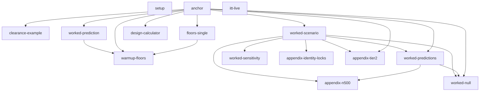

# Static chunk index — `analytic_verification_and_prediction_md_harm.qmd`

Generated by `qmd_chunk_index.R` (base R, static parse only; nothing evaluated).  
File: `quarto/simulations/actg175/continuous/analytic_verification_and_prediction_md_harm.qmd` — 2701 lines, 15 fenced code chunks (15 R).  
Line numbers are valid only at the commit recorded in the provenance header of the report that embeds this index.

## 1. Chunk index (document order)

| # | label | lang | lines | n expr | options | assigns / modifies | free symbols (inputs) | pkg::calls | RNG / draw | analytic | parse |
|---|---|---|---|---|---|---|---|---|---|---|---|
| 1 | `setup` | r | 20–23 | 1 | include: false |  |  | knitr::opts_chunk |  |  | ok |
| 2 | `anchor` | r | 25–103 | 24 | include: false | .anchor, .fmt_tex, .iQ, .iQc, .iS, .mc_se_prop, .pay_path, .reg, .scale |  |  |  | pnorm | ok |
| 3 | `itt-live` | r | 748–759 | 2 |  | b, obs_itt, pfile, pred_itt, r, tr | b, obs_itt, pred_itt, r, tr |  |  |  | ok |
| 4 | `clearance-example` | r | 1155–1160 | 3 |  | pred, z | .anchor |  |  | pnorm | ok |
| 5 | `floors-single` | r | 1362–1427 | 31 | fig-width: 7; fig-height: 5 | bint, c1_for, chan, detect1, g1, g2, inv, ITT, nstar, piQ, res, sQ1, tQ, tQc, tr, Z, zr | .anchor, rbind | knitr::kable |  | dnorm, integrate, pnorm, qnorm, uniroot | ok |
| 6 | `worked-prediction` | r | 1510–1546 | 18 |  | bint, c1, cand, out, ov, p_fam, p_marg, piQ, R, sel, seQ, Sg, tauQc | .anchor, rbind | knitr::kable | set.seed | pmvnorm, pnorm | ok |
| 7 | `warmup-floors` | r | 1571–1613 | 28 |  | beta5, fam_split, fam10, fam25, fam5_10, ov5, P1_3, P1_5, piQ, prev5, R5, Rg, rt3, rt5, S5, scr5, se5, sQ1 | .anchor, c1, cand, ov, p_fam, Sg | forestsearch::fs_sym_root, knitr::kable | rnorm, set.seed | pnorm | ok |
| 8 | `design-calculator` | r | 1632–1638 | 2 |  | n_for | .anchor |  |  | qnorm | ok |
| 9 | `worked-scenario` | r | 1733–1790 | 40 |  | beta_g, bint, c1, c2, cells, conds, fam, gstar_P, J3, jac, keep, lab, M, n_rep, ovl, pcons_gate, Pg, piQ_fix, PQ, PQg, pV, Rho, se_g, sens_g, seQ1000, Sg, spec_g, tab3, tauQc | .anchor, [[ | knitr::kable | set.seed |  | ok |
| 10 | `worked-predictions` | r | 1825–1875 | 28 |  | Bhat, Bmask, det, det_rate, EbetaH, Enaive_bias, EnH, Enpv, Eppv, Esens, Espec, mass_below, noise, p_sel, P1, pass, Rdraw, root_half, sel_c, top, W1, W2, winner | beta_g, c1, c2, lab, M, n_rep, Pg, PQ, PQg, sens_g, Sg, spec_g | forestsearch::fs_sym_root, knitr::kable | rnorm, set.seed |  | ok |
| 11 | `worked-sensitivity` | r | 1957–2018 | 7 |  | .Random.seed, .rng_state, build_J, grid, predict_scn, sens_out | .Random.seed, bint, c1, c2, n_rep, piQ_fix, rbind, seQ1000, tauQc | forestsearch::fs_sym_root, knitr::kable | rnorm, set.seed |  | ok |
| 12 | `worked-null` | r | 2062–2077 | 8 |  | beta_null, p1n, pass_n, W1n, W2n | c1, c2, M, Rdraw, root_half, tauQc |  | rnorm, set.seed |  | ok |
| 13 | `appendix-identity-locks` | r | 2245–2276 | 8 |  | backout, cov_formula, lock1, lock2, lock3m, lock3n, meas | bint, piQ_fix, tauQc | knitr::kable |  | pnorm | ok |
| 14 | `appendix-tier2` | r | 2311–2371 | 34 |  | beta7, Bh, Bm, det, fam0, fam7, keep7, lab7, M7, measd, npv7, ovl7, pass, Pg7, PQg7, pred, R7, rt7, se7, sel, selc, sens7, Sg7, spec7, top7, W1, W2, win | [[, bint, c1, c2, cells, conds, piQ_fix, seQ1000, tauQc | forestsearch::fs_sym_root, knitr::kable | rnorm, set.seed |  | ok |
| 15 | `appendix-n500` | r | 2409–2441 | 4 |  | bH500, m500 | bint, det_rate, EbetaH, Enaive_bias, EnH, Enpv, Eppv, Esens, Espec, piQ_fix, tauQc | knitr::kable |  | pnorm | ok |

## 2. Chunk dependency edges (free symbol → last earlier chunk that assigned it)

| chunk | depends on | via symbols |
|---|---|---|
| `clearance-example` | `anchor` | .anchor |
| `floors-single` | `anchor` | .anchor |
| `worked-prediction` | `anchor` | .anchor |
| `warmup-floors` | `worked-prediction` | c1, cand, ov, p_fam, Sg |
| `warmup-floors` | `anchor` | .anchor, .mc_se_prop |
| `warmup-floors` | `floors-single` | detect1 |
| `design-calculator` | `anchor` | .anchor |
| `worked-scenario` | `anchor` | .anchor |
| `worked-predictions` | `worked-scenario` | beta_g, c1, c2, lab, M, n_rep, Pg, PQ, PQg, sens_g, Sg, spec_g |
| `worked-predictions` | `anchor` | .mc_se_prop |
| `worked-sensitivity` | `worked-scenario` | bint, c1, c2, n_rep, piQ_fix, seQ1000, tauQc |
| `worked-null` | `worked-scenario` | c1, c2, M, tauQc |
| `worked-null` | `worked-predictions` | Rdraw, root_half |
| `worked-null` | `anchor` | .mc_se_prop |
| `appendix-identity-locks` | `worked-scenario` | bint, piQ_fix, tauQc |
| `appendix-tier2` | `worked-scenario` | bint, c1, c2, cells, conds, piQ_fix, seQ1000, tauQc |
| `appendix-tier2` | `anchor` | .mc_se_prop |
| `appendix-n500` | `worked-scenario` | bint, piQ_fix, tauQc |
| `appendix-n500` | `worked-predictions` | det_rate, EbetaH, Enaive_bias, EnH, Enpv, Eppv, Esens, Espec |

## 3. Symbols used but never assigned by any earlier chunk (external: package, base, or defined in prose/YAML)

| chunk | external symbols |
|---|---|
| `itt-live` | b, obs_itt, pred_itt, r, tr |
| `floors-single` | rbind |
| `worked-prediction` | rbind |
| `worked-scenario` | [[ |
| `worked-sensitivity` | .Random.seed, rbind |
| `appendix-tier2` | [[ |

## 4. Assignment targets in full (including in-place modifications such as `x$y <- …`)

- `anchor`: .pay_path ; .scale ; .reg ; .iQ ; .anchor ; .anchor$seQ1000 ; .anchor$sd_eff ; .anchor$c2_ceiling ; .anchor$scr_clear_Q ; .iQc ; .anchor$m_Qc ; .anchor$beta_int ; .anchor$V_mu0_Q ; .iS ; .anchor$m_ITT ; .anchor$v_cond0 ; .fmt_tex ; .mc_se_prop
- `itt-live`: pfile ; b ; tr ; r ; pred_itt ; obs_itt
- `clearance-example`: z ; pred
- `floors-single`: detect1 ; c1_for ; piQ ; tQc ; bint ; tQ ; ITT ; sQ1 ; chan ; chan$sigma_n1000 ; res ; res[, 3:5] ; zr ; nstar ; tr ; tr$power_Q ; tr$ITT_chan ; tr$Qc_chan ; tr[, 2:4] ; inv ; g1 ; g2 ; Z
- `worked-prediction`: tauQc ; bint ; c1 ; seQ ; piQ ; cand ; cand$beta ; cand$se ; ov ; R ; Sg ; p_marg ; p_fam ; sel ; out
- `warmup-floors`: P1_3 ; rt3 ; Rg ; fam_split ; fam10 ; fam25 ; piQ ; sQ1 ; beta5 ; prev5 ; se5 ; ov5 ; ov5[1:3, 1:3] ; ov5[, 4] ; ov5[4, ] ; ov5[1:3, 5] ; ov5[5, 1:3] ; ov5[4, 5] ; ov5[5, 4] ; ov5[5, 5] ; diag(ov5)[1:3] ; R5 ; S5 ; rt5 ; fam5_10 ; scr5 ; P1_5
- `design-calculator`: n_for
- `worked-scenario`: tauQc ; bint ; c1 ; c2 ; n_rep ; pcons_gate ; seQ1000 ; piQ_fix ; J3 ; PQ ; gstar_P ; jac ; pV ; cells ; cells$prob ; cells$inQ ; conds ; fam ; Pg ; keep ; M ; lab ; PQg ; beta_g ; se_g ; sens_g ; spec_g ; ovl ; Rho ; Sg ; tab3
- `worked-predictions`: Rdraw ; root_half ; W1 ; W2 ; Bhat ; pass ; det ; Bmask ; Bmask[!pass] ; winner ; winner[!det] ; P1 ; p_sel ; det_rate ; sel_c ; EnH ; Esens ; Espec ; Eppv ; Enpv ; EbetaH ; noise ; Enaive_bias ; mass_below ; top
- `worked-sensitivity`: .rng_state ; build_J ; predict_scn ; grid ; sens_out ; .Random.seed
- `worked-null`: beta_null ; W1n ; W2n ; pass_n ; p1n
- `appendix-identity-locks`: meas ; backout ; lock1 ; lock2 ; cov_formula ; lock3n ; lock3m
- `appendix-tier2`: fam0 ; Pg7 ; keep7 ; fam7 ; M7 ; lab7 ; PQg7 ; beta7 ; se7 ; sens7 ; spec7 ; ovl7 ; Sg7 ; rt7 ; R7 ; W1 ; W2 ; Bh ; pass ; det ; Bm ; Bm[!pass] ; win ; win[!det] ; sel ; selc ; npv7 ; pred ; measd ; measd[2] ; top7
- `appendix-n500`: m500 ; bH500

## 5. Numeric literals by chunk (raw; classify their roles by hand)

| chunk | literal | count |
|---|---|---|
| `anchor` | 0 | 1 |
| `anchor` | 1 | 4 |
| `anchor` | 10 | 1 |
| `anchor` | 1000 | 1 |
| `anchor` | 2 | 2 |
| `anchor` | 30 | 1 |
| `itt-live` | 0 | 1 |
| `itt-live` | 1 | 1 |
| `itt-live` | 1e-08 | 1 |
| `itt-live` | 9 | 1 |
| `clearance-example` | 30 | 1 |
| `clearance-example` | 40 | 1 |
| `floors-single` | 0 | 3 |
| `floors-single` | 0.05 | 1 |
| `floors-single` | 0.1 | 1 |
| `floors-single` | 0.2 | 1 |
| `floors-single` | 0.5 | 3 |
| `floors-single` | 0.6 | 1 |
| `floors-single` | 0.7 | 1 |
| `floors-single` | 0.743 | 1 |
| `floors-single` | 0.8 | 3 |
| `floors-single` | 0.9 | 3 |
| `floors-single` | 0.95 | 3 |
| `floors-single` | 1 | 14 |
| `floors-single` | 10 | 8 |
| `floors-single` | 1000 | 3 |
| `floors-single` | 19 | 1 |
| `floors-single` | 1e-08 | 1 |
| `floors-single` | 1e-10 | 1 |
| `floors-single` | 2 | 11 |
| `floors-single` | 22 | 1 |
| `floors-single` | 25 | 1 |
| `floors-single` | 28 | 1 |
| `floors-single` | 3 | 7 |
| `floors-single` | 30 | 5 |
| `floors-single` | 4 | 2 |
| `floors-single` | 40 | 1 |
| `floors-single` | 42 | 1 |
| `floors-single` | 44 | 1 |
| `floors-single` | 5 | 2 |
| `floors-single` | 500 | 1 |
| `floors-single` | 700 | 1 |
| `floors-single` | 8 | 2 |
| `floors-single` | Inf | 1 |
| `floors-single` | NA | 2 |
| `worked-prediction` | 0 | 2 |
| `worked-prediction` | 0.28 | 5 |
| `worked-prediction` | 0.31 | 6 |
| `worked-prediction` | 0.45 | 3 |
| `worked-prediction` | 1 | 6 |
| `worked-prediction` | 1e-06 | 2 |
| `worked-prediction` | 20260824 | 1 |
| `worked-prediction` | 3 | 11 |
| `worked-prediction` | 30 | 1 |
| `worked-prediction` | 4 | 2 |
| `worked-prediction` | Inf | 1 |
| `warmup-floors` | 0 | 4 |
| `warmup-floors` | 0.28 | 1 |
| `warmup-floors` | 0.45 | 1 |
| `warmup-floors` | 1 | 14 |
| `warmup-floors` | 10 | 4 |
| `warmup-floors` | 2 | 3 |
| `warmup-floors` | 20260826 | 1 |
| `warmup-floors` | 25 | 1 |
| `warmup-floors` | 2e+05 | 1 |
| `warmup-floors` | 3 | 12 |
| `warmup-floors` | 4 | 4 |
| `warmup-floors` | 5 | 10 |
| `design-calculator` | 0.8 | 1 |
| `design-calculator` | 0.9 | 1 |
| `design-calculator` | 0.95 | 1 |
| `design-calculator` | 1000 | 1 |
| `design-calculator` | 2 | 1 |
| `design-calculator` | 30 | 1 |
| `design-calculator` | 40 | 1 |
| `design-calculator` | 80 | 1 |
| `design-calculator` | 90 | 1 |
| `design-calculator` | 95 | 1 |
| `worked-scenario` | 0 | 2 |
| `worked-scenario` | 0.001 | 1 |
| `worked-scenario` | 0.002 | 1 |
| `worked-scenario` | 0.007 | 1 |
| `worked-scenario` | 0.0089 | 1 |
| `worked-scenario` | 0.0121 | 1 |
| `worked-scenario` | 0.023 | 1 |
| `worked-scenario` | 0.036 | 1 |
| `worked-scenario` | 0.045 | 1 |
| `worked-scenario` | 0.0876 | 1 |
| `worked-scenario` | 0.12 | 1 |
| `worked-scenario` | 0.1554 | 1 |
| `worked-scenario` | 0.25 | 1 |
| `worked-scenario` | 0.3357 | 1 |
| `worked-scenario` | 0.3553 | 1 |
| `worked-scenario` | 0.42 | 1 |
| `worked-scenario` | 0.455 | 1 |
| `worked-scenario` | 0.5 | 1 |
| `worked-scenario` | 0.727 | 1 |
| `worked-scenario` | 0.882 | 1 |
| `worked-scenario` | 0.9 | 1 |
| `worked-scenario` | 1 | 27 |
| `worked-scenario` | 10 | 1 |
| `worked-scenario` | 1e-04 | 1 |
| `worked-scenario` | 1e-12 | 3 |
| `worked-scenario` | 2 | 12 |
| `worked-scenario` | 20260825 | 1 |
| `worked-scenario` | 3 | 14 |
| `worked-scenario` | 30 | 1 |
| `worked-scenario` | 4 | 6 |
| `worked-scenario` | 5 | 4 |
| `worked-scenario` | 500 | 1 |
| `worked-scenario` | 6 | 4 |
| `worked-predictions` | 0 | 1 |
| `worked-predictions` | 1 | 3 |
| `worked-predictions` | 2 | 3 |
| `worked-predictions` | 20260825 | 1 |
| `worked-predictions` | 2e+05 | 1 |
| `worked-predictions` | 3 | 4 |
| `worked-predictions` | 6 | 1 |
| `worked-predictions` | Inf | 1 |
| `worked-predictions` | NA | 1 |
| `worked-sensitivity` | 0 | 4 |
| `worked-sensitivity` | 0.002 | 5 |
| `worked-sensitivity` | 0.006 | 1 |
| `worked-sensitivity` | 0.023 | 2 |
| `worked-sensitivity` | 0.045 | 3 |
| `worked-sensitivity` | 0.0946 | 1 |
| `worked-sensitivity` | 0.12 | 1 |
| `worked-sensitivity` | 0.1554 | 1 |
| `worked-sensitivity` | 0.25 | 1 |
| `worked-sensitivity` | 0.3 | 1 |
| `worked-sensitivity` | 0.325 | 1 |
| `worked-sensitivity` | 0.3357 | 5 |
| `worked-sensitivity` | 0.341 | 1 |
| `worked-sensitivity` | 0.42 | 5 |
| `worked-sensitivity` | 0.455 | 1 |
| `worked-sensitivity` | 0.5 | 1 |
| `worked-sensitivity` | 0.55 | 1 |
| `worked-sensitivity` | 0.727 | 2 |
| `worked-sensitivity` | 0.882 | 1 |
| `worked-sensitivity` | 1 | 17 |
| `worked-sensitivity` | 1e-09 | 3 |
| `worked-sensitivity` | 1e-12 | 1 |
| `worked-sensitivity` | 2 | 13 |
| `worked-sensitivity` | 20260827 | 1 |
| `worked-sensitivity` | 2e+05 | 1 |
| `worked-sensitivity` | 3 | 11 |
| `worked-sensitivity` | 4 | 4 |
| `worked-sensitivity` | 5 | 4 |
| `worked-sensitivity` | 5e-04 | 1 |
| `worked-sensitivity` | 6 | 4 |
| `worked-sensitivity` | Inf | 1 |
| `worked-null` | 0 | 3 |
| `worked-null` | 1 | 2 |
| `worked-null` | 2 | 1 |
| `worked-null` | 20260828 | 1 |
| `appendix-identity-locks` | 0.123 | 1 |
| `appendix-identity-locks` | 0.18 | 1 |
| `appendix-identity-locks` | 0.402 | 1 |
| `appendix-identity-locks` | 0.97 | 1 |
| `appendix-identity-locks` | 108.85 | 1 |
| `appendix-identity-locks` | 121.4 | 1 |
| `appendix-identity-locks` | 144.49 | 1 |
| `appendix-identity-locks` | 17.57 | 1 |
| `appendix-identity-locks` | 2 | 2 |
| `appendix-identity-locks` | 22.17 | 1 |
| `appendix-identity-locks` | 22.37 | 1 |
| `appendix-identity-locks` | 3 | 2 |
| `appendix-identity-locks` | 40.66 | 1 |
| `appendix-identity-locks` | 53.94 | 1 |
| `appendix-identity-locks` | 700 | 1 |
| `appendix-identity-locks` | 74 | 1 |
| `appendix-identity-locks` | 77.09 | 1 |
| `appendix-identity-locks` | 8.9 | 1 |
| `appendix-tier2` | 0 | 1 |
| `appendix-tier2` | 0.123 | 1 |
| `appendix-tier2` | 0.402 | 1 |
| `appendix-tier2` | 0.662 | 1 |
| `appendix-tier2` | 0.904 | 1 |
| `appendix-tier2` | 0.999 | 1 |
| `appendix-tier2` | 1 | 15 |
| `appendix-tier2` | 1000 | 1 |
| `appendix-tier2` | 2 | 9 |
| `appendix-tier2` | 20260825 | 1 |
| `appendix-tier2` | 2e+05 | 1 |
| `appendix-tier2` | 3 | 6 |
| `appendix-tier2` | 31.76 | 1 |
| `appendix-tier2` | 4 | 4 |
| `appendix-tier2` | 5 | 4 |
| `appendix-tier2` | 6 | 4 |
| `appendix-tier2` | 60 | 1 |
| `appendix-tier2` | 700 | 3 |
| `appendix-tier2` | 74 | 1 |
| `appendix-tier2` | 77.09 | 1 |
| `appendix-tier2` | Inf | 1 |
| `appendix-n500` | 0.17 | 1 |
| `appendix-n500` | 0.23 | 1 |
| `appendix-n500` | 0.41 | 1 |
| `appendix-n500` | 0.66 | 1 |
| `appendix-n500` | 0.87 | 1 |
| `appendix-n500` | 0.98 | 1 |
| `appendix-n500` | 1 | 1 |
| `appendix-n500` | 106.04 | 1 |
| `appendix-n500` | 121.66 | 1 |
| `appendix-n500` | 18.04 | 1 |
| `appendix-n500` | 19.81 | 1 |
| `appendix-n500` | 2 | 3 |
| `appendix-n500` | 20.21 | 1 |
| `appendix-n500` | 20.25 | 1 |
| `appendix-n500` | 3 | 3 |
| `appendix-n500` | 39.43 | 1 |
| `appendix-n500` | 500 | 1 |
| `appendix-n500` | 52.01 | 1 |
| `appendix-n500` | 7.67 | 1 |
| `appendix-n500` | 72 | 1 |
| `appendix-n500` | 74.27 | 1 |

## 6. Namespace-qualified calls (all chunks)

- `forestsearch::fs_sym_root` — chunks: warmup-floors, worked-predictions, worked-sensitivity, appendix-tier2
- `knitr::kable` — chunks: floors-single, worked-prediction, warmup-floors, worked-scenario, worked-predictions, worked-sensitivity, appendix-identity-locks, appendix-tier2, appendix-n500
- `knitr::opts_chunk` — chunks: setup

## 6b. Packages attached / loaded (library, require, requireNamespace, loadNamespace)

- `worked-prediction`: mvtnorm
- `worked-scenario`: mvtnorm

## 7. File I/O calls (verbatim)

- `anchor`: `file.path("mr_md_harm", "fs_maxeffCons_mr_md40_knoise0_n500_s1000_d5000", "fs_maxeffCons_mr_md40_knoise0_n500_res_1_1000.rds")`
- `anchor`: `file.exists(.pay_path)`
- `anchor`: `readRDS(.pay_path)`
- `itt-live`: `file.exists(pfile)`
- `itt-live`: `readRDS(pfile)`

## 8. Functions called, by chunk (bare names; base/package/document-defined not distinguished here)

- `anchor`: abs, all.equal, file.exists, file.path, formatC, inherits, is.na, isTRUE, length, list, match, max, min, pnorm, readRDS, sign, sqrt, stopifnot, unique
- `itt-live`: abs, cat, file.exists, is.na, length, readRDS, round, sprintf, stopifnot, unique
- `clearance-example`: cat, pnorm, sprintf
- `floors-single`: abline, c, cat, contour, data.frame, detect1, dnorm, do.call, format, integrate, knitr::kable, lapply, nstar, numeric, outer, paste, pmax, pnorm, points, qnorm, return, round, seq, seq_len, sprintf, sqrt, text, uniroot, vapply, Vectorize, zr
- `worked-prediction`: abs, as.numeric, c, data.frame, diag, do.call, GenzBretz, knitr::kable, lapply, library, matrix, numeric, outer, pmvnorm, pnorm, rbind, rep, round, set.seed, setdiff, sprintf, sqrt, sum, t, vapply
- `warmup-floors`: .mc_se_prop, as.character, as.numeric, c, cat, data.frame, detect1, fam_split, forestsearch::fs_sym_root, knitr::kable, matrix, mean, numeric, outer, pnorm, rep, rnorm, round, rowSums, seq_len, set.seed, sprintf, sqrt, t, vapply
- `design-calculator`: c, cat, format, n_for, qnorm, round, sprintf
- `worked-scenario`: abs, c, cat, cbind, character, colSums, data.frame, expand.grid, ifelse, knitr::kable, lapply, length, library, list, matrix, names, numeric, order, outer, paste, round, rowSums, seq_len, set.seed, sprintf, sqrt, stopifnot, sum, unlist, vapply, Vectorize
- `worked-predictions`: .mc_se_prop, c, cbind, colMeans, data.frame, forestsearch::fs_sym_root, knitr::kable, matrix, max.col, mean, numeric, order, rep, rnorm, round, rowSums, seq_len, set.seed, sprintf, sum, t, tabulate, vapply, which
- `worked-sensitivity`: abs, all, as.data.frame, build_J, c, cbind, colSums, data.frame, do.call, expand.grid, forestsearch::fs_sym_root, ifelse, knitr::kable, lapply, length, list, matrix, max, max.col, mean, nrow, numeric, outer, paste, predict_scn, rep, rnorm, round, rowSums, seq_len, set.seed, sqrt, stopifnot, sum, t, tabulate, vapply, Vectorize, which
- `worked-null`: .mc_se_prop, cat, colMeans, log, matrix, max, mean, min, rep, rnorm, rowSums, set.seed, sprintf, t
- `appendix-identity-locks`: c, cov_formula, data.frame, knitr::kable, list, paste, pnorm, round
- `appendix-tier2`: .mc_se_prop, c, cat, cbind, character, data.frame, forestsearch::fs_sym_root, knitr::kable, lapply, length, list, matrix, max.col, mean, names, numeric, order, outer, paste, rep, rnorm, round, rowSums, seq_len, set.seed, sprintf, sqrt, sum, t, tabulate, unlist, vapply, Vectorize, which
- `appendix-n500`: c, data.frame, knitr::kable, list, pnorm, round, unname

## 9. Objects read by inline `r …` code in prose

55 inline code spans; 0 failed to parse.

| symbol | inline uses |
|---|---|
| `.anchor` | 55 |

